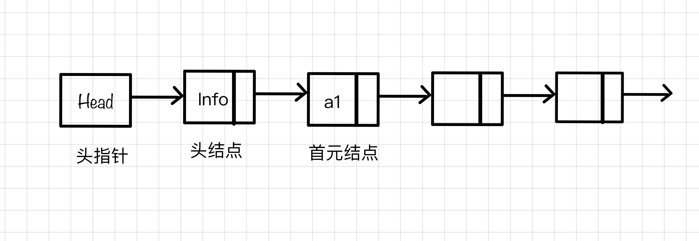

# 链表

## 什么是链表
- 链表是物理存储单元上**非连续**的、**非顺序**的存储结构，它是由一个个结点，通过指针来联系起来的，其中每个结点包括数据和指针。  

- 链表是一种通过指针串联在一起的线性结构，每一个节点由两部分组成，一个是数据域一个是指针域（存放指向下一个节点的指针），最后一个节点的指针域指向null（空指针的意思）。

- 链接的入口节点称为链表的头结点也就是head。

## 链表的类型
### 头指针、头结点、首元结点

- 头指针：指向链表中第一个结点的指针
- 头结点：链表的首元结点之前附设的一个结点，没有数据域
- 首元结点：链表中存储第一个数据元素a1的结点
### 单链表
- 结点只有一个指针域的链表
### 双链表
- 结点由两个指针域
- 既可以向前查询也可以向后查询。
### 循环链表
- 首尾相接的链表
- 可以用来解决约瑟夫环问题。

## 链表定义
```js
// Definition for singly-linked list.
function ListNode(val, next){
  this.val = (val===undefined ? 0 : val);
  this.next = (next===undefined ? null : next)
}
```