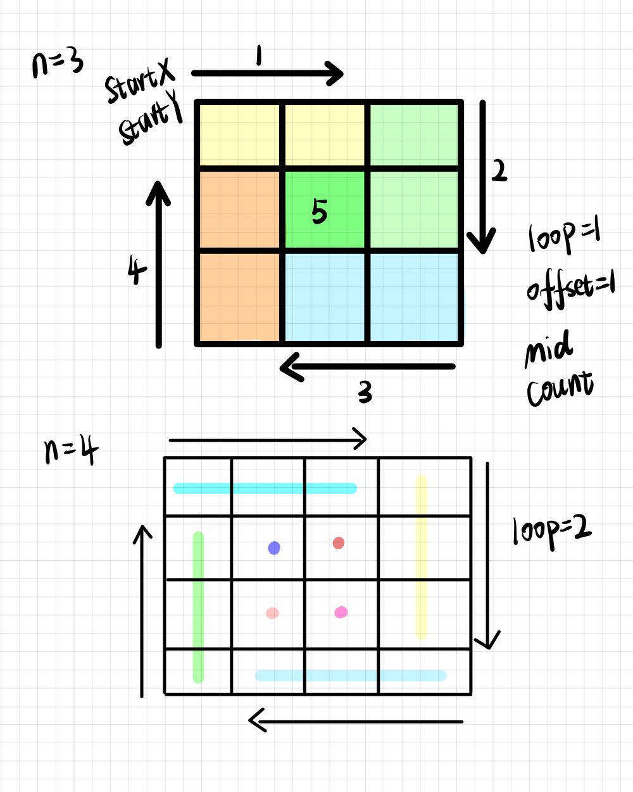

# 7.螺旋矩阵 II

## 59.螺旋矩阵 II
 [题目链接](https://leetcode.cn/problems/spiral-matrix-ii/)

给定一个正整数 n，生成一个包含 1 到 n^2 所有元素，且元素按顺时针顺序螺旋排列的正方形矩阵。

示例:

输入: 3 输出: [ [ 1, 2, 3 ], [ 8, 9, 4 ], [ 7, 6, 5 ] ]

### 思路
模拟过程，坚持循环不变量原则  

模拟顺时针画矩阵的过程:

填充上行从左到右
填充右列从上到下
填充下行从右到左
填充左列从下到上
由外向内一圈一圈这么画下去。

我们要画每四条边，每画一条边都要坚持一致的左闭右开，或者左开右闭的原则，这样这一圈才能按照统一的规则画下来。  

按照左闭右开的原则，来画一圈  

  

每种颜色代表一条边，即遍历的长度，每一个拐角处让给新的一条边来继续画。

```js
var generateMatrix = function(n) {
    let res=new Array(n).fill(0).map(()=>new Array(n).fill(0));
    let startX=0,startY=0;//每循环一个圈的起始位置
    let loop=Math.floor(n/2);//旋转圈数
    let offset=1;//控制每一条边遍历的长度，每次循环右边界收缩一位
    let mid=Math.floor(n/2);//中间位置
    let count=1//给矩阵中每一个空格赋值
    let i,j;
    while(loop--){
      //一圈  模拟填充上行从左到右(左闭右开)
      for(j=startY;j<n-offset;j++){
          res[startX][j]=count++;//行不变
      }
      //模拟填充右列从上到下(左闭右开
      for(i=startX;i<n-offset;i++){
          res[i][j]=count++;
      }
      //模拟填充下行从右到左(左闭右开)
      for(;j>startY;j--){
          res[i][j]=count++;
      }
      //模拟填充左列从下到上(左闭右开)
      for(;i>startX;i--){
          res[i][j]=count++;
      }
      //第二圈开始的时候，起始位置要各自加1， 例如：第一圈起始位置是(0, 0)，第二圈起始位置是(1, 1)
      startX++;
      startY++;
     //控制每一圈里每一条边遍历的长度.例如n=4,第一圈n-offset=3,第二圈n-offset=2;
      offset+=1;
    }
    //如果n为奇数的话，需要单独给矩阵最中间的位置赋值
    if(n%2===1){
          res[mid][mid]=count++;
      }
      return res;
};
```