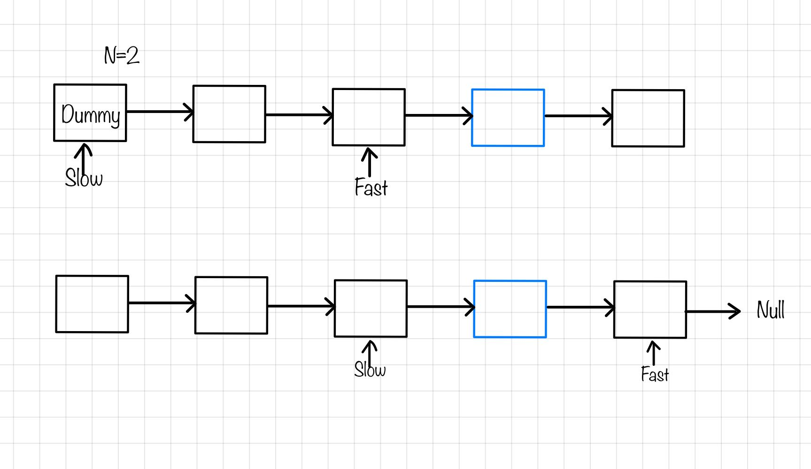

# 5.删除链表的倒数第 N 个结点 

## 19.删除链表的倒数第 N 个结点 
[题目链接](https://leetcode.cn/problems/remove-nth-node-from-end-of-list/)

给你一个链表，删除链表的倒数第 n 个结点，并且返回链表的头结点。

进阶：你能尝试使用一趟扫描实现吗?   

示例：  
  


输入：head = [1,2,3,4,5], n = 2 输出：[1,2,3,5] 示例 2：

输入：head = [1], n = 1 输出：[] 示例 3：

输入：head = [1,2], n = 1 输出：[1]  

### 计算链表长度
我首先想到的就是计算链表长度length  

要删除倒数第n个节点，从虚拟头结点开始遍历，遍历到length-n,正好是要删除的节点  

找到其前一个节点进行删除操作

```js
var removeNthFromEnd = function(head, n) {
     let length=0;
     let dummy=new ListNode(0,head);
     let cur=dummy;
     while(head){
         length++;
         head=head.next;
     }
     for(let i=0;i<length-n;i++){//正好遍历到其前一个节点
        cur=cur.next;
     }
     cur.next=cur.next.next;
     return dummy.next;
};
```
### 双指针
如果要删除倒数第n个节点  

让fast先移动n步，然后让fast和slow同时移动，直到fast指向链表末尾。删掉slow所指向的节点就可以了.   



```js
var removeNthFromEnd = function(head, n) {
     let dummy=new ListNode(0,head);
     let slow=dummy;
     let fast=dummy;
     while(n--){
         fast=fast.next
     }
     while(fast.next){
         slow=slow.next;
         fast=fast.next;
     }
     slow.next=slow.next.next;
     return dummy.next;
};
```

### 栈
遍历链表的同时将所有节点依次入栈。

根据栈「先进后出」的原则，我们弹出栈的第n个节点就是需要删除的节点，  

并且目前栈顶的节点就是待删除节点的前驱节点。这样一来，删除操作就变得十分方便了。

```js
var removeNthFromEnd = function(head, n) {
     let dummy=new ListNode(0,head);
     let cur=dummy;
     let stack=[];
     while(cur){
         stack.push(cur);
         cur=cur.next;
     }
     while(n--){
         stack.pop();
     }
    let pre=stack.pop();
    pre.next=pre.next.next;
    return dummy.next;
};
```