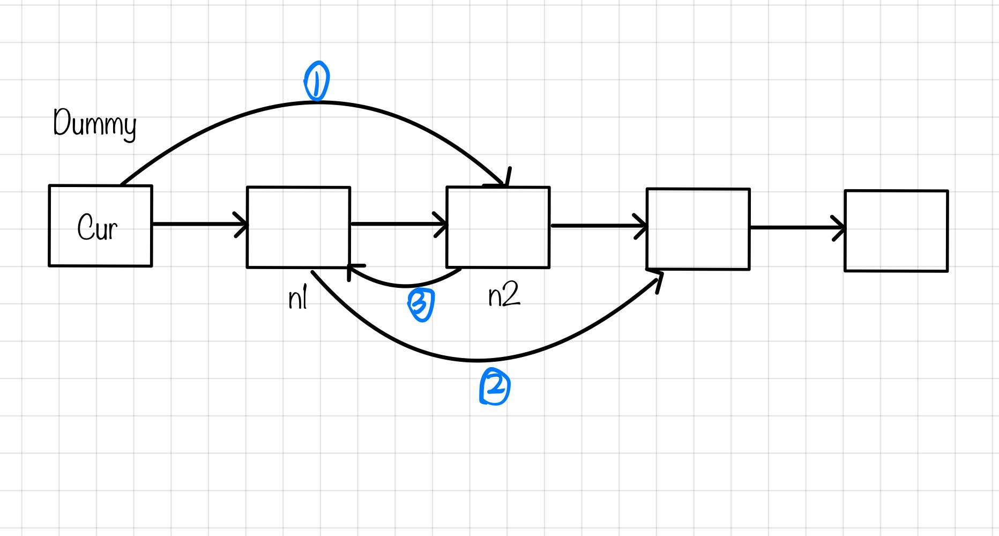

# 4.两两交换链表中的节点

## 24.两两交换链表中的节点
[题目链接](https://leetcode.cn/problems/swap-nodes-in-pairs/)

给定一个链表，两两交换其中相邻的节点，并返回交换后的链表。

你不能只是单纯的改变节点内部的值，而是需要实际的进行节点交换。  

输入：head = [1,2,3,4]
输出：[2,1,4,3]
示例 2：

输入：head = []
输出：[]
示例 3：

输入：head = [1]
输出：[1]

### 虚拟头结点
一定要画图，不画图，操作多个指针很容易乱，而且要操作的先后顺序

初始时，cur指向虚拟头结点  



```js
var swapPairs = function(head) {
  let dummy=new ListNode(0);
  dummy.next=head;
  let cur=dummy;
  while(cur.next&&cur.next.next){//要判断cur.next.next
    let n1=cur.next;
    let n2=cur.next.next;
    cur.next=n2;
    n1.next=n2.next;
    n2.next=n1;
    cur=n1;
  }
  return dummy.next;
};
```

### 递归
宗旨就是紧紧抓住原来的函数究竟返回的是什么?作用是什么即可
swapPairs(ListNode head) 的意义就是两两翻转链表中的节点+返回翻转后的新的头结点
```js
var swapPairs = function(head) {
 if(head===null||head.next===null) return head;
 //1->2->3->4
 //保存节点2
 const newHead=head.next;
 //继续递归，处理节点3->4
 //当递归结束返回后，就变成了4->3
 //于是head节点就指向了4，变成1->4->3
 head.next=swapPairs(newHead.next);
 //节点2指向1
 newHead.next=head;
 return newHead;
};
```