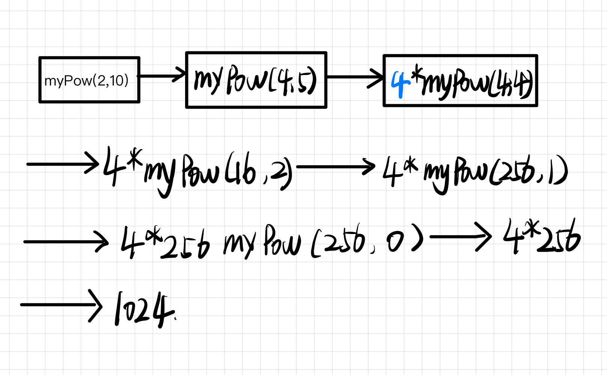

# Pow(x, n)

[链接](https://leetcode.cn/problems/powx-n/description/)  

- n<0 时, x^n^ = (1/x) ^-n^   
- n为偶数时，x ^n^ = ( x * x )^n/2^  
- n为奇数时， x ^n^ = x * x ^n-1^   
- n === 0 返回 1  




```js
var myPow = function(x, n) {
   if(n === 0) return 1;

   if(n < 0) return myPow(1/x, -n);

   if(n % 2) return x * myPow(x, n - 1);

   return myPow(x*x, n/2);
};
```
