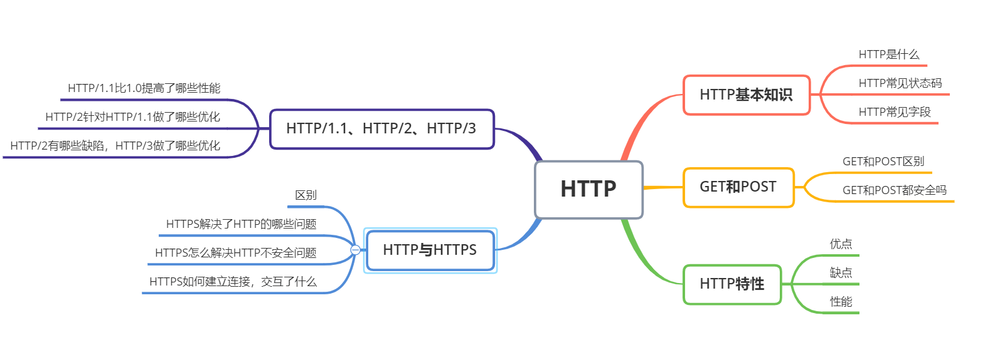

---
# 这是页面的图标
icon: page
# 这是侧边栏的顺序
order: 1
# 设置写作时间
date: 2022-08-05
tag:
  - HTTP
---
<!-- more -->


# HTTP



## 1.HTTP 是什么

::: info
HTTP是超文本传输协议（Hyper Transfer Protocol)  
HTTP 是一个在计算机世界里专门在**两点**之间传输文字、图片、音频、视频等**超文本数据**的**约定和规范**  
:::


那HTTP 是⽤于从互联⽹服务器传输超⽂本到本地浏览器的协议 ，这种说法正确吗？  
这种说法是不正确的。因为也可以是「服务器< -- >服务器」，所以采⽤两点之间的描述会更准确。

## 2.HTTP状态码  

五大类HTTP响应状态码   

|  | 含义 |
| :----:| :----: |
| 1xx | 提示信息，表示目前是协议处理的中间状态，还需要后续操作 |
| 2xx | 成功，报文已经收到并被成功处理 |
| 3xx | 重定向，资源位置发生改变，需要客户端重新发送请求 |
| 4xx | 客户端错误，请求报文有误，服务器无法处理 |
| 5xx | 服务器错误，服务器在处理请求时内部发生了错误 |  

1. 1xx
  - `100 Continue` : 表示目前为止一切正常，客户端应该继续请求，如果已完成请求则忽略。为了让服务器检查请求的首部，客户端必须在发送请求实体前，在初始化请求中发送 Expect: 100-continue 首部并接收 100 Continue 响应状态码    

  - `101 Switching Protocol`：表示服务器应客户端升级协议的请求（Upgrade (en-US)请求头）正在切换协议。  

  - `103 Early Hints` :一般和 Link header（首部）一起使用，来允许用户在服务器还在准备响应数据的时候预加载一些资源  


2. 2xx 成功

  - `200 OK` :请求成功,如果是非head请求，服务器返回的响应头都会有body数据   

  - `201 Created`: 表示请求已经被成功处理，并且创建了新的资源 ，常用于post请求返回值    

  - `202 Accepted`: 服务器端已经收到请求消息，但是尚未进行处理   

  - `203 Non-Authoritative Information` ：求已经成功被响应，但是获得的负载与源头服务器的状态码为 200 (OK) 的响应相比，经过了拥有转换功能的 proxy（代理服务器）的修改    

  - `204 No Content` ：与200 OK基本形同，但响应头没有body数据,包含header和状态行   

  >使用惯例是，在 PUT 请求中进行资源更新，但是不需要改变当前展示给用户的页面，那么返回 204 No Content。如果创建了资源，则返回 201 Created 。如果应将页面更改为新更新的页面，则应改用 200     

  - `205 Reset Content`: 用来通知客户端重置文档视图，比如清空表单内容、重置 canvas 状态或者刷新用户界面   

  - `206 Partial Content` : 响应返回的body数据不是资源的全部，包含由Content-Range指定范围的实体内容，应用于HTTP分块下载或断点重传

3. 3xx 重定向  
  - `300 Multiple Choices` :是一个用来表示重定向的响应状态码，表示该请求拥有多种可能的响应。用户代理或者用户自身应该从中选择一个  

  - `301 Moved Permanently `: 永久重定向，请求的资源不存在了，已经被分配了新的URL  

  - `302 Found` : 临时重定向，请求的资源还在，但暂时需要用另一个URL访问  

  >301 和 302 都会在响应头里使用字段Location，指明后续要跳转的URL，浏览器会自动重定向新的URL  

  - `303 See Other` : 请求的资源存在着另一个URI，应使用GET方法定向获取请求的资源 

  >当 301、302、303 响应状态码返回时，几乎所有的浏览器都会把POST 改成 GET，并删除请求报文内的主体，之后请求会自动再次发送。301、302 标准是禁止将 POST 方法改变成 GET 方法的，但实际使用时大家都会这么做。  

  - `304 Not Modified` : 不具有跳转含义，表示资源未修改，重定向已存在的缓存文件，也称缓存重定向，用于缓存控制  

  - `307 Temporary Redirect`:临时重定向响应状态码，表示请求的资源暂时地被移动到了响应的 Location 首部所指向的 URL 上。  

  - `308 Permanent Redirect`:（永久重定向）是表示重定向的响应状态码，说明请求的资源已经被永久的移动到了由 Location 首部指定的 URL 上

  >与302,301区别就是，使用GET以外的请求方法时，307,308可以保证请求方法和消息主体不会在变化，而301,302不能保证,可能会被修改为GET方法


4. 4xx

  - `400 Bad Request`：客户端请求的报文有误，服务器无法处理 ；浏览器会像200 OK一样对待该状态码   

  - `401 Unauthorized`: 指的是由于缺乏目标资源要求的身份验证凭证，发送的请求未得到满足

  - `403 Forbidden` : 服务器禁止访问资源，不是客户端请求出错  

  - `404 Not Found` : 请求的资源在服务器上不存在或未找到    

  - `405 Method Not Allowed`: 表明服务器禁止了使用当前 HTTP 方法的请求  

  - `406 Not Acceptable`: 服务器端无法提供与 Accept-Charset 以及 Accept-Language 消息头指定的值相匹配的响应。(极少使用)  

  - `407 Proxy Authentication Required` :缺乏代理服务器（proxy server ）要求的身份验证凭证  

  - `409 Conflict`: 表示请求与服务器端目标资源的当前状态相冲突。  

  - `410 Gone`: 说明请求的目标资源在原服务器上不存在了，并且是永久性的丢失

5. 5xx   

  - `[500 Internal Server Error] `: 服务端在执行请求时发生错误，也可能是Web应用存在的Bug或某些临时故障  

  - `[501 Not Implemented]` : 客户端请求的功能还不支持  

  - `[502 Bad GateWay]` : 服务器作为网关或代理时返回的错误码，表示服务器自身工作正常，访问后端服务器发生了错误  

  - `[503 Service Unavailable] `: 服务器当前很忙。暂时无法响应，如果事先得知解除以上状况需要的时间，可以写入Retry-After首部字段在返回给客户端    

  - `504 Gateway Timeout`:表示扮演网关或者代理的服务器无法在规定的时间内获得想要的响应。  

  - `505 HTTP Version Not Supported ` : 服务器不支持所请求的HTTP版本   

  - `511 Network Authentication Required`:表示客户端需要通过验证才能使用该网络。由控制网络访问的拦截代理服务器生成的。


## 3.HTTP 常见字段

- Host 字段；客户端发送请求时，⽤来指定服务器的域名。可以将请求发往「同⼀台」服务器上的不同⽹站

```http
Host:www.A.com
```  

- Content-Length 字段：服务器在返回数据时，本次回应的数据⻓度。  

- Connection 字段：常⽤于客户端要求服务器使⽤ TCP 持久连接，以便其他请求复⽤


>HTTP/1.1 版本的默认连接都是持久连接，但为了兼容⽼版本的 HTTP，需要指定 Connection ⾸部字段的值为
Keep-Alive 。


- Content-Type 字段:服务器响应时使用的数据格式

```http
Content-Type: text/html; charset=utf-8  

上⾯的类型表明，发送的是⽹⻚，⽽且编码是UTF-8。

客户端请求的时候，可以使⽤ Accept 字段声明⾃⼰可以接受哪些数据格式。

Accept: */*  

上⾯代码中，客户端声明⾃⼰可以接受任何格式的数据。
```

- Content-Encoding 字段:说明数据的压缩⽅法。表示服务器返回的数据使⽤了什么压缩格式  

```http
Content-Encoding: gzip  
服务器返回的数据采⽤了 gzip ⽅式压缩，告知客户端需要⽤此⽅式解压。
客户端在请求时，⽤ Accept-Encoding 字段说明⾃⼰可以接受哪些压缩⽅法。
Accept-Encoding: gzip, deflate
```  

- Cache-Control 用来指定当前的请求或者回复，是否使用缓存机制


## 4.HTTP 特性 

1. 基于TCP/IP  
   - http协议是基于TCP/IP协议之上的应用层协议  

2. 基于请求-响应模式
    - 请求从客户端发出，服务器响应请求并返回

3. 无状态保存  
   - 减轻服务器的负担，能够把更多的 CPU 和内存⽤来对外提供服务。它在完成有关联性的操作时会⾮常麻烦。解法⽅案有很多种，其中 ⽐较简单的⽅式⽤ Cookie 技术。

4. 无连接 
   - 限制每次连接只处理一个请求，服务器处理完客户请求，并收到客户的应答后即断开连接

5. 明文传输 
   - 传输过程中的信息，是可⽅便阅读的，通过浏览器的 F12 控制台或 Wireshark 抓包都可以直接⾁眼查看，为我们调试⼯作带了极⼤的便利性。

## 5.HTTP/1.1  

### 5.1 相比HTTP/1.0改进
1. ⻓连接
   - HTTP/1.0 每发起⼀个请求，都要新建⼀次 TCP 连接（三次握⼿），⽽且是串⾏请求，增加了通信开销。
   - HTTP/1.1 采用⻓连接，也叫持久连接。只要任意⼀端没有明确提出断开连接，则保持 TCP 连接状态。  

2. 管道⽹络传输  
   - 在同⼀个 TCP 连接⾥⾯，客户端可以同时发起多个请求，只要第⼀个请求发出去了，不必等其回来，就可以发第二个请求出去，可以减少整体的响应时间。
   - 服务器则是按照请求顺序依次响应    

### 5.2 缺点

1. 队头阻塞
   - 发送的请求中有一个因为某种原因堵塞无法响应时，后面排队的请求也会被堵塞

2. 请求只能由客户端发送，服务器被动响应
3. 请求 / 响应头部（Header）未经压缩就发送，⾸部信息越多延迟越⼤。只能压缩 Body 的部分；
4. 发送冗⻓的⾸部。每次互相发送相同的⾸部造成的浪费较多
5. 没有请求优先级控制；


## 6.HTTP/2

>HTTP/2 协议是基于 HTTPS 的，所以 HTTP/2 的安全性也是有保障的。

### 6.1 HTTP/2 相⽐ HTTP/1.1 性能上的改进

1. 头部压缩
   - 同时发送多个头部相同或相似的请求，协议会消除重复的部分
   - 用的是HPACK 算法：在客户端和服务器同时维护⼀张头信息表，所有字段都会存⼊这个表，⽣成⼀个索引号，以后就不发送同样字段了，只发送索引号，提⾼速度。  

2. ⼆进制格式
   - 不采用HTTP/1.1 ⾥的纯⽂本形式的报⽂，全⾯采⽤了⼆进制格式，头信息和数据体都是⼆进制，统称为帧（frame）：头信息帧和数据帧。  

3. 多路复用
   - 一个连接中并发多个请求或回应，不用按顺序一一对应
   - 不需要排队等待，也就不会再出现「队头阻塞」问题，降低了延迟
   - 当一个请求非常耗时，先回应已处理好的部分，回应其他请求后再回应该请求剩下的部分  

4. 数据流
   - 每个请求或回应的所有数据包，称为⼀个数据流（ Stream ），每个数据流都有编号
   - 客户端可以指定数据流的优先级。优先级⾼服务器就先响应。  

5. 服务器推送  
   - 服务不再是被动地响应，也可以主动向客户端发送消息。
   - 浏览器请求HTML时，提前吧可能会用到的JS，CSS等推送给客户端  

### 6.2 缺陷

>HTTP/2 多个请求复⽤⼀个TCP连接，⼀旦发⽣丢包，触发TCP重传机制，就会阻塞住所有的 HTTP 请求。  


## 7.HTTP/3

> HTTP/3 把 HTTP 下层的 TCP 协议改成了 UDP, 不管顺序，也不管丢包的，不会出现 HTTP/1.1 的队头阻塞 和 HTTP/2 的⼀个丢包全部重传问题。

1. 基于 UDP 的 QUIC 协议 可以实现类似 TCP 的可靠性传输。  
    - 某个流发生丢包时，只会阻塞这个流，不影响其他
    - 头部压缩算法升级为QPack  


## 8.HTTPS

### 8.1 HTTP与HTTPS

1. 概念
   >HTTPS是以安全为目标的HTTP通道，简单讲是HTTP的安全版，即HTTP下加入SSL层，HTTPS的安全基础是SSL，因此加密的详细内容就需要SSL。

2. HTTP和HTTPS区别
    - http是超文本传输协议，信息是明文传输，https则是具有安全性的SSL加密传输协议
    - http的默认端口是80，https的默认端口是443
    - https比http多了加密传输，网络身份认证的功能
    - https协议需要向 CA（证书权威机构）申请数字证书，来保证服务器的身份是可信的。  

### 8.2 HTTPS解决了HTTP哪些问题
1. 混合加密
    HTTPS 采⽤的是对称加密和⾮对称加密结合的「混合加密」⽅式，防止用户信息被获取
      - 在通信建⽴前采⽤⾮对称加密的⽅式交换「会话秘钥」，后续就不再使⽤⾮对称加密。
      - 在通信过程中全部使⽤对称加密的「会话秘钥」的⽅式加密明⽂数据

2. 摘要算法  
    为数据⽣成独⼀⽆⼆的「指纹」，⽤于校验数据的完整性，解决了篡改的⻛险。

3. 数字证书    
     将服务器公钥放在数字证书（由数字证书认证机构颁发）中，只要证书是可信的，公钥就是可信的。  
     通过数字证书的⽅式保证服务器公钥的身份，解决冒充的⻛险。  


### 8.3 HTTPS如何建立连接
1. 三次握手
2. 建立SSL/TLS连接，基本流程：
  - 客户端向服务器索要并验证服务器的公钥。
  - 双⽅协商⽣产「会话秘钥」。
  - 双⽅采⽤「会话秘钥」进⾏加密通信。

详细过程：
   1. ClientHello  
   客户端发起加密通信的请求，并生成一个随机数发送给服务器

   2. SeverHello  
   服务器收到请求后，会将网站的证书信息（包含公钥）传送一份给客户端，同时生成第二个随机数发送
   
   3. 客户端回应  
    客户端收到后会用浏览器或者操作系统的CA证书验证证书合法性，并提取出公钥，然后生成第三个随机数发送
    此时客户端发送的信息是用公钥加密的，只有对应的服务器有私钥解密

   4. 服务器回应   
     服务器收到后用私钥解密，将三个随机数用算法生成`会话密钥`，客户端也一样，生成的密钥是一样的  


⾄此，整个 SSL/TLS 的握⼿阶段全部结束。接下来，客户端与服务器进⼊加密通信，就完全是使⽤普通的 HTTP
协议，只不过⽤「会话秘钥」加密内容。   

>SSL连接总结： 采用非对称加密（公钥和私钥）来商量会话密钥（对称加密）是多少，商量完成后就用这个会话密钥作为对称加密的密钥来进行通信

采⽤「混合加密」的⽅式的原因：  
 - 对称加密只使⽤⼀个密钥，运算速度快，密钥必须保密，⽆法做到安全的密钥交换。
 - ⾮对称加密使⽤两个密钥：公钥和私钥，公钥可以任意分发⽽私钥保密，解决了密钥交换问题但速度慢  


## 9.HTTP方法  

1. GET
    - 请求从服务器获取资源，这个资源可以是静态的⽂本、⻚⾯、图⽚视频等。  

2. POST
    - 向 URI 指定的资源提交数据，数据就放在报⽂的 body ⾥。

3. PUT
    - PUT方法主要用来传输文件，就像FTP协议的文件上传一样。  
但是由于Http/1.1的PUT方法不带验证机制，存在安全性问题，所以一般的网站都不用这个方法来进行文件传输。  

4. HEAD
    - HEAD请求主要用来获取报文首部  

5. DELETE
    - DELETE方法主要是用来删除某个资源,该方法也不带认证机制，所以一般网站并不会对它进行开放使用。  

6. OPTIONS请求
    - 请求的指定资源都支持什么http方法。  

## 10.GET和POST区别

1. 缓存上
     - GET请求会被浏览器主动缓存，POST不会，除非手动设置

2. 可传输数据的长度
     - GET请求在URL中传递的参数有长度限制，POST没有
     - 因为GET参数通过URL传递，POST放在body中，URL在请求头中，大小受限制 

3. 参数数据类型
     - GET只接受ASCII字符，POST没有限制

4. GET请求只能进行url encoding编码，POST支持多种格式

5. 可见性
     - GET请求的参数暴露在URL中，可见，
     - POST请求的参数放在request body中，不可见

6. GET在浏览器回退是无害的，POST会重新发送请求

7. GET产生一个TCP数据包，POST产生两个TCP数据包，对于GET，浏览器会把http的header和data一起发送出去，服务器响应200，返回数据，对于POST，浏览器先发送header，服务器响应100 continue，浏览器发送data，服务器响应200 OK，返回数据
 


