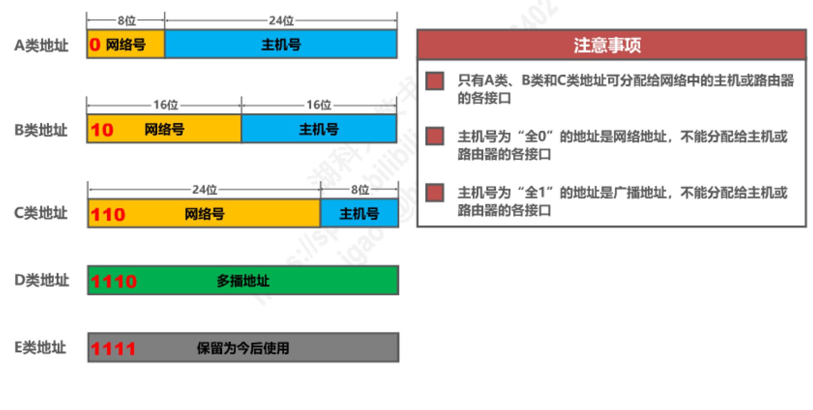
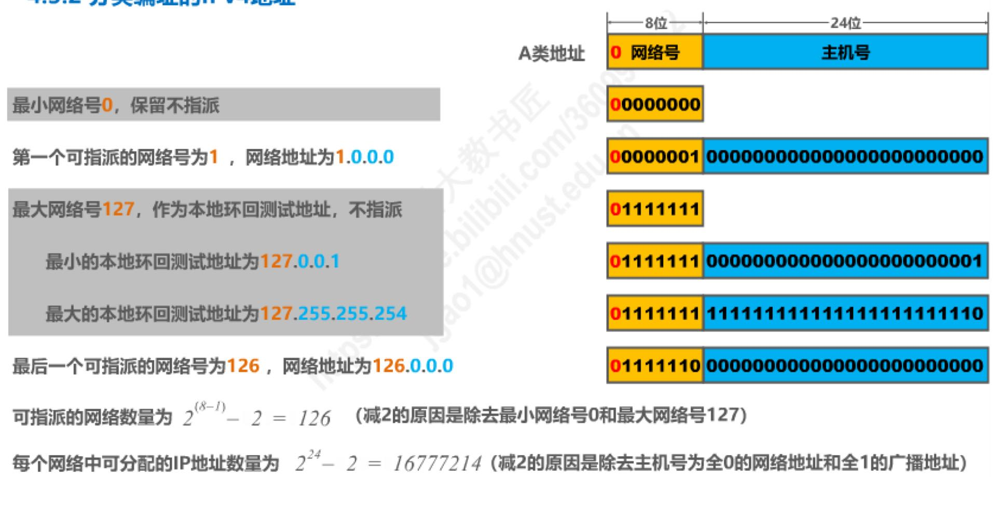
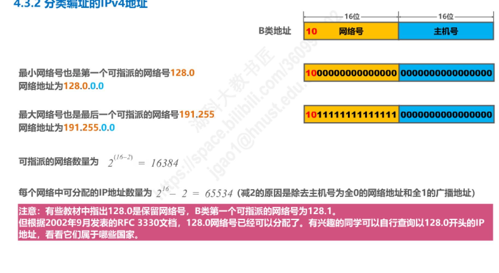
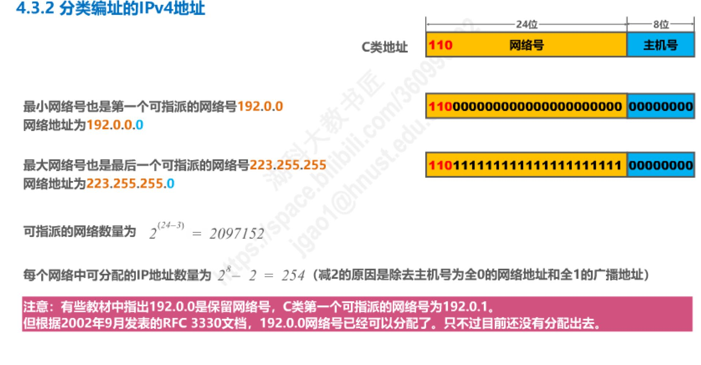
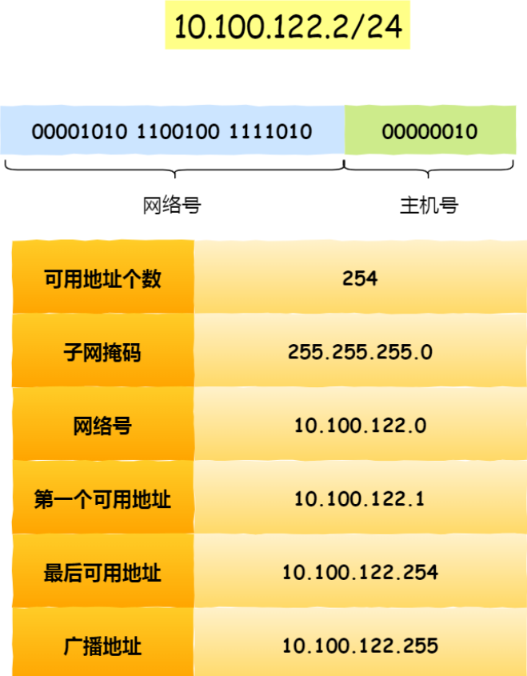
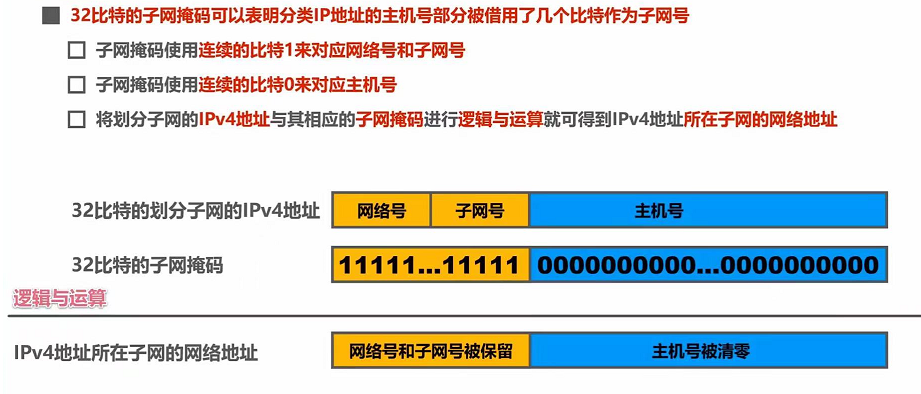
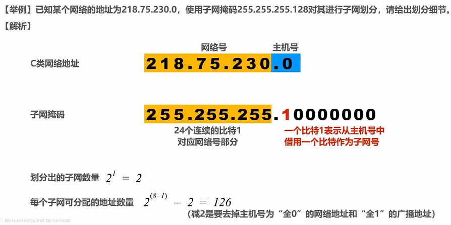
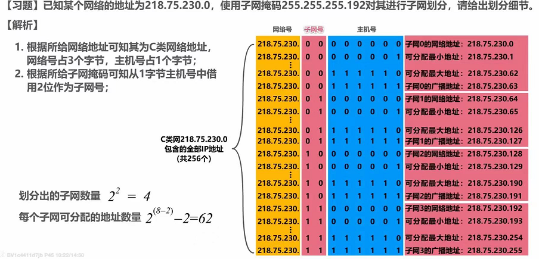
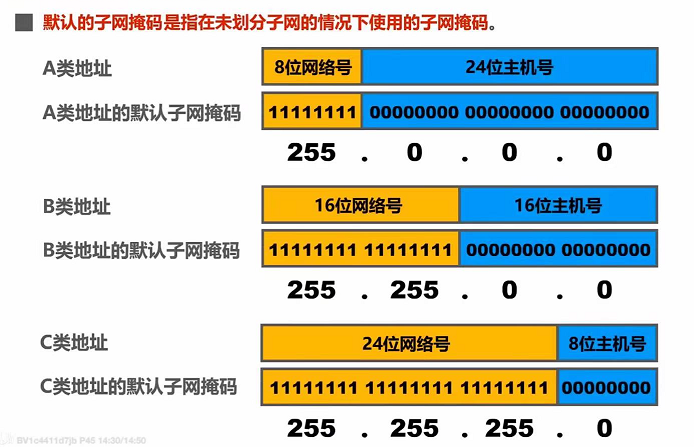

---
# 这是页面的图标
icon: page
# 这是侧边栏的顺序
order: 1
# 设置写作时间
date: 2022-08-09
tag:
  - IP
---
<!-- more -->

# IP

## 1.IP基础知识 

IP 在 TCP/IP 参考模型中处于第三层，也就是⽹络层。   

⽹络层的主要作⽤是：实现主机与主机之间的通信，也叫点对点（end to end）通信。     

IP（⽹络层） 和 MAC （数据链路层）之间的区别和关系  
  - MAC 的作⽤是实现**直连**的两个设备之间通信，⽽ IP 则负责在**没有直连**的两个⽹络之间进⾏通信传输   

在 TCP/IP ⽹络通信时，为了保证能正常通信，每个设备都需要配置正确的 IP 地址，否则⽆法实现正常的通信。    

IP 地址（IPv4 地址）由 32 位正整数来表示，IP 地址在计算机是以⼆进制的⽅式处理的。    

采⽤点分⼗进制的标记⽅式，也就是将 32 位 IP 地址以每 8 位为组，共分为 4 组，每组以`. `隔开，再将每组转换成⼗进制    

IP地址最大值也就是：2^32^=4294967296    

IP 地址并不是根据主机台数来配置的，⽽是以⽹卡。像服务器、路由器等设备都是有 2 个以上的⽹卡，也就是它们会有 2 个以上的 IP 地址。  

## 2.IP地址分类  

   

什么是 A、B、C 类地址:    

对于 A、B、C 类主要分为两个部分，分别是⽹络号和主机号

  

  

  

## 3.⽆分类地址 CIDR   

32 ⽐特的 IP 地址被划分为两部分，前⾯是⽹络号，后⾯是主机号。   

表示形式 a.b.c.d/x ，其中 /x 表示前 x 位属于⽹络号， x 的范围是 0 ~ 32 ，这就使得 IP 地址更加具有灵活性。  

⽐如 10.100.122.2/24，这种地址表示形式就是 CIDR，/24 表示前 24 位是⽹络号，剩余的 8 位是主机号。    

还有另⼀种划分⽹络号与主机号形式，那就是⼦⽹掩码，掩码的意思就是掩盖掉主机号，剩余的就是⽹络号。   

将⼦⽹掩码和 IP 地址按位计算 AND，就可得到⽹络号   

为什么要分离⽹络号和主机号？  

   - 判断两台计算机是否处于同一个广播域内，即网络地址是否相同，如果⽹络地址相同，表明接受⽅在本⽹络上，那么可以把数据包直接发送到⽬标主机   
   - 路由器寻址⼯作，也就是通过这样的⽅式来找到对应的⽹络号的，进⽽把数据包转发给对应的⽹络内   

怎么进⾏⼦⽹划分？   

  - 实际上是将主机地址分为两个部分：⼦⽹⽹络地址和⼦⽹主机地址
  - 未做⼦⽹划分的 ip 地址：⽹络地址＋主机地址  
  - 做⼦⽹划分后的 ip 地址：⽹络地址＋（⼦⽹⽹络地址＋⼦⽹主机地址）  

 

 

  

公有IP和私有IP  

- 公有 IP 地址由 ICANN 组织管理,保持唯一
- 私有IP不唯一，平时我们办公室、家⾥、学校⽤的 IP 地址，⼀般都是私有IP 地址。     

环回地址：  

>环回地址是在同⼀台计算机上的程序之间进⾏⽹络通信时所使⽤的⼀个默认地址。
计算机使⽤⼀个特殊的 IP 地址 127.0.0.1 作为环回地址。与该地址具有相同意义的是⼀个叫做 localhost 的主机
名。使⽤这个 IP 或主机名时，数据包不会流向⽹络。  

## 4.IP协议相关

### DNS  

上网的时候，通常使用的方式是域名不是IP地址，域名方便人记忆  

DNS域名解析可以将域名网址自动转换为IP地址     

DNS域名都是用句点来分隔的，越靠右的位置层级越高   

### 域名解析流程    
>类似问路过程，只指路不带路  

1. 浏览器首先看自己的缓存里有没有 ，没有就像操作系统的缓存要，再没有就检查本机域名解析文件hosts，还没有就会进行DNS服务查询    

2. 客户端首先发送一个DNS请求给本地DNS服务器（客户端的TCP/IP设置中填写的DNS服务器地址）   

3. 本地域名服务器收到请求后如果能在缓存中找到则直接返回IP地址，没有就会去问它的根域名服务器（最高层次，不直接用于域名解析），能指明道路  

4. 根DNS收到本地DNS请求后，会将相应的顶级域名服务器地址发给本地服务器，如www.server.com,将.com顶级域名服务器地址发送  
   
5. 本地DNS收到后，发起请求询问顶级域名服务器    

6. 顶级域名服务器将相应的权威DNS服务器地址发给本地服务器  

7. 本地服务器再询问权威DNS服务器相应的IP地址  

8. 权威DNS服务器查询后将对应IP地址告诉本地DNS  

9.  本地DNS再将IP地址返回客户端，客户端和目标建立连接  

### ARP
由于主机的路由表中可以找到下⼀跳的 IP 地址，所以可以通过 ARP 协议，求得下⼀跳的 MAC 地址。  