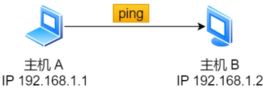

# ping

## ping原理

ping 是基于 ICMP 协议工作的，ICMP 报文是封装在 IP 包里面，它工作在网络层，是 IP 协议的助手。    

[ICMP协议](../IP/IP%E7%9B%B8%E5%85%B3%E5%8D%8F%E8%AE%AE.md)

  

## 查询报文类型    

回送消息用于主机或路由器之间判断数据包是否成功送达,ping利用这个消息实现   

可以向对端主机发送回送请求的消息`（ICMP Echo Request Message，类型 8）`，也可以接收对端主机发回来的回送应答消息`（ICMP Echo Reply Message，类型 0）`

## 差错报文类型  

几个常用的 ICMP 差错报文：

1. 目标不可达消息 —— 类型 为 3  
  - IP 路由器无法将 IP 数据包发送给目标地址   

|  | 目标不可达代码号 |
| :----:| :----: |
| 0 | 网络不可达 |
| 1 | 主机不可达 ：路由表中没有相应主机|
| 2 | 协议不可达 :对端主机的防火墙已经禁止 TCP 协议访问|
| 3 | 端口不可达:对端主机没有监听相应端口|
| 4 | 需要分片但设置不了分片 |    

2. 原点抑制消息 —— 类型 4   

缓和低速广域线路上的网络拥堵

3. 重定向消息 —— 类型 5   

路由器发现发送端主机使用了「不是最优」的路径发送数据，那么它会返回一个 ICMP 重定向消息给这个主机。  

4. 超时消息 —— 类型 11   

IP 包中有一个字段叫做 `TTL （Time To Live，生存周期）`  

它每经过一次路由器就会减 1，直到减到 0 时该 IP 包会被丢弃。此时路由器发送ICMP超时消息给发送端
 

 ## ping使用   

    

ping 命令执行的时候，源主机首先会构建一个 **ICMP 回送请求消息数据包**。   

ICMP 数据包内包含多个字段，最重要的是两个：   

- 类型，对于回送请求消息而言该字段为 8；
- 序号，主要用于区分连续 ping 的时候发出的多个数据包。     

每发出一个请求数据包，序号会自动加 1。为了能够计算往返时间 RTT，它会在报文的数据部分插入发送时间。    

  

- 由 ICMP 协议将这个数据包连同地址 192.168.1.2 一起交给 IP 层。IP 层将以 192.168.1.2 作为目的地址，本机 IP 地址作为源地址，协议字段设置为 1 表示是 ICMP 协议，再加上一些其他控制信息，构建一个 IP 数据包。     
- 接下来，需要加入 MAC 头。如果本地ARP映射表中没有目的IP地址的MAC地址，则发送ARP请求，查询 MAC 地址，获得 MAC 地址后，由数据链路层构建一个数据帧，目的地址是 IP 层传过来的 MAC 地址，源地址则是本机的 MAC 地址   
- 主机 B 收到这个数据帧后，检查MAC,IP,构建一个 ICMP 回送响应消息数据包，回送响应数据包的类型字段为 0，序号为接收到的请求数据包中的序号，然后再发送出去给主机 A   
- 规定的时候间内，源主机如果没有接到 ICMP 的应答包，则说明目标主机不可达   
- 源主机会检查，用当前时刻减去该数据包最初从源主机上发出的时刻，就是 ICMP 数据包的时间延迟。    

