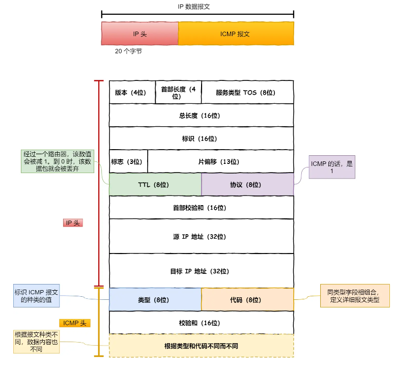

# ping相关  

ping 是基于 ICMP 协议工作的，ICMP 报文是封装在 IP 包里面，它工作在网络层，是 IP 协议的助手。    

[ICMP协议](../IP/IP%E7%9B%B8%E5%85%B3%E5%8D%8F%E8%AE%AE.md)

  

## 查询报文类型    

回送消息用于主机或路由器之间判断数据包是否成功送达,ping利用这个消息实现   

可以向对端主机发送回送请求的消息`（ICMP Echo Request Message，类型 8）`，也可以接收对端主机发回来的回送应答消息`（ICMP Echo Reply Message，类型 0）`

## 差错报文类型  

几个常用的 ICMP 差错报文：

1. 目标不可达消息 —— 类型 为 3  
  - IP 路由器无法将 IP 数据包发送给目标地址   

|  | 目标不可达代码号 |
| :----:| :----: |
| 0 | 网络不可达 |
| 1 | 主机不可达 ：路由表中没有相应主机|
| 2 | 协议不可达 :对端主机的防火墙已经禁止 TCP 协议访问|
| 3 | 端口不可达:对端主机没有监听相应端口|
| 4 | 需要分片但设置不了分片 |    

2. 原点抑制消息 —— 类型 4   

缓和低速广域线路上的网络拥堵

3. 重定向消息 —— 类型 5   

路由器发现发送端主机使用了「不是最优」的路径发送数据，那么它会返回一个 ICMP 重定向消息给这个主机。  

4. 超时消息 —— 类型 11   

IP 包中有一个字段叫做 `TTL （Time To Live，生存周期）`  

它每经过一次路由器就会减 1，直到减到 0 时该 IP 包会被丢弃。此时路由器发送ICMP超时消息给发送端

