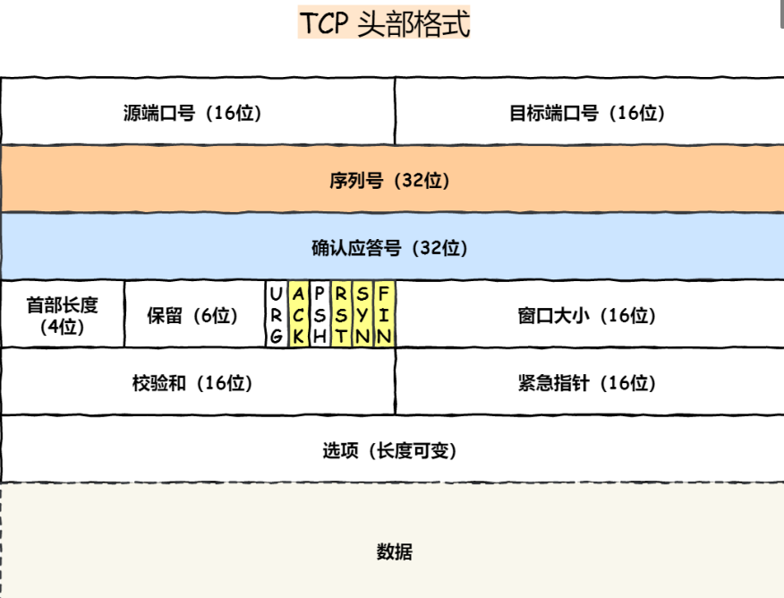
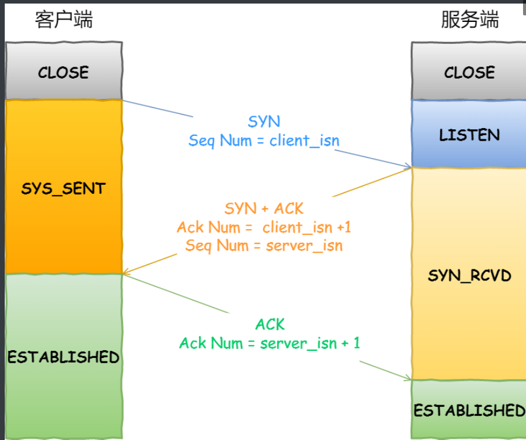
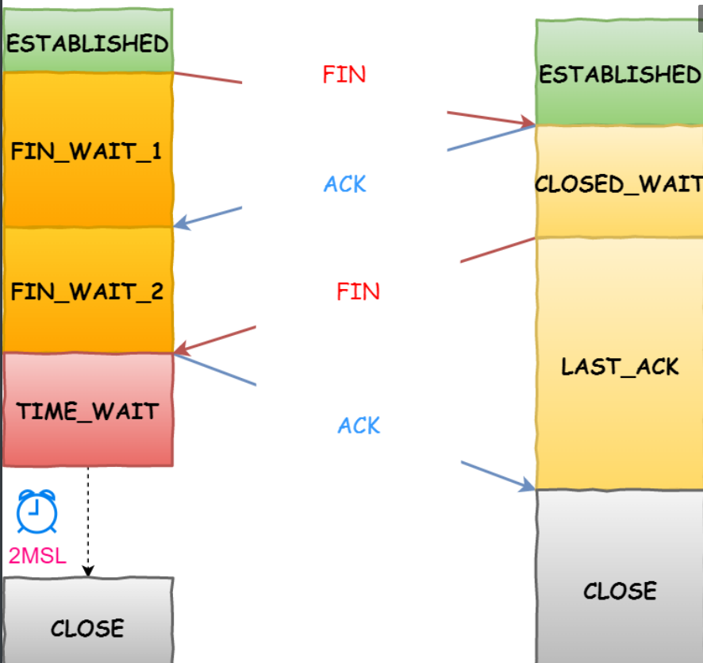

---
# 这是页面的图标
icon: page
# 这是侧边栏的顺序
order: 1
# 设置写作时间
date: 2022-08-06
tag:
  - TCP
---
<!-- more -->

# TCP

## 1.什么是TCP
TCP 是⾯向连接的、可靠的、基于字节流的`传输层`通信协议  

  - 面向连接：一对一。不能像UDP可以⼀个主机同时向多个主机发送消息  
  - 可靠的：⽆论的⽹络链路中出现了怎样的链路变化，TCP 都可以保证⼀个报⽂⼀定能够到达接收端  
  - 字节流：消息是「没有边界」的，⽆论消息有多⼤都可以进⾏传输，并且消息是「有序的」，当「前⼀个」消息没有收到的时候，即使它先收到了后⾯的字节，也不能扔给应⽤层去处理，  

## 2.如何唯⼀确定⼀个 TCP 连接  

TCP 四元组可以唯⼀的确定⼀个连接，四元组包括如下：
  - 源地址
  - 源端⼝
  - ⽬的地址
  - ⽬的端⼝   

有⼀个 IP 的服务器监听了⼀个端⼝，它的 TCP 的最⼤连接数是多少？  

服务器通常固定在某个本地端⼝上监听，等待客户端的连接请求。
因此，客户端 IP 和 端⼝是可变的  
>最大TCP连接数=客户端IP数×客户端端口数  

对于IPv4,客户端的 IP 数最多为 2^32^，客户端的端⼝数最多为 2^16^，也就是服务端单机最⼤TCP 连接数，约为 2^48^。 

## 3.TCP和UDP
1. 连接
     - TCP 是⾯向连接的传输层协议，传输数据前先要建⽴连接。类似打电话，需要对方接通。
     - UDP 是不需要连接，即刻传输数据。类似于写信，写就行了

2. 服务对象
     - TCP是一对一两点服务,需要连接
     - UDP支持一对一，一对多，多对多交互通信

3. 可靠性
     - TCP 是可靠交付数据的，数据可以⽆差错、不丢失、不重复、按需到达。
     - UDP 是尽最⼤努⼒交付，不保证可靠交付数据。  

4. 拥塞控制、流量控制
     - TCP 有拥塞控制和流量控制机制，保证数据传输的安全性。
     - UDP 没有，即使⽹络⾮常拥堵了，也不会影响 UDP 的发送速率。  

5. ⾸部开销
     - TCP ⾸部⻓度较⻓，⾸部在没有使⽤「选项」字段时是 20 个字节，如果使⽤了「选项」字段则会变⻓的。
     - UDP ⾸部只有 8 个字节，并且是固定不变的，开销较⼩。  

6. 传输⽅式
     - TCP 是流式传输，没有边界，但保证顺序和可靠。面向字节流
     - UDP 是对应用层交付的报文直接打包，⼀个包⼀个包的发送，是有边界的，但可能会丢包和乱序     

为什么UDP 头部没有「⾸部⻓度」字段，⽽ TCP 头部有「⾸部⻓度」字段
  - 原因是 TCP 有可变⻓的「选项」字段，⽽ UDP 头部⻓度则是不会变化的，⽆需多⼀个字段去记录 UDP 的⾸部⻓度

## 4.TCP和UDP应用场景
1. TCP面向连接，能保证数据的可靠性交付，常用于
      - FTP 文件传输
      - HTTP/HTTPS

2. UDP无连接，可以随时发送数据，处理数据简单高效
      - 视频，音频等多媒体通信
      - 广播通信
      - 域名查询
      - 隧道网络，比如：vpn,VXLAN.

   
## 5.TCP连接建立

### 5.1 TCP 三次握⼿
  TCP通过三次握手建立连接 ,刚开始客户端处于 Closed 的状态，服务端处于 Listen 状态，主动监听某个端口  
   1. 客户端随机初始化序列号（`client_isn`)填入TCP首部,把`SYN`置为1，表示SYN报文，接着把第一个SYN报文发给服务端，表示发起连接，该报文不包含应用层数据，之后客户端处于`SYN-SENT`状态   

   2. 服务端收到后，首先也会随机初始化自己的序列号（`server_isn`) ,填入TCP首部,把TCP首部`确认应答号`填入`client_isn+1`,再把 `SYN `和`ACK` 标志位置为 1，最后把该报⽂发给客户端，该报⽂也不包含应⽤层数据，之后服务端处于 `SYN-RCVD`状态。

   3. 客户端收到后，还要发送一个应答报文，⾸先该应答报⽂ TCP ⾸部 `ACK `标志位置为1，其次 `确认应答号` 字段填⼊` server_isn + 1`,最后把报⽂发送给服务端，这次报⽂可以携带客户到服务器的数据，之后客户端处于 `ESTABLISHED `状态。  

   4. 服务器收到客户端的应答报⽂后，也进⼊ `ESTABLISHED` 状态    

>第三次握⼿是可以携带数据，前两次握⼿是不可以携带数据

  

TCP 的连接状态查看，在 Linux 可以通过 netstat -napt 命令查看。  

为什么是三次？不是四次，两次？  

1. 三次握⼿才可以阻⽌重复历史连接的初始化（主要原因）
    - 当第二次握手客户端收到SYN+ACK报文后，根据自身上下文判断是一个历史连接（序列号过期或者超时），客户端会通过第三次握手发送RST报文给服务端终止此次连接，显然两次握手不能判断当前连接是否是历史连接  

2. 三次握⼿才可以同步双⽅的初始序列号  
    -  两次握手只保证了一方的序列号能被对方接收，没办法保证双⽅的初始序列号都能被确认接收。  
    -  四次握⼿其实也能够可靠的同步双⽅的初始化序号，但第⼆步和第三步可以优化成⼀步  

3. 三次握⼿才可以避免资源浪费
    - 两次握手。客户端SYN阻塞时，没有接受到ACK会重发，此时服务器响应SYN+ACK建立连接，
    - 一段时间后被阻塞的SYN报文到达，此时服务器不清楚客户端是否收到ACK确认信号，所以只能建立连接
    - 所以如果客户端的 SYN 阻塞了，重复发送多次 SYN 报⽂，那么服务器在收到请求后就会建⽴多个冗余的⽆效链接，造成不必要的资源浪费。

为什么客户端和服务端的初始序列号 ISN 是不相同：    

  - 如果序列号相同，⽆法分辨出该报⽂是不是历史报⽂，如果历史报⽂被新的连接接收了，则会产⽣数据错乱。  
  - 为了安全性，防⽌⿊客伪造的相同序列号的 TCP 报⽂被对⽅接收  

## 6.TCP连接断开

### 6.1 TCP四次挥手  

双⽅都可以主动断开连接，断开连接后主机中的「资源」将被释放。

 

1. 客户端打算关闭连接，会发送⼀个 TCP ⾸部 `FIN `标志位被置为 1 的报⽂，也即 `FIN` 报⽂，之后客户端进⼊ `FIN_WAIT_1 `状态。

2. 服务端收到该报⽂后，就向客户端发送 `ACK` 应答报⽂，接着服务端进⼊ `CLOSED_WAIT `状态  

3. 客户端收到服务端的 `ACK `应答报⽂后，之后进⼊` FIN_WAIT_2` 状态。

4. 等待服务端处理完数据后，也向客户端发送 `FIN `报⽂，之后服务端进⼊` LAST_ACK` 状态。  

5. 客户端收到服务端的 `FIN` 报⽂后，回⼀个 `ACK` 应答报⽂，之后进⼊ `TIME_WAIT `状态  

6. 服务器收到了` ACK `应答报⽂后，就进⼊了` CLOSED` 状态，⾄此服务端已经完成连接的关闭。

7. 客户端在经过 `2MSL `(报文最大生存时间）⼀段时间后，⾃动进⼊ `CLOSED `状态，⾄此客户端也完成连接的关闭  

>每个⽅向都需要⼀个 FIN 和⼀个 ACK,主动关闭连接的，才有 TIME_WAIT 状态。  

为什么挥⼿需要四次:   

  - 关闭连接时，客户端向服务端发送 FIN 时，仅表示客户端不再发送数据了但是还能接收数据。  
  - 服务器收到客户端的 FIN 报⽂时，先回⼀个 ACK 应答报⽂，⽽服务端可能还有数据需要处理和发送,等服务端不再发送数据时，才发送 FIN 报⽂给客户端来表示同意现在关闭连接    
  - 服务端通常需要等待完成数据的发送和处理，所以服务端的 ACK 和 FIN ⼀般都会分开发送，从⽽⽐三次握⼿导致多了⼀次  

为什么需要 TIME_WAIT 状态   

   -  防⽌旧连接的数据包
       - 没有TIME_WAIT,有相同端⼝的 TCP 连接被复⽤后, 客户端可能会接收被延迟的数据包 ，产生数据错乱
   -  保证连接正确关闭 
       - 最后⼀个 ACK 报⽂如果在⽹络中被丢失了，此时TIME-WAIT 没有等待时间或时间过短，直接进入CLOSED状态，那么服务端则会⼀直处在 LASE_ACK 状态，阻止下一次连接    

## 7.TCP重传机制
1. 超时重传   
 - 在发送数据时，设定⼀个定时器，当超过指定的时间后，没有收到对⽅的 ACK 确认应答报⽂，就会重发该数据。
 - 数据包丢失或确认应答丢失会发生超时重传

2. SACK ⽅法

