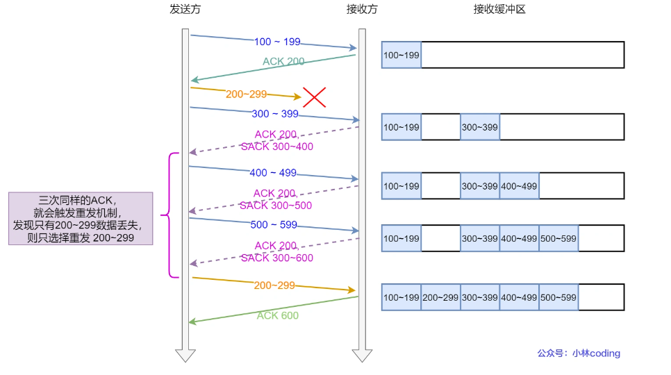
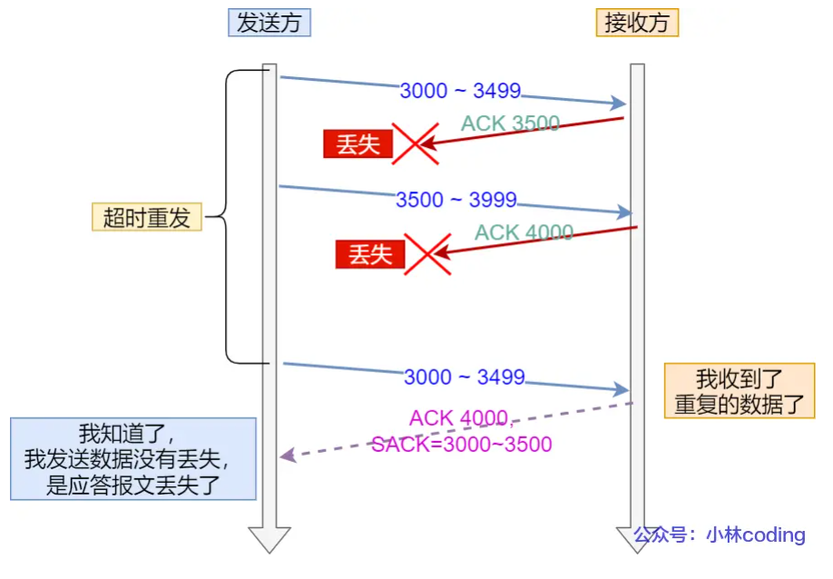
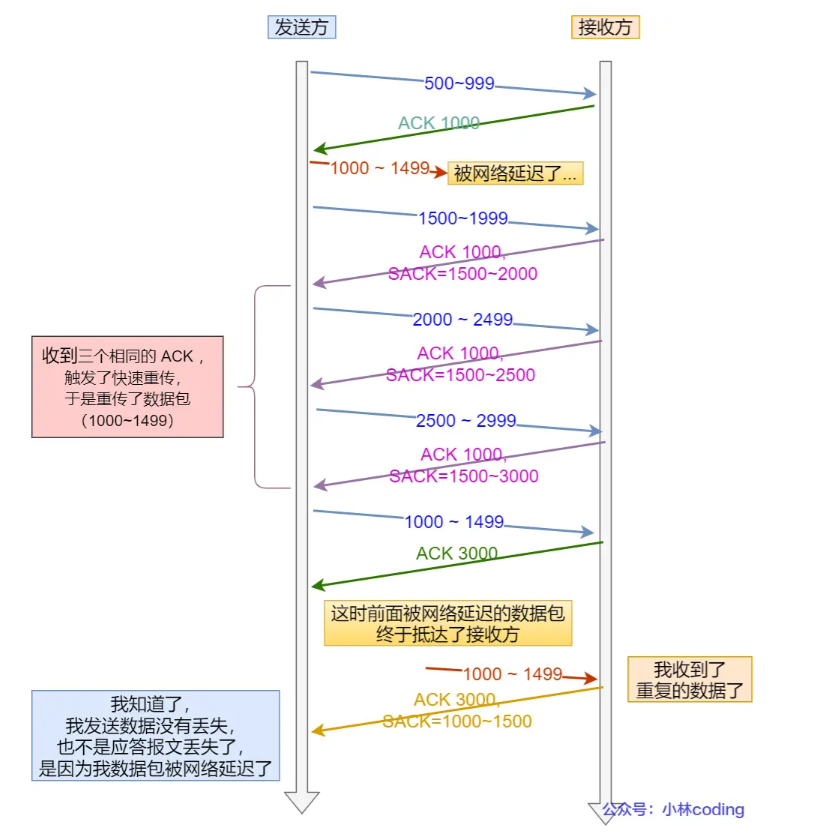

# TCP重传机制，拥塞控制...

## TCP重传机制  
### 超时重传   
 - 在发送数据时，设定⼀个定时器，当超过指定的时间后，没有收到对⽅的 ACK 确认应答报⽂，就会重发该数据。
 - 数据包丢失或确认应答报文丢失会发生超时重传   

超时时间设置（RTO）：  

RTT:RTT 指的是数据发送时刻到接收到确认的时刻的差值，也就是包的往返时间    

- RTO较短时，可能会导致没有丢包就重传，增加网络拥塞  
- RTO较长时，重发就慢，效率低，性能差  

RTO应略大于RTT   

报文往返 RTT 的值是经常变化的，因为我们的网络也是时常变化的。也就因为「报文往返 RTT 的值」 是经常波动变化的，所以超时重传时间 RTO 的值应该是一个动态变化的值。   

### 快速重传   
不以时间为驱动，以数据为驱动  

发送1，2，3，4，5数据包  

当数据包中有一个没有成功到达时（比如seq2)，接收方（收到seq1,返回ACK2)在收到其他数据包后会持续返回上一个ACK(ACK2），发送方收到连续几个相同的ACK后，就会在定时器过期之前，重传丢失的 Seq2。  

快速重传机制只解决了一个问题，就是超时时间的问题，但是它依然面临着另外一个问题。就是重传的时候，是重传一个，还是重传所有的问题。  

- 当seq2，seq3都丢失时，接收方在收到 Seq4、Seq5时，都是回复 ACK2 给发送方，但是发送方并不清楚这连续的 ACK2 是接收方收到哪个报文而回复的， 那是选择重传 Seq2 一个报文，还是重传 Seq2 之后已发送的所有报文
   - 只选择重传 Seq2 一个报文，后续收到三个重复的ACK3才触发重传，效率低
   - 重传 Seq2 之后已发送的所有报文，虽然能同时重传已丢失的 Seq2 和 Seq3 报文，但是 Seq4、Seq5的报文是已经被接收过了，浪费资源。

解决这些问题可以用sack方法  

### SACK ⽅法   
  - 在 TCP 头部「选项」字段⾥加⼀个 SACK ,它可以将已经收到的数据信息发给发送⽅，这样发送⽅就可以知道哪些数据收到了，哪些数据没收到，知道了这些信息，就可以只重传丢失的数据。  

   

使用这个方法需两方都支持  

### Duplicate SACK   
又称 D-SACK，其主要使用了 SACK 来告诉「发送方」有哪些数据被重复接收了。   

1. ACK丢报时  
  - 接收方给发送方的ACK确认应答丢失,发送方超时后，重传第一个数据包（3000 ~ 3499）  
  - 接收方收到后发现已经收到过了，于是回了一个 SACK = 3000~3500，告诉发送方  
  - 发送方收到后就知道是ACK丢了，数据没丢  

  

2. 网络延迟时   
  - 发送方数据包被网络延迟，导致发送方没有收到ACK确认报文  
  - 后面报文到达的三个相同的 ACK 确认报文，就触发了快速重传机制，但是在重传后，被延迟的数据包（1000~1499）又到了接收方  
  - 接收方回一个 SACK=1000~1500，因为 ACK 已经到了 3000，所以这个 SACK 是 D-SACK，表示收到了重复的包。  
  - 发送方就知道快速重传触发的原因不是发出去的包丢了，也不是因为回应的 ACK 包丢了，而是因为网络延迟了   

    

D-SACK优点：  
- 可以让发送方知道是发送出去的包丢了，还是ACK丢了   
- 可以知道发送的数据包是不是被网络延迟了  

## 滑动窗口  

TCP每发送一个数据，都要进行一次确认应答，上一个数据包收到应答后，再发送下一个，往返时间越长，通信效率越低      

TCP 引入窗口这个概念。在往返时间较长的情况下，也不会降低网络通信的效率。    

- 累计确认（累计应答）:   
假设窗口大小为3个TCP段，发送方可以连续发送3个TCP数据包，若其中有一个ACK丢失，可以通过下一个确认应答报文来确认    
比如发送方发送400-499,500-599,600-699,三个数据包，ACK600丢失，但是收到了ACK700, 说明700 之前的所有数据接收方都收到了    

### 窗口大小  

1. 窗口大小：指无需等待确认应答，而可以继续发送数据的最大值。  

窗口的实现实际是操作系统开辟一个缓冲区，发送方把已发送的数据保存在缓冲区中，当按期收到确认应答报文后，再将数据从缓存清除  

2. TCP 头里有一个字段叫 Window，也就是窗口大小。  

>这个字段是接收端告诉发送端自己还有多少缓冲区可以接收数据。于是发送端就可以根据这个接收端的处理能力来发送数据，而不会导致接收端处理不过来。  

所以，通常窗口的大小是**由接收方的窗口大小来决定**的。   

发送方发送的数据大小不能超过接收方的窗口大小，否则接收方就无法正常接收到数据。   

### 发送方滑动窗口    

