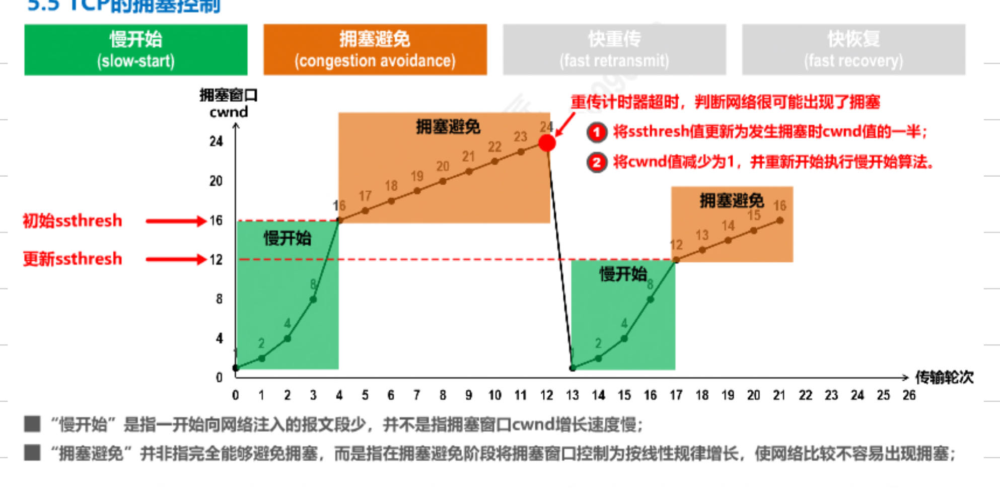
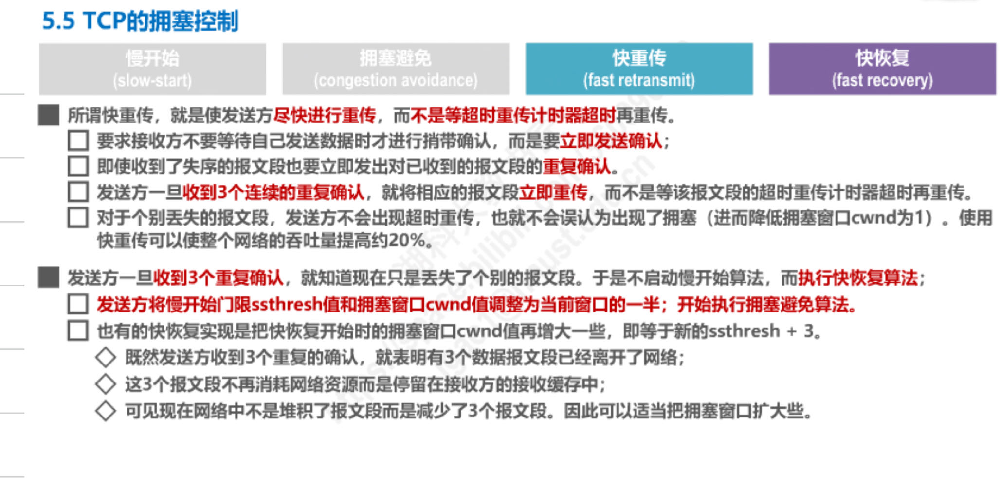
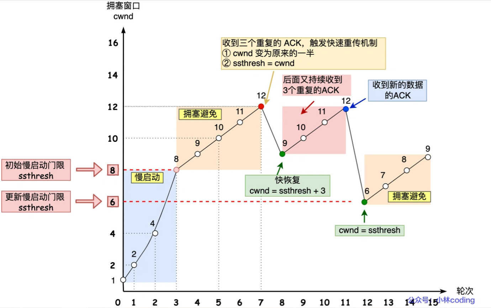

# 拥塞控制

>在网络出现拥堵时，避免发送方数据填满网络  

## 拥塞窗口  

>拥塞窗口是发送方维护的状态变量，根据网络拥塞程度动态变化 

发送窗口 swnd 和接收窗口 rwnd 是约等于的关系，由于加入了拥塞窗口的概念后，此时发送窗口的值是swnd = min(cwnd, rwnd)，是拥塞窗口和接收窗口中的最小值   

<b>发生了超时重传，就会认为网络出现了拥塞。</b>

## 拥塞控制算法  

### 慢启动

>发送方每收到一个ACK, cwnd + 1 ,一点一点的提高发送数据包的数量   

有一个叫慢启动门限 `ssthresh （slow start threshold）`状态变量。  

- 当 cwnd < ssthresh 时，使用慢启动算法。
- 当 cwnd >= ssthresh 时，就会使用拥塞避免算法  

假定swnd = cwnd
- 连接建立完成后，一开始初始化 cwnd = 1，表示可以传一个 MSS 大小的数据
- 收到一个ACK后，cwnd + 1,一次能发2个
- 收到两个ACK,每收到一个ACK加一，cwnd + 2，于是一次能发4个
- 收到四个ACK，cwnd + 4,一次能发8个

>慢启动算法，发包个数是指数性增长  

### 拥塞避免   

当拥塞窗口 cwnd 超过慢启动门限 ssthresh 就会进入拥塞避免算法。   

拥塞避免算法是将原本慢启动算法的指数增长变成了线性增长，还是增长阶段，但是增长速度缓慢了一些   

它的规则是：<b>每当收到一个 ACK 时，cwnd 增加 1/cwnd</b>

接上前面的慢启动的栗子，现假定 ssthresh 为 8：

当 8 个 ACK 应答确认到来时，每个确认增加 1/8，8 个 ACK 确认 cwnd 一共增加 1，于是这一次能够发送 9 个 MSS 大小的数据，变成了线性增长。   

### 拥塞发生  

当网络出现拥塞，也就是会发生数据包重传，重传机制主要有两种：  

- 超时重传
- 快速重传

>发生超时重传使用拥塞发生算法: 

ssthresh 和 cwnd 的值会发生变化：   

ssthresh 设为 cwnd/2，  
cwnd 重置为 1 （是恢复为 cwnd 初始化值，假定 cwnd 初始化值 1  

接着，就重新开始慢启动，慢启动是会突然减少数据流的。一旦「超时重传」，马上回到解放前。但是这种方式太激进了，反应也很强烈，会造成网络卡顿      

>发生快速重传的拥塞发生算法   

快速重传算法: 当接收方发现丢了一个中间包的时候，发送三次前一个包的 ACK，于是发送端就会快速地重传，不必等待超时再重传。  

TCP 认为这种情况不严重，因为大部分没丢，只丢了一小部分，则 ssthresh 和 cwnd 变化如下：

cwnd = cwnd/2 ，也就是设置为原来的一半;   
ssthresh = cwnd;   

进入快速恢复算法  

### 快速恢复  

快速重传和快速恢复算法一般同时使用   

进入快速恢复算法如下：   

拥塞窗口 cwnd = ssthresh + 3 （ 3 的意思是确认有 3 个数据包被收到了）；  
重传丢失的数据包；    
如果再收到重复的 ACK，那么 cwnd 增加 1；   
如果收到新数据的 ACK 后，把 cwnd 设置为第一步中的 ssthresh 的值，原因是该 ACK 确认了新的数据，说明从 duplicated ACK 时的数据都已收到，该恢复过程已经结束，可以回到恢复之前的状态了，也即再次进入拥塞避免状态     

