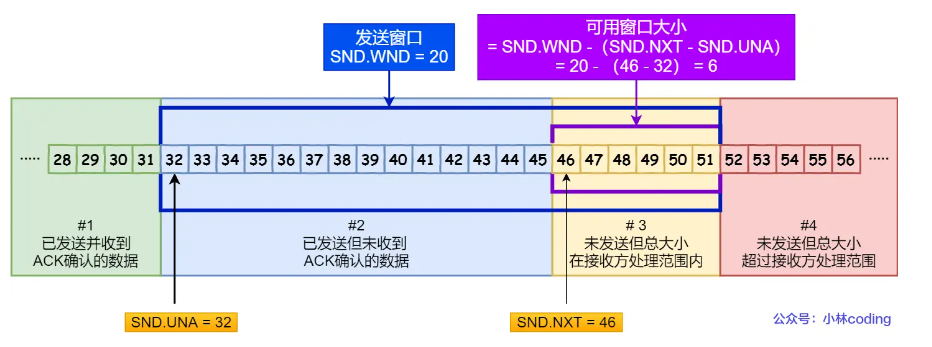
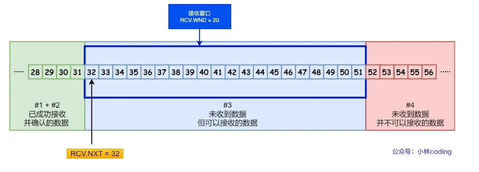

# 滑动窗口  

TCP每发送一个数据，都要进行一次确认应答，上一个数据包收到应答后，再发送下一个，往返时间越长，通信效率越低      

TCP 引入窗口这个概念。在往返时间较长的情况下，也不会降低网络通信的效率。    

- 累计确认（累计应答）:   
假设窗口大小为3个TCP段，发送方可以连续发送3个TCP数据包，若其中有一个ACK丢失，可以通过下一个确认应答报文来确认    
比如发送方发送400-499,500-599,600-699,三个数据包，ACK600丢失，但是收到了ACK700, 说明700 之前的所有数据接收方都收到了    

## 窗口大小  

1. 窗口大小：指无需等待确认应答，而可以继续发送数据的最大值。  

窗口的实现实际是操作系统开辟一个缓冲区，发送方把已发送的数据保存在缓冲区中，当按期收到确认应答报文后，再将数据从缓存清除  

2. TCP 头里有一个字段叫 Window，也就是窗口大小。  

>这个字段是接收端告诉发送端自己还有多少缓冲区可以接收数据。于是发送端就可以根据这个接收端的处理能力来发送数据，而不会导致接收端处理不过来。  

所以，通常窗口的大小是**由接收方的窗口大小来决定**的。   

发送方发送的数据大小不能超过接收方的窗口大小，否则接收方就无法正常接收到数据。   

## 发送方窗口    

  

- SND.WND：表示发送窗口的大小（大小由接收方指定）；    

- SND.UNA（Send Unacknoleged）：是一个绝对指针，指向的是已发送但未收到确认的第一个字节的序列号，也就是 #2 的第一个字节。  

- SND.NXT：也是一个绝对指针，它指向未发送但可发送范围的第一个字节的序列号，也就是 #3 的第一个字节。   

- 指向 #4 的第一个字节是个相对指针，它需要 SND.UNA 指针加上 SND.WND 大小的偏移量，就可以指向 #4 的第一个字节了。  

## 接收方窗口   

   

- RCV.WND：表示接收窗口的大小，它会通告给发送方。   
- RCV.NXT：是一个指针，它指向期望从发送方发送来的下一个数据字节的序列号，也就是 #3 的第一个字节。   
- 指向 #4 的第一个字节是个相对指针，它需要 RCV.NXT 指针加上 RCV.WND 大小的偏移量，就可以指向 #4 的第一个字节了。  

>接收窗口的大小是约等于发送窗口的大小,接收方的应用进程读取数据的速度非常快的话，接收窗口可以很快的就空缺出来。那么新的接收窗口大小，是通过 TCP 报文中的 Windows 字段来告诉发送方。     

