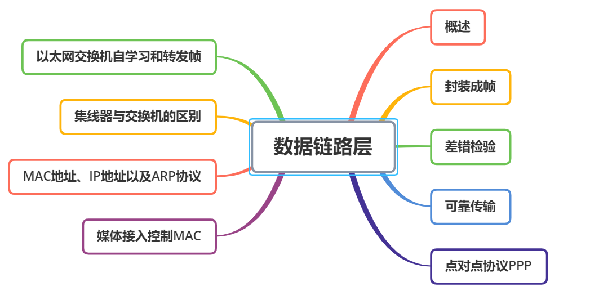

# 计算机网络

## 计算机网络概述

 
 网络:由若干结点和连接这些结点的链路组成；

 互联网：internet通用名词，许多网络连接一起，多个网络可以通过路由器互连起来；

 因特网：Internet专用名词,全球最大的一个互联网

 局域网：自己购买设备 自己维护 带宽固定 100M 1000M 
 广域网：花钱买服务，花钱买带宽

 因特网服务提供者(ISP)(Internet Service Provider)
   
## OSI
7层模型及各自功能：
- 应用层：提供给应用程序的接口（HTTP/FTP/DNS)
- 表示层：数据格式标识，基本压缩加密功能。
- 会话层：控制应用程序之间会话能力；如不同软件数据分发给不同软件。
- 传输层：端到端传输数据的基本功能；如 TCP、UDP。
- 网络层：进行逻辑地址寻址，实现不同网络之间的路径选择
- 数据链路层：建立逻辑连接，进行硬件寻址，差错校验等功能，如网卡MAC地址。
- 物理层：如何把数据包通过网卡在网线中传输

### 物理层

#### 奈氏准则
1. 理想低通信道的最高码元传输速率=2W Baud=2W 码元/秒
2. 理想带通信道德最高码元传输速率=W Baud=W 码元/秒
3. 波特率与比特率
  - 码元传输速率又称为波特率，调制速率，波形速率，符号速率
  - 当一个码元只携带一比特信息量时，波特率比特率数值上相等
  - 当一个码元只携带n比特信息量时，波特率转换为特率数值上× n
#### 香农准则
1. 信道的极限传输速率
   c=W×log2^(1+S/N)^
   - c:信道的极限信息传输速率(b/s)
   - W:信道带宽Hz
   - S:信道内所传输信号的平均功率
   - N:高斯噪声功率
   - S/N:信噪比 dB=10×log10^(S/N)^

### 数据链路层 

   