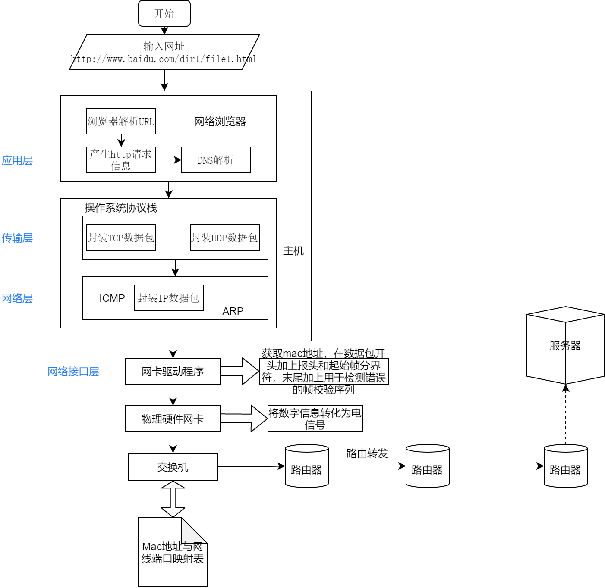
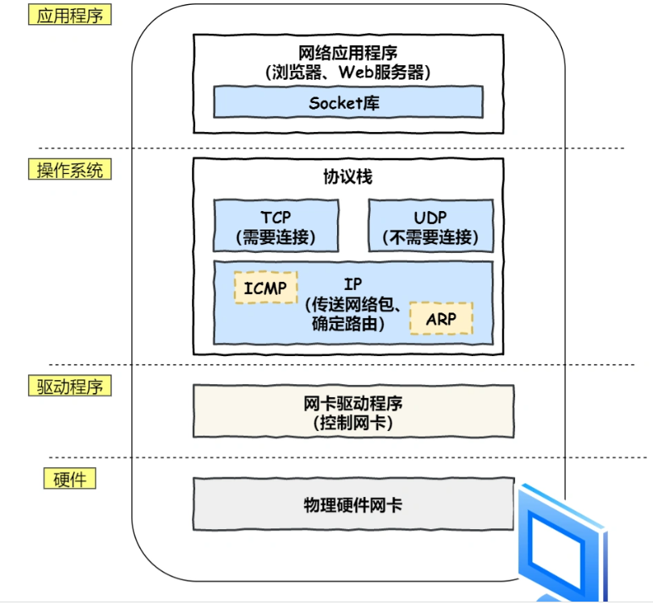
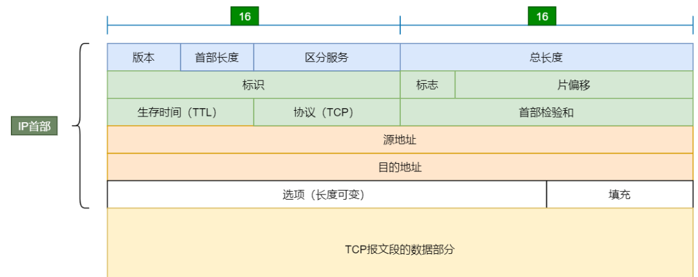
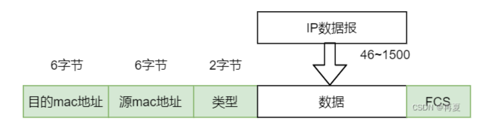
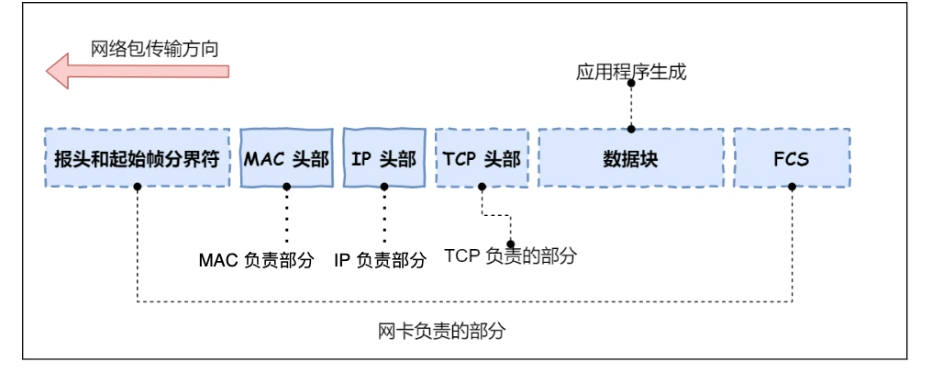

# 输入网址到网页显示过程    

大致流程如下   

   

## HTTP  

>浏览器首先解析URL    

[URL组成](../other/other.md)    

对 URL 进行解析之后，浏览器确定了 Web 服务器和文件名，接下来就根据这些信息来生成 HTTP 请求消息。   

## DNS   

浏览器解析 URL 并生成 HTTP 消息后，需要委托操作系统将消息发送给 Web 服务器。

在发送之前，需要查询服务器域名对应的 IP 地址      

>DNS服务器保存了web服务器域名与IP地址之间的一一对应关系   

[DNS域名解析](../IP/IP相关协议.md)     

## 协议栈   

通过 DNS 获取到 IP 后，就可以把 HTTP 的传输工作交给操作系统中的协议栈。     

协议栈上面的部分会向下面部分委托工作，下面的部分收到委托并执行     

应用程序调用Socket库，TCP,UDP协议接收应用层委托执行收发数据操作    

协议栈的下面一半是用 IP 协议控制网络包收发操作，在互联网上传数据时，数据会被切分成一块块的网络包，而将网络包发送给对方的操作就是由 IP 负责的     

[IP相关协议](../IP/IP相关协议.md)   

IP 下面的网卡驱动程序负责控制网卡硬件，而最下面的网卡则负责完成实际的收发操作，对网线中的信号执行发送和接收操作       

   

## TCP  

[TCP建立连接](../TCP/TCP基础知识.md)     

TCP 协议里面会有两个端口，一个是浏览器监听的端口（通常是随机生成的），一个是 Web 服务器监听的端口（HTTP 默认端口号是 80， HTTPS 默认端口号是 443）。   

双方建立连接后，TCP数据部分存放HTTP头部和数据，组装好后交给网络层处理     

## IP     

>TCP模块在执行连接、收发、断开等各阶段操作时，都需要委托IP模块将数据封装成网络包发送给通信对象。   

IP数据包格式：   

    

>存在多个网卡时,需要根据路由表规则，来判断哪一个网卡作为源地址 IP。将web服务器目标地址与子网掩码进行&运算，得到结果与路由表对比     

## MAC   

>生成IP报文后，需要在IP头部加上MAC头部   
>在 MAC 包头里需要发送方 MAC 地址和接收方目标 MAC 地址，用于两点之间的传输。     

   

发送方的 MAC 地址是在网卡生产时写入到 ROM 里的，只要将这个值读取出来写入到 MAC 头部就可以了    

接收方MAC地址：发送方先在路由表中找到接收方IP地址，在通过ARP协议(发包时先查询 ARP 缓存)获取接收方MAC地址     

[ARP协议](../IP/IP相关协议.md)    

一般在 TCP/IP 通信里，MAC 包头的协议类型只使用：   

0800 ： IP 协议   
0806 ： ARP 协议    

## 出口-网卡  

网卡负责将网络包的数字信息转换为电信号，电信号才能在网线上传输   

控制网卡还需要靠网卡驱动程序。   

网卡驱动获取网络包之后，会将其复制到网卡内的缓存区中，接着会在其开头加上报头和起始帧分界符，在末尾加上用于检测错误的帧校验序列。    

    

- 起始帧分界符是一个用来表示包起始位置的标记  
- 末尾的 FCS（帧校验序列）用来检查包传输过程是否有损坏   

## 交换机   

