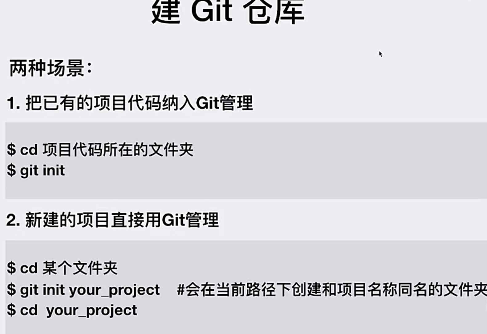
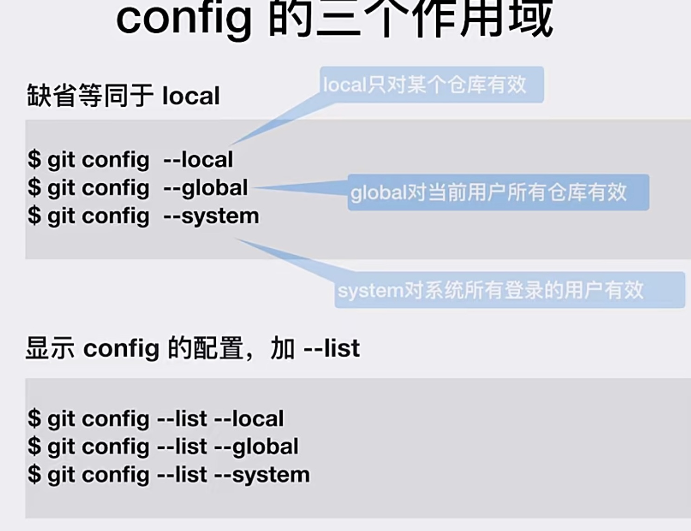
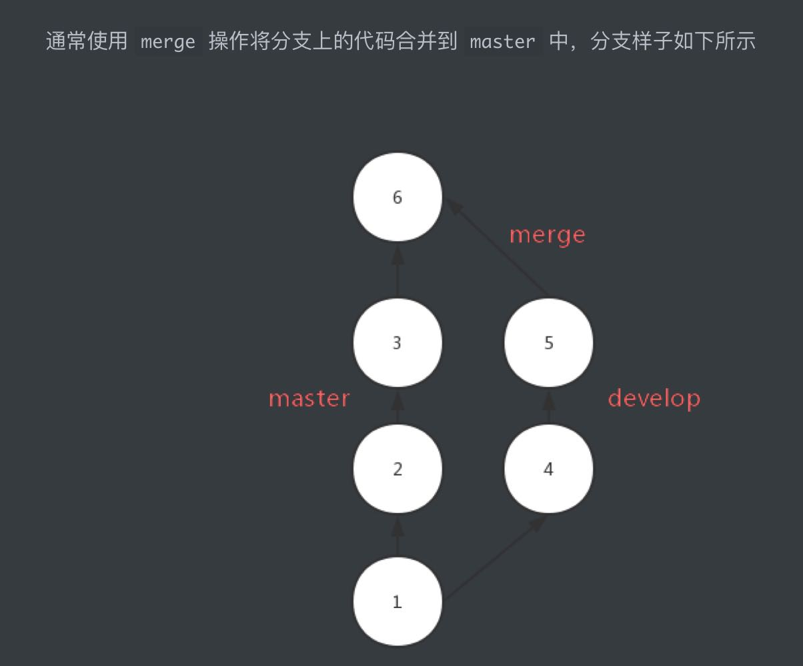
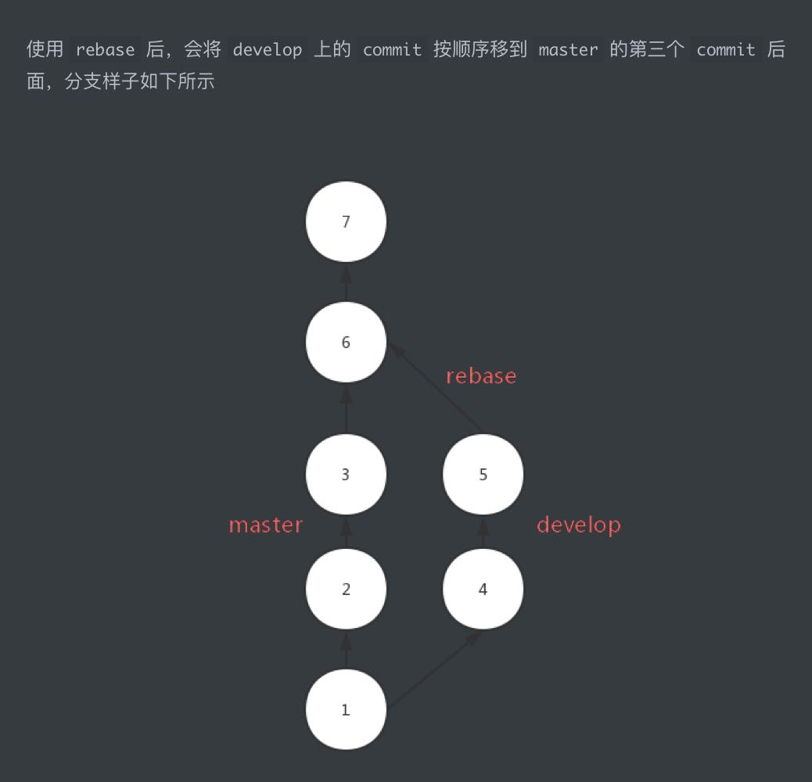

# git

在线学习网站：<https://learngitbranching.js.org/>  

## 1.git基础操作  

Git 工具在Linux 上是集成的，只要cmd命令行执行 sudo apt-get install git-core 命令即可。

Windows 系统需要到 <https://git-for-windows.github.io/> 进行下载即可   

    


### 1.1 创建提交用户名和邮箱

```sh
git config --global user.name "Tony"

git config --global user.email "tony@gmail.com"   
```  
 
    

### 1.2 创建本地仓库

进入指定文件夹鼠标右键单击选中 `Git Base Here` 执行如下语句：

```sh
git init 
```

### 1.3 添加暂存区 

```sh
#将当前目录及其子目录下所有变更添加到暂存区 （ 注意不要忽略 “ . ”）
 git add . 
#将本地库所有变更添加到暂存区
git add -A       
#指定文件添加暂存区
git add file1 file2 ...   
```

### 1.4 提交到本地仓库

```sh
#提交所有变更
git commit
# or
git commit -m '日志信息' -a  

#提交当前目录及其子目录的变更
git commit -m '日志信息' .  

#提交指定文件
git commit -m '日志信息' fileName

```

## 2.分支操作

### 2.1 创建分支

```sh
#基于当前分支创建分支
git branch 新分支  

#基于指定分支创建分支
git branch 新分支 已有分支

#基于某个 commit 创建分支
git branch 新分支 commitID

#基于当前分支创建分支并切换到新分支
git checkout -b 新分支

```

### 2.2 查看本地分支

```sh
git branch -v
```

### 2.3 删除分支

```sh
#安全删除本地分支
git branch -d 分支  

#强制删除本地分支
git branch -D 分支

```

### 2.3 切换分支

```sh
git checkout 分支名
```

### 2.4 合并分支

#### merge
```sh
#将 A 分支合并到当前分支，且为 merge 创建 commit
git merge A  

#将 A 分支合并到 B 分支，且为 merge 创建 commit
git merge A B
```

#### rebase

```sh
#当前分⽀基于 B 分⽀做 rebase，以便把 B 分⽀合⼊到当前分⽀
git rebase B

#把 A 分⽀基于 B 分⽀做 rebase，以便把 B 分⽀合⼊到 A 分⽀
git rebase B A
```

#### 区别

  

  

`rebase`对比`merge`,优势在于合并后的结果很清晰，只有一条线，劣势在于如果一旦出现冲突，解决会很麻烦，但是`merge`出现冲突只需要解决一次

使用`rebase`应该在需要被`rebase`的分支上操作，并且该分支是本地分支，如果`develop`分支需要`rebase`到`master`上去，应该如下操作:
```sh
## branch develop
git rebase master
git checkout master
## 用于将`master`上的HEAD 移动到最新的commit
git merge develop
```

## 3.远程仓库交互

```sh
# 克隆远程仓库到本地
git clone 地址

# 克隆远程仓库指定分支到本地
git clone -b 远程仓库分支名 地址  

# 拉取远程分支，并与本地分支合并
git pull 别名 分支名  

# 推送本地指定分支到仓库指定分支
git push 别名 本地分支:远程分支  

# 查看所有远程仓库地址别名
git remote -v

# 为远程仓库起别名
git remote add 别名 地址  

# 删除远程仓库别名
git remote remove 别名

# 修改别名
git remote rename 旧 新
```

## 4.git 撤销操作

1. git add 
```bash
# 后面什么都不跟 就是上一次add 里面的全部撤销了
git reset HEAD 
```

2. git commit错误

```bash
# 先使用
git log #查看节点
commit xxxxxxxxxxxxxxxxxxxxxxxxxx
Merge:
Author:
Date:

# 然后
git reset commit_id
```

## 5.常用

```bash
git clone 远程仓库地址

git pull 

git checkout 分支名

git add .

git commit -m '日志信息'

git push

git checkout main

git merge 分支名

git push

```  

## 不小心把不需要的文件添加到暂存区  

不小心把依赖包文件夹node_modules（这个很大而且没必要git管理这份代码）add了

第一种方法:   

```sh
$ git reset HEAD -- node_modules   
注意：双杠--后面有一个空格，后面再跟文件名。
```

第二种方法:  

```sh
$ git rm -r --cached node_modules  
```  

## 把本地项目上传到github    
本地仓库：  

1. git init 在本地创建一个Git仓库（clone的别人的仓库就先删除.git文件夹）

2. git add . 将项目添加到暂存区；  

3. git commit -m "注释内容" 将项目提交到Git仓库；  


远程仓库：    
1. 添加SSH KEY；  

2. 新建repositories；  

本地仓库：  
1. git remote add origin git@github.com:UserName/projectName.git 将本地仓库与远程仓库关联；  

2. git push -u origin master 将本地项目推送到远程仓库。  

>新建repositories时最好不要勾选添加README.md文件，git push时会报错 ,因为新建的Github仓库的README.md文件不在本地仓库的目录中    


如果在选择了Initialize this repository with a README,将远程仓库最新的更新拉取到本地，并合并到主支干：   
```sh
git pull --rebase origin master   
```
这时再重新push就可以   


## 修改git remote url   

1. 修改命令   
```sh
git remote set-url origin [url]  

例如: 
git remote set-url origin git@gitee.com:xigexige/ztjs.git
```
2. 先删后加    
```sh
git remote rm origin 
git remote add origin [url]
```
3. 直接修改.git里的config文件   