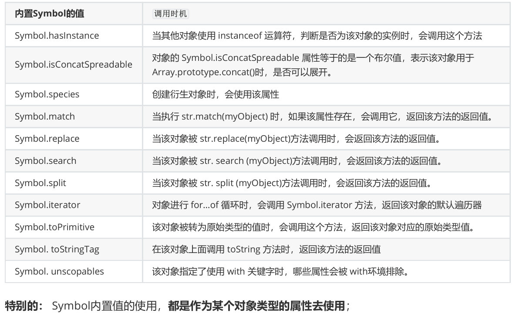

# ES6新特性

## 1.箭头函数  
1. 概述：
    ES6允许使用箭头（=>）定义函数，箭头函数提供了一种更加简洁的函数书写方式，箭头函数多用于匿
名函数的定义；  

2. 箭头函数的注意点：
  - 如果形参只有一个，则小括号可以省略；
  - 函数体如果只有一条语句，则花括号可以省略，函数的返回值为该条语句的执行结果；
  - **箭头函数 this 指向声明时所在作用域下 this 的值；**
  - 箭头函数不能作为构造函数实例化；
  - 不能使用 `arguments；`  

3. 特性：
  - 箭头函数的`this`是静态的，**始终**指向函数声明时所在作用域下的this的值；
  - 不能使用 `arguments` 变量；  
  - 箭头函数是没有显式原型prototype的，所以不能作为构造函数，使用new来创建对象；   
  - 箭头函数也不绑定this、super参数    

1. 点击div两秒后变成粉色

```html
<html>
<head>
<meta charset="utf-8">
<title>箭头函数的实践和应用场景</title>
<style>
div {
width: 200px;
height: 200px;
background: #58a;
}
</style>
</head>
<body>
<div id="ad"></div>
<script>
// 需求-1 点击 div 2s 后颜色变成『粉色』
// 获取元素
let ad = document.getElementById('ad');
// 绑定事件：这也是错误写法，这里的this还是window
// ad.addEventListener("click", () => {
// // ES6写法
// // 定时器：参数1：回调函数；参数2：时间；
// setTimeout(() => this.style.background = 'pink',2000);
// }
// )
// 绑定事件
ad.addEventListener("click", function(){
// ES6写法
// 定时器：参数1：回调函数；参数2：时间；
// 这个this才是ad
setTimeout(() => this.style.background = 'pink',2000);
}
)
</script>
</body>
</html>
```

## 2.解构赋值

>ES6 允许按照一定模式，从数组和对象中提取值，对变量进行赋值，这被称为解构赋值

1. 数组的解构赋值

```js
const F4 = ["大哥","二哥","三哥","四哥"];
let [a,b,c,d] = F4;
// 这就相当于我们声明4个变量a,b,c,d，其值分别对应"大哥","二哥","三哥","四哥"
console.log(a + b + c + d); // 大哥二哥三哥四哥  
```  

2. 对象的解构赋值
```js
const F3 = {
name : "大哥",
age : 22,
sex : "男",
xiaopin : function(){ // 常用
console.log("我会演小品！");
}
}
let {name,age,sex,xiaopin} = F3; // 注意解构对象这里用的是{}
console.log(name + age + sex + xiaopin); // 大哥22男
xiaopin(); // 此方法可以正常调用  
```  

3. 应用场景：
频繁使用对象方法、数组元素，就可以使用解构赋值形式；


## 3.模板字符串
1. 概述：
模板字符串（template string）是增强版的字符串，用反引号（`）标识    

2. 特点：
  - 字符串中可以出现换行符；
  - 可以使用 ${xxx} 形式引用变量；  


3. 应用场景：  

当遇到字符串与变量拼接的情况使用模板字符串；   

模板字符串还有另外一种用法：标签模板字符串（Tagged Template Literals）   

如果我们使用标签模板字符串，并且在调用的时候插入其他的变量：    
模板字符串被拆分了；  

第一个元素是数组，是被模块字符串拆分的字符串组合；   

后面的元素是一个个模块字符串传入的内容；   

```js
function foo(...args) {
  console.log(args);
}

const name = 'why';
const age = 18;

foo`Hello ${name} World ${age}` //[['Hello ', ' World ', ''], 'why', '18']
```

## 4.let const关键字

1. let
   - 不允许重复声明；
   - 块级作用域（局部变量）；
   - 不存在变量提升；
   - 不影响作用域链；

2. const
  const 关键字用来声明常量，const 声明有以下特点：
   - 声明必须赋初始值；
   - 标识符一般为大写（习惯）；
   - 不允许重复声明；
   - 值不允许修改；
   - 块儿级作用域（局部变量） 


<b>暂时性死区</b>    

在let、const定义的标识符真正执行到声明的代码之前，是不能被访问的   

从块作用域的顶部一直到变量声明完成之前，这个变量处在暂时性死区（TDZ，temporal dead zone）   

区域取决于执行顺序（时间），而不是编写代码的位置    


```js
function foo() {
  console.log(message);
}

let message = 'hello world';
foo(); // hello world
```  

<b>let const有没有作用域提升</b>     

在执行上下文的词法环境创建出来的时候，变量事实上已经被创建了，只是这个变量是不能被访问的。    

那么变量已经有了，但是不能被访问，是不是一种作用域的提升呢    

作用域提升：在声明变量的作用域中，如果这个变量可以在声明之前被访问，那么我们可以称之为作用域提升   

在这里，它虽然被创建出来了，但是不能被访问，我认为不能称之为作用域提升     

所以我的观点是let、const没有进行作用域提升，但是会在解析阶段被创建出来    

>window添加属性：   

在全局通过var来声明一个变量，事实上会在window上添加一个属性：   

但是let、const是不会给window上添加任何属性的    

<b>块级作用域</b>   

以前JavaScript只会形成两个作用域：全局作用域和函数作用域   

ES6中新增了块级作用域，并且通过let、const、function、class声明的标识符是具备块级作用域的限制的：    

但是函数拥有块级作用域，但是外面依然是可以访问的：   

这是因为引擎会对函数的声明进行特殊的处理，允许像var那样进行提升   

```js
{
  let foo = 'foo';
  function bar() {
    console.log('bar');
  }
  class Person {}
}
console.log(foo); //Uncaught ReferenceError: foo is not defined
bar(); //bar
var p = new Person(); //Uncaught ReferenceError: Person is not defined
```


## 5.函数参数默认值  

1. ES6 允许给函数参数赋值初始值
    - 形参初始值 具有默认值的参数, 一般位置要靠后(潜规则)     
    - JavaScript允许不将其放到最后，但是意味着还是会按照顺序来匹配；    
    - 另外默认值会改变函数的length的个数，默认值以及后面的参数都不计算在length之内了      

2. 与解构赋值结合

```js
// 注意这里参数是一个对象
    function connect({host="127.0.0.1", username,password, port}){
      console.log(host)
      console.log(username)
      console.log(password)
      console.log(port)
   }
    connect({
      host: 'atguigu.com',
      username: 'root',
      password: 'root',
      port: 3306
   })
```

## 6.rest参数
  1. ES6 引入 rest 参数，用于获取函数的实参，用来代替 arguments；  
  2. arguments 对象不是真正的数组，而rest 参数是数组实例，可以直接应用sort, map, forEach, pop等方法   

```js
// ES5获取实参的方式
function data(){
   console.log(arguments);
}  
data("1","2","3","4");

//ES6的rest参数...args，rest参数必须放在最后面
function data(...args){
console.log(args); // fliter some every map
}
data("1","2","3","4");

```  

剩余参数和arguments有什么区别    

- 剩余参数只包含那些没有对应形参的实参，而 arguments 对象包含了传给函数的所有实参；    

- arguments对象不是一个真正的数组，而rest参数是一个真正的数组，可以进行数组的所有操作；  

- arguments是早期的ECMAScript中为了方便去获取所有的参数提供的一个数据结构，而rest参数是ES6中提供并且希望以此来替代arguments的；   

剩余参数必须放到最后一个位置，否则会报错。

## 7.扩展运算符

1. ... 扩展运算符能将数组转换为逗号分隔的参数序列；  


2. 扩展运算符（spread）也是三个点（...）。它好比 rest 参数的逆运算，将一个数组转为用逗号分隔的参数序列，对数组进行解包；  


3. 应用：
   - 数组的合并
   - 数组的克隆
   - 将伪数组转为真正的数组  

展开运算符其实是一种浅拷贝    

```js
const arr1=[1,2,3];
const arr2=[4,5,6];
const arr=[...arr1,...arr2]
console.log(arr)  

const divs = document.querySelectorAll('div');
const divArr = [...divs];
console.log(divArr); // arguments
```

## 8.Symbol 
>ES6 引入了一种新的原始数据类型 Symbol，表示独一无二的值。它是JavaScript 语言的第七种数据类型，是一种类似于字符串的数据类型  

1. 特点
   - Symbol 的值是唯一的，用来解决命名冲突的问题；
   - Symbol 值不能与其他数据进行运算；
   - Symbol 定义的对象属性不能使用`for…in`循环遍历 ，但是可以使用`Reflect.ownKeys `来获取对象的所有键名；也可以用`Object.getOwnPropertySymbols`获取对象的symbol属性      

如果我们现在就是想创建相同的Symbol:   

可以使用Symbol.for方法来做到这一点；  

可以通过Symbol.keyFor方法来获取对应的key；  


```js
//创建Symbol
    let s = Symbol();
    // console.log(s, typeof s);
    let s2 = Symbol('尚硅谷');
//Symbol创建对象属性：
    let s3 = Symbol('尚硅谷');
     console.log(s2==s3); // false
    //Symbol.for 创建
    let s4 = Symbol.for('尚硅谷');
    let s5 = Symbol.for('尚硅谷');
    console.log(s4==s5); // true
    //不能与其他数据进行运算
    //  let result = s + 100;
    //  let result = s > 100;
    //  let result = s + s;
```

2. Symbol创建对象属性
```js
let say = Symbol('say');
let youxi= {
  name:"狼人杀",
 [say]: function(){
    console.log("我可以发言")
 },
 [Symbol('zibao')]: function(){
    console.log('我可以自爆');
 }
}
youxi[say]();

Object.defineProperty(youxi, say, {
  enumerable: true,
  configurable: true,
  writable: true,
  value:'say'
})
```

3. Symbol内置值

   

```js
const arr = [1,2,3];
const arr2 = [4,5,6];
// 合并数组：false数组不可展开，true可展开
arr2[Symbol.isConcatSpreadable] = false;
console.log(arr.concat(arr2));//arr2未展开
```   

   


## 数值的表示   

ES6中规范了二进制和八进制的写法：   

在ES2021新增特性：数字过长时，可以使用_作为连接符     

```js
const num1 = 100;
const num2 = 0b100;
const num3 = 0o100;
const num4 = 0x100;

const num = 100_000_000;
```  

## Set  

在ES6中新增了另外两种数据结构：Set、Map，以及它们的另外形式WeakSet、WeakMap     

Set是一个新增的数据结构，可以用来保存数据，类似于数组，但是和数组的区别是元素不能重复。     

创建Set我们需要通过Set构造函数（暂时没有字面量创建的方式）   

我们可以发现Set中存放的元素是不会重复的，那么Set有一个非常常用的功能就是给数组去重    

Set常用的方法：    
- size：返回Set中元素的个数；   
- add(value)：添加某个元素，返回Set对象本身；    
- delete(value)：从set中删除和这个值相等的元素，返回boolean类型；   
- has(value)：判断set中是否存在某个元素，返回boolean类型；   
- clear()：清空set中所有的元素，没有返回值；   
- forEach(callback, [, thisArg])：通过forEach遍历set；  

>另外Set是支持for of的遍历的    


和Set类似的另外一个数据结构称之为WeakSet，也是内部元素不能重复的数据结构  

和Set区别:   

- WeakSet中只能存放对象类型，不能存放基本数据类型；    

- WeakSet对元素的引用是弱引用，如果没有其他引用对某个对象进行引用，那么GC可以对该对象进行回收；

WeakSet常见的方法：      
- add(value)：添加某个元素，返回WeakSet对象本身；
- delete(value)：从WeakSet中删除和这个值相等的元素，返回boolean类型；     
- has(value)：判断WeakSet中是否存在某个元素，返回boolean类型；   

>WeakSet应用   

WeakSet不能遍历   

因为WeakSet只是对对象的弱引用，如果我们遍历获取到其中的元素，那么有可能造成对象不能正常的销毁。  

所以存储到WeakSet中的对象是没办法获取的；  


## Map  

Map，用于存储映射关系    

对象存储映射关系只能用字符串（ES6新增了Symbol）作为属性名（key）；  

某些情况下我们可能希望通过其他类型作为key，比如对象，这个时候会自动将对象转成字符串来作为key；    

我们就可以使用Map   

Map常见的方法：  
- size：返回Map中元素的个数；   
- set(key, value)：在Map中添加key、value，并且返回整个Map对象；   
- get(key)：根据key获取Map中的value；   
- has(key)：判断是否包括某一个key，返回Boolean类型；  
- delete(key)：根据key删除一个键值对，返回Boolean类型；  
- clear()：清空所有的元素；  
- forEach(callback, [, thisArg])：通过forEach遍历Map； 

>Map也可以通过for of进行遍历    

和Map类型的另外一个数据结构称之为WeakMap，也是以键值对的形式存在的  

和Map区别:  

- WeakMap的key只能使用对象，不接受其他的类型作为key；    
  
- WeakMap的key对对象想的引用是弱引用，如果没有其他引用引用这个对象，那么GC可以回收该对象；  

WeakMap常见的方法有四个：   
- set(key, value)：在Map中添加key、value，并且返回整个Map对象；  
- get(key)：根据key获取Map中的value；  
- has(key)：判断是否包括某一个key，返回Boolean类型；  
- delete(key)：根据key删除一个键值对，返回Boolean类型；  

WeakMap也是不能遍历的   

- 没有forEach方法，也不支持通过for of的方式进行遍历；    

## ES7  

>Array Includes   

判断一个数组中是否包含某个元素，可以通过 indexOf 获取结果，并且判断是否为 -1, indexOf(NaN) 为 -1  

在ES7中，可以通过includes来判断一个数组中是否包含一个指定的元素，根据情况，如果包含则返回 true，否则返回false， 可以判断NaN   

>指数exponentiation运算符   

计算数字的乘方需要通过 Math.pow 方法来完成   

在ES7中，增加了 ** 运算符，可以对数字来计算乘方   

```js
const result = 3 ** 5;
```


## ES8  

>Object values

之前可以通过 Object.keys 获取一个对象所有的key   

在ES8中提供了 Object.values 来获取所有的value值   

```js
const obj = {
  name: 'why',
  age: '18',
  height: 1.78
}

console.log(Object.values(obj));  //[ 'why', '18', 1.78 ]

console.log(Object.values('abc')); //[ 'a', 'b', 'c' ]
```

Object.entries 可以获取到一个数组，数组中会存放可枚举属性的键值对数组    

可以针对对象、数组、字符串进行操作    

```js
console.log(Object.entries(['abc', 'def', 'njk'])); //[ [ '0', 'abc' ], [ '1', 'def' ], [ '2', 'njk' ] ]

console.log(Object.entries('abc'));  //[ [ '0', 'a' ], [ '1', 'b' ], [ '2', 'c' ] ]
``` 

>String Padding   

对某些字符串进行前后的填充，来实现某种格式化效果，ES8中增加了 padStart 和 padEnd 方法，分别是对字符串
的首尾进行填充的    

```js
const cardNumber = '5435473837584938374';
const lastFourNumber = cardNumber.slice(-4);
const finalcardNumber = lastFourNumber.padStart(cardNumber.length, '*');
console.log(finalcardNumber); //***************8374
``` 

在ES8中，允许在函数定义和调用时多加一个逗号 

```js
function foo(a, b,) {
  console.log(a ,b)
}

foo(10, 20,)
```


## ES10  

>flat flatMap  

flat() 方法会按照一个可指定的深度 递归遍历数组，并将所有元素与遍历到的子数组中的元素合并为一个新数组返回。  

```js
const nums = [10, 20, [5, 8], [[2, 3], [9, 22]], 100]

const newNums = nums.flat(1);
const newNums2 = nums.flat(2);

console.log(newNums); //[ 10, 20, 5, 8, [ 2, 3 ], [ 9, 22 ], 100 ]
console.log(newNums2); //[ 10, 20, 5, 8, 2, 3 ,  9, 22 , 100 ]
```


flatMap() 方法首先使用映射函数映射每个元素，然后将结果压缩成一个新数组   

- flatMap是先进行map操作，再做flat的操作；   

- flatMap中的flat相当于深度为1；

```js
const messages = ['hello world', 'sad today', 'my name'];
const newMessage = messages.flatMap(item => {
  return item.split(' ')
})
console.log(newMessage); // [ 'hello', 'world', 'sad', 'today', 'my', 'name' ]
```

>Objects.fromEntries  

在前面，我们可以通过 Object.entries 将一个对象转换成 entries    

如果有一个entries，可以用Object.formEntries来转换成对象   

```js
const paramString = 'name=why&age=20&height=1.78';
const searchParams = new URLSearchParams(paramString);
console.log(searchParams); //URLSearchParams { 'name' => 'why', 'age' => '20', 'height' => '1.78' }
for (const param of searchParams) {
  console.log(param);
}
// [ 'name', 'why' ]
// [ 'age', '20' ]
// [ 'height', '1.78' ]

const searchObj = Object.fromEntries(searchParams);
console.log(searchObj); //{ name: 'why', age: '20', height: '1.78' }
``` 

去除一个字符串首尾的空格，可以通过trim方法  

trimStart()和trimEnd() 可以单独去除前面或者后面的空格     

## ES11  

>BigInt  

在早期的JavaScript中，不能正确的表示过大的数字：  

大于MAX_SAFE_INTEGER的数值，表示的可能是不正确的   

引入了新的数据类型BigInt，用于表示大的整数：  

BitInt的表示方法是在数值的后面加上n   

```js
const maxInt = Number.MAX_SAFE_INTEGER
console.log(maxInt); //9007199254740991
console.log(Number.MAX_VALUE); //1.7976931348623157e+308
console.log(2 ** 53); //9007199254740992
console.log(2 ** 53 + 1); //9007199254740992

console.log(maxInt + 1); //9007199254740992
console.log(maxInt + 2); //9007199254740992  

const bigInt = 9007199254740991n

console.log(bigInt + 1n); //9007199254740992n
console.log(bigInt + 2n); //9007199254740993n

``` 

>Nullish Coalescing Operator增加了空值合并操作符   

```js
const foo = "";
const result1 = foo || '默认值';
const result2 = foo ?? '默认值';

console.log(result1); //默认值
console.log(result2); // ""
```   

> 可选链: 主要作用是代码在进行null和undefined判断时更加清晰和简洁   

```js
const obj = {
  friend: {
    bestFriend: {
      name:'aaaaaa'
    }
  }
}

if (obj.friend && obj.friend.bestFriend) {
  console.log(obj.friend.bestFriend.name);
}

console.log(obj.friend?.bestFriend?.name);
```  

>globalThis  

获取JavaScript环境的全局对象，不同的环境获取的方式是不一样的   

在浏览器中可以通过this、window来获取；    

在Node中我们需要通过global来获取；    

在ES11中对获取全局对象进行了统一的规范：globalThis    


## ES12   

>FinalizationRegistry 对象可以在对象被垃圾回收时请求一个回调        

FinalizationRegistry 提供了一种方法：当一个在注册表中注册的对象被回收时，请求在某个时间点上调用一个清理回
调。（清理回调有时被称为 finalizer ）    

可以通过调用register方法，注册任何你想要清理回调的对象，传入该对象和所含的值    

```js
      let obj = { name: 'why' };
      const registry = new FinalizationRegistry(value => {
        console.log('对象被销毁了', value);
      })
      registry.register(obj, 'obj')

      obj = null;
```  

>如果默认将一个对象赋值给另外一个引用，那么这个引用是一个强引用,如果希望是一个弱引用的话，可以使用WeakRef；  

```js
let obj = { name: 'wy'};
let info = new WeakRef(obj);
```

>逻辑运算    

```js
let message = "";
message = message || 'hello';
message ||= 'hello'
console.log(message); //hello

let obj = {
  name: 'y'
}

// obj = obj && obj.foo()
obj &&= obj.name
console.log(obj) //y

let foo = null
let bar = undefined
foo ??= '默认值'
bar ??= '默认值'
console.log(foo) //默认值
console.log(bar); //默认值
```

## ES13  

>method.at()  

字符串、数组的at方法，它们是作为ES13中的新特性加入的   

```js
var names = ['abc', 'acb', 'nbc']
console.log(names.at(1)); //acb
console.log(names.at(-1)); //nbc
```   

>Object.hasOwn(obj, propKey)   

Object中新增了一个静态方法（类方法）： hasOwn(obj, propKey)    

该方法用于判断一个对象中是否有某个自己的属性；     

和Object.prototype.hasOwnProperty区别:    

- 防止对象内部有重写hasOwnProperty   

- 对于隐式原型指向null的对象， hasOwnProperty无法进行判断    

```js
let info = Object.create(null);
info.name = 'wy';
console.log(info.hasOwnProperty('name')); //报错
console.log(Object.hasOwn(info, 'name')); //true
```  


