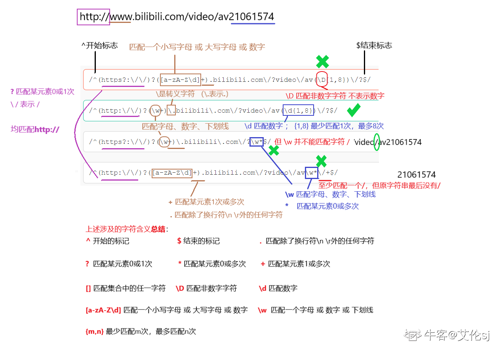

# JS 不知道...

## splice 和 slice

1. slice(start,end)

- 从 start 开始截取到 end 但是不包括 end
- 返回值为截取出来的元素的集合
- 原始数组不会发生变化

2. splice(start,deleteCount,item1,item2....)

- start 参数 开始的位置
- deleteCount 要截取的个数
- 后面的 items 为要添加的元素
- 如果 deleteCount=0，则表示不删除元素，从 start 位置开始添加后面的几个元素到原始的数组里面
- 返回值为由被删除的元素组成的一个数组，如果只删除了一个元素，则返回只包含一个元素的数组，
  没有删除元素，返回空数组
- 这个方法会改变原数组，数组的长度会发生变化

```js
let arr = [1, 2, 3, 4, 5, 6];
//1.splice删除
let arr1 = arr.splice(2, 3); //删除第三个元素以后的三个数组元素（包含第三个）
console.log(arr1); //[3,4,5]
console.log(arr); //[1,2,6] 原始数组被改变

//2.splice插入
let arr2 = arr.splice(2, 0, "wu", "le"); //从第三位前插入'wu','le'
console.log(arr2); //[] 空数组
console.log(arr); //[1, 2, 'wu', 'le', 6]

//3.splice替换
let arr3 = arr.splice(2, 3, "xiao", "nie"); //删除第三个元素以后的三个数组元素（包含第三个），插入'xiao''nie'
console.log(arr3); //['wu', 'le', 6]
console.log(arr); //[1, 2, 'xiao', 'nie']

let arr4 = arr.splice(1); //从第二个元素开始删除所有元素
console.log(arr4); //[2, 'xiao', 'nie']
console.log(arr); //[1]
```

## 为什么 Object.prototype.toString.call 能完美判断数据类型

### 判断数据类型可以使用：

- typeof
- instanceof
- Object.prototype.toString.call

typeof 和 instanceof 的缺点

```js
console.log(typeof 6); //number
console.log(typeof Symbol()); //symbol
console.log(typeof function () {}); //function
console.log(typeof "前端web"); //string
console.log(typeof true); //boolean
console.log(typeof null); //object
console.log(typeof {}); //object
console.log(typeof []); //object
console.log(typeof new Date()); //object
console.log(typeof undefined); //undefined
```

> typeof 在判断 Undefined，Boolean，Number，String，Symbol，Function 时比较靠谱，无法区分 object，array，null

```js
console.log(6 instanceof Number); //false
console.log(Symbol("1234") instanceof Symbol); //false
console.log(function () {} instanceof Function); //true
console.log("前端web" instanceof String); //false
console.log(true instanceof Boolean); //false
console.log(null instanceof null); //报错
console.log({} instanceof Object); //true
console.log([] instanceof Object); //true
console.log(new Date() instanceof Object); //true
console.log(undefined instanceof Undefiend); //报错
```

> instanceof 可以检测 Object，Array，Function，但检查不了 Number，Boolean,String 等基础数据类型

知识点：

> Object.prototype.toString()方法，会返回一个形如"[object xxx]"的字符串

```js
[1,2,3].toString() //1,2,3
Array 里面也有toString 方法。根据原型链的就近原则，会优
先取 Array.prototype.toString。返回字符串

      //1. 判断 Array 里是否含有 toString
      console.log(Array.prototype.hasOwnProperty('toString'));
      // true
      //2.把 Array 里面的toString 方法删除
      Reflect.deleteProperty(Array.prototype, 'toString')
          //3. 再次判断 Array 里是否包含 toString
      Array.prototype.has0wnProperty("toString") // false
          //4. 再次调用 Array.toString0 方法，看看结果
      console.log([1, 2, 3].toString()) //[object Array]

      当 Array 里的 toString 被删除时，根据原型链的知识，会向上层访问这个方法，即Object的 toString()。
```

为什么要加 call

```js
如果不加 call, Object.prototype.toString结果永远是[object Object]，因为 Object.prototype永远是一个对象。加上call,改变toString 的this 指向，就可以将 Object 里的toString 方法引用在数组身上
```

## js 判断数组相等

> 注意数组是引用数据类型，在`==`或 `=== `比较时，比较的是地址值，[1,2] == [1,2],[1,2] === [1,2]返回的都是 false

1. toString()

```js
[1, 2, 3].toString() === [1, 2, 3].toString(); //true
```

2. join()

```js
[1, 2, 3, "4"].join() === [1, 2, 3, 4].join(); //true
```

3. JSON.stringify()

```js
JSON.stringify([{ name: "nls" }, { sex: "男" }]) ===
  JSON.stringify([{ name: "nls" }, { sex: "男" }]); //true
```

4. every()

```js
//every 不会对空数组进行检测，不会改变原数组
return (
  arr1.length === arr2.length &&
  arr1.every((item, index) => {
    return item === arr2[index];
  })
);
```

## split() 和 join()

split()是把一串字符串通过某个分隔符，分成若干个元素存放在一个数组里。

join()是把数组中的元素通过指定的字符串拼接，返回的是拼接好的字符串，相当于 split()的逆操作。

## 立即执行的具名函数 A 内修改 A 的值时到底发生了什么

[相关文章](https://segmentfault.com/q/1010000002810093)

## +号的行为

1. 如果有一个操作数是字符串，那么把另一个操作数转换成字符串连接
2. 如果有一个操作数是对象，，调用对象的 valueOf 方法转换成原始值，没有该方法或者转换后非原始值，则调用 toString()方法
3. 其他情况，两个操作数都会被转换成数字执行加法操作

```js
console.log(1 + NaN); // NaN
console.log("1" + 3); // 13
console.log(1 + undefined); // NaN
console.log(1 + null); // 1
console.log(1 + {}); // 1[object Object]
console.log(1 + []); // 1
console.log([] + {}); // [object Object]
```

## 四则运算符

> 只有当加法运算时，其中一方是字符串类型，就会把另一个也转为字符串类型。
> 其他运算只要其中一方是数字，那么另一方就转为数字。并且加法运算会触发三种类型转换：将值转换为原始值，转换为数字，转换为宇符串

```js
2 *
  "2"[(1, 2)] + //4
  [2, 1][(1, 2)] // '1,22,1'
    .toString() //'1,2'
    [(2, 1)].toString(); //'2,1'
"1,2" + "2,1"; //'1,22,1'
"a" + +"b"; //aNaN => + 'b' ->NaN
```

## for in 和 for of

for...in 是 ES5 的标准，该方法遍历的是对象的属性名称(key：键名)

- for...in 遍历 Array 时，拿到的是每个元素索引
- for…in 的原理是: Object.keys()：返回给定对象所有可枚举属性的字符串数组

for...of 是 ES6 的标准，该方法遍历的是对象的属性所对应的值(value：键值)。所以它用来遍历数组时得到每个元素的值

- for…of 语句在可迭代对象上创建一个迭代循环，调用自定义迭代钩子，并为每个不同属性的值执行语句

### 区别

- for-in 只是获取数组的索引；for-of 会获取数组的值
- for-in 会遍历对象的整个原型链，性能差；for-of 只遍历当前对象，不会遍历原型链
- 对于数组的遍历，for-in 会返回数组中所有可枚举的属性(包括原型链上可枚举的属性)；for-of 只返回数组的下标对应的属性值
- for-of 适用遍历数组／字符串/map/set 等有迭代器对象的集合，但是不能遍历普通对象（obj is not iterable）

## call,apply,bind

1. 都可以改变 this 指向，函数.call()、函数.apply()、函数.bind()
2. call，apply 可以立即执行，bind 不会立即执行，bind 返回的是一个函数，需要再加一个()执行
3. 参数不同，apply 第二个参数是数组，call 和 bind 有多个参数需要挨个写

```js
var arr1 = [1, 2, 3, 45, 6, 78];
console.log(Math.max.apply(null, arr1));
```

## indexOf()&&includes()

> indexOf() 不能判断数组的 NaN 元素，不管是否有 NaN,arr.indexOf(NaN)都返回-1

## Object.is()&&===

> 都判断两个数是否严格相等

```js
Object.is(NaN, NaN); //true
NaN === NaN; //false

Object.is(+0, -0) + //false
  0 ===
  -0; //true
```

## 数组降维

```js
[1, [2], 3].flatMap((v) => v); //[1,2,3]

const flattenDeep = (arr) =>
  Array.isArray(arr)
    ? arr.reduce((a, b) => [...a, ...flattenDeep(b)], [])
    : [arr];
```

## async 和 await

- async 本身是同步代码，除非遇到 await
- await 只能在 async 中使用
- await 是右结合，会执行它右边的代码，等右边的执行完在执行下面的代码
- await 后面的所有代码都是异步的，属于微任务

## new 一个对象的过程

1. 创建一个新对象:son
2. 新对象会被执行[[prototype]]连接；
   - son.**proto**=Mother.prototype;
3. 新对象和函数用的 this 会被绑起来
   - Mother.call(son,'Da');
4. 执行构造函数中的代码;
   - son.lastName;
5. 如果函数没有返回值，就会自动返回这个新对象
   - return this;

```js
function Mother(lastName) {
  this.lastName = lastName;
}
var son = new Mother("Da");
console.log(son.lastName); //Da

function Mother(lastName) {
  this.lastName = lastName;
  return this;
}

var son = Mother("Da");
console.log(son.lastName); //Da
```

```js
//1.创建一个空对象
// 2. 将空对象的原型指向构造函数的原型
// 3. 空对象作为构造函数上下文（改变this指向）
// 4. 对构造函数有返回值的处理判断：如果返回基本类型的数据则无影响，返回引用类型则new 无效
function Fun(age, name) {
  this.age = age;
  this.name = name;
}
function create(fn, ...args) {
  var obj = {};
  Object.setPrototypeOf(obj, fn.prototype);
  var result = fn.apply(obj, args);
  return result instanceof Object ? result : obj;
}
console.log(create(Fun, 18, "张三"));
```

## null 和 undefined

null 表示‘无’的对象，Number(null) 为 0

undefined 表示‘无’的数值，Number(undefined) 为 NaN

null 和 undefined 的区别:

- null 在内存中的表示就是，栈中的变量没有指向堆中的内存对象
- undefined 表示 “缺少值”，就是此处应该有一个值，但是还没有赋值。

```js
10 + null; //10

10 + undefined; //NaN
```

## typeof null

JS 底层以二进制表示数据，前三个数据表示数据类型，000 代表对象，而 null 全为 0，所以 typeof null 为 object，而 null 是基本数据类型

## 0/0

JS 中，0 可以做分母，0/0 为 NaN，不会抛出异常

## sort

sort()使用原地算法对数组进行排序，如果不传入参数，则数组按照元素的字典序升序排列（在此过程中含有隐式转换，数组的每个元素都会调用一次 toString() 方法转换为字符串）

所谓的按字典序排列，就是对两个字符串的第一个不同字符的 Unicode 编码值进行比较并排序。

如果传入的是排序函数，形式为 sort((a, b) => {})，a 和 b 为每次比较的值，a 和 b 的顺序根据排序函数的返回值决定

- 若返回的是一个正数（不包括 0 ），则 a 应排在 b 的后面；
- 若返回的是 0 ，则 a 和 b 的相对位置不变；
- 若返回的是一个负数，则 a 应排在 b 的前面；

```js
// 升序
arr.sort(function (a, b) {
  return a - b;
});

// 降序
arr.sort((a, b) => b - a);
```

```js
var array = [-1, 1, 3, 4 ,6];
console.log(arr.sort((a, b) => Math.abs(a - 3) - Math.abs(b - 3)));  //[3, 4, 1, 6, -1, 10]

数值减3的绝对值[4, 2, 0, 1, 3, 7]作为参数决定顺序
根据绝对值减3大小排列[0, 1, 2, 3, 4, 7] 对应原数组[3, 4, 1, 6, -1, 10]


```

## 怎么判断一个数据是不是 NaN

NaN 不是一个数字且数字类型为 number，而且不等于自身

1. 可直接采用内置方法 isNaN

```js
function isNaN(n) {
  if (n !== n) {
    return true;
  } else {
    return false;
  }
}
```

2. 利用 NaN 是唯一一个不等于任何自身的特点

```js
var a = NaN;
a == a; //false
```

3. Object.is() 方法

```js
console.log(Object.is("a", NaN)); //false
console.log(Object.is(1, NaN)); //false
console.log(Object.is(NaN, NaN)); //true
```

## 防抖

> 频繁触发一个事件，只触发最后一次，以最后一次为准  
> n 秒后执行该事件，如果 n 秒内再次触发，则重新计时

- 改变页面大小的统计
- 电脑息屏时间，每动一次电脑重新计算时间
- 输入框连续输入的请求次数控制
- 防止表单多次提交

```js
const buttton = document.querySelector("input");
function payMoney() {
  console.log("已剁");
  cosole.log(this);
}
//防抖函数
function debounce(func, delay) {
  //在定义监听事件的时候同时定义timer，利用作用域链，所有的独立的执行函数都能访问到timer
  //timer 只创建一次
  let timer;
  return function () {
    //使用防抖函数后this的指向会变成window
    let context = this;
    //增加参数
    let args = arguments;
    //清除延时要在建立延时的前面
    clearTimeout(timer);
    timer = setTimeout(function () {
      func.apply(context, args);
    }, delay);
  };
}

button.addEventListener("click", debounce(payMoney, 1000));
```

```js
const debounce = function (func, wait) {
  let timeout;
  return function () {
    let args = arguments;
    if (timeout) clearTimeout(timeout);
    timeout = setTimeout(() => {
      func.apply(this, args);
    }, wait);
  };
};
```

## 节流

> 频繁触发一个事件，只能每隔一段时间触发一次  
> n 秒内只执行一次，如果 n 秒内再次触发，只有一次生效

- 如果需要统计用户滚动屏幕的行为来做出相应的网页反应，需要设置节流，因为如果用户不断进行滚动，就会不断产生请求，响应也会不断增加，容易产生阻塞
- 游戏里长按鼠标，但是动作都是每隔一段时间做一次

```js
//假设监听用户改变页面尺寸的事件，并且在改变尺寸时变换相应的背景颜色
function coloring() {
  let r = Math.floor(Math.random() * 255);
  let g = Math.floor(Math.random() * 255);
  let b = Math.floor(Math.random() * 255);
  document.body.style.background = `rgba(${r},${g},${b})`;
}
//创建节流函数
function throrrle(func, delay) {
  let timer;
  return function () {
    let context = this;
    let args = arguments;
    //判断触发的事件是否在时间间隔内,
    //即如果timer被赋值,也就是任务还在等待执行，暂时不改变timer的值
    //如果timer没有被赋值，那就给他赋值执行任务
    if (timer) {
      return;
    }
    //这个时间间隔是要给后面的任务来判断是否执行的标识，需要创建变量
    timer = setTimeout(function () {
      func.apply(context, args);
      timer = null; //延迟执行后清空
    }, delay);
  };
}

window.addEventListener("resize", throttle(coloring, 2000));
```

## 0.1 + 0.2

对浮点数进行计算时，将十进制转换为二进制，JS 以 64 位双精度浮点数存储 number 类型，0.1,0.2 转换成二进制时是无限循环小数，出现精度丢失

## Map 和 weakMap

> WeakMap 的键名所引用的对象都是弱引用，即垃圾回收机制不将该引用考虑在内。因此，只要所引用的对象的其他引用都被清除，垃圾回收机制就会释放该对象所占用的内存。也就是说，一旦不再需要，WeakMap 里面的键名对象和所对应的键值对会自动消失，不用手动删除引用

- Map 数据结构。它类似于对象，也是键值对的集合，但是“键”的范国不限于字符串，各种类型的值（包括对象）都可以当作键。

- WeakMap 结构与 Map 结构类似，也是用于生成键值对的集合。但是 WeakMap 只接受对象作为键名（null 除外），不接受其他类型的值作为键名。而且 WeakMap 的键名所指向的对象，不计入垃圾回收机制。

## 对异步编程的理解

在早期的时候，没有 promise 的出现之前，js 中常用解决异步函数的方式是回调函数，回调函数有不少缺点，多个回调函数嵌套容易形成回调地狱，代码耦合度过高，不利于代码维护。

为了解决回调地狱的问题，从而出现了 Promise，promise 可以将嵌套的回调函数作为链式调用。Promise 本身是同步的立即执行函数，Promise 实例有三个状态 Pending fulfilled,rejected， promise 的进行状态一旦改变为其他状态就不会改变了。然后 Promise 是有一套自己的规范，提供了一些对应的 api,

promise 的对象方法有 then,catch,finally  
Promise 的类方法有 resolve,reject,all,allSettled,race,any 等。

primise 的缺点：  
promise 如果不设置回调西数，promise 内部拋出的错误，不会反馈到外部。其次使用 promise 的时候，有时候会造成多个 then 的链式调用，可能会造成代码的语义就不太明确。

于是出现了 async 和 await,async 数本质是 generator 和 promise 实现的一个自动执行的语法糖，当函数内部执行到一个 await 语句的时候，如果语句返回一个 promise 对象，那么函数将会等待 promise 对象的状态变成 resolve 后继续执行。这样可以将异步的逻辑转化为同步来写，代码看起来更简洁。

async 函数返回的是—个 promise 对象，如果没有返回值 则是返回一个 Promise.resolve (undefined)

await 在等什么？它等的如果不是一个 promise 对象那么 await 表达式的运算结果就是它等到的东西。如果是一个 promise 对象，那么 await 就会阻塞后面的代码，等着 Promise 对象 resolve，然后等到 resolve 的值，作为 await 表达式的运算结果。

async 和 await 还会支持 try,catch 来进行昇常捕获。更加便于调试

## 图片的异步加载

```js
const imgAddress = "图片地址";

const imgPromise = (url) => {
  return new Promise((resolve, reject) => {
    const img = new image();
    img.src = url;
    img.onload = () => {
      resolve(img);
    };
    img.onerror = () => {
      reject(new Error("图片有误"));
    };
  });
};

imgPromise(imgAddress)
  .then((img) => {
    document.body.appendChild(img);
  })
  .catch((err) => {
    document.body.innerHTML = err;
  });
```

## 图片懒加载

- 即延迟加载
- 滚动到网页下才能看到看不见的图片

```html
<!--使用自定义属性-->


```

- 使用事件监听
- 消耗资源，不推荐

```js
//事件监听
const images = document.querySelectorAll("img");

window.addEventListener("scroll", (e) => {
  //判断图片是否出现在可视区域
  images.forEach((image) => {
    //获取每张图片到顶部的距离
    const imageTop = image.getBoundingClientRect().top;
    //判断距离是否小于窗口显示区的高度
    if (imageTop < window.innerHeight) {
      const data_src = image.getAttribute("data-src");
      image.setAttribute("src", data_src);
    }
  });
});
```

- 使用浏览器提供的构造函数 IntersetionObserver

```js
const images = document.querySelectorAll("img");

const observer = new IntersectionObserver(callback);

images.forEach((image) => {
  observer.observe(image);
});

const callback = (entries) => {
  console.log(entries); //是一个数组
  entries.forEach((entry) => {
    //判断是否到达图片可视区域
    if (entry.isIntersecting) {
      const image = entry.target;
      const data_src = image.getAttribute("data-src");
      image.setAttribute("src", data_src);
      //在图片被加载后取消回调函数的触发
      observer.unobserve(image);
    }
  });
};
```

## Promise 核心代码

- 初始结构
- this 指向
- then
- 执行异常 throw new Error...

```js
//原生
let promise = new Promise((resolve, reject) => {
  resolve("这次一定");
  reject("下次一定");
});
promise.then(
  (result) => {
    console.log(result);
  },
  (result) => {
    console.log(result.message);
  }
);
```

```js
class Commitment {
  //创建静态属性
  static PENDING = "待定";
  static FULFILLED = "成功";
  static REJECTED = "拒绝";
  constructor(func) {
    //为每一个实例创建状态属性
    this.status = Commitment.PENDING;
    //参数
    this.result = null;
    //给实例的resolve reject方法绑定this为当前实例对象，并且执行
    //生成实例时判断是否有报错
    try {
      func(this.resolve.bind(this), this.reject.bind(this));
    } catch (error) {
      //有报错把错误信息传入给reject，并直接执行reject
      this.reject(error);
    }
  }
  resolve(result) {
    if (this.status === Commitment.PENDING) {
      this.status = Commitment.FULFILLED;
      this.result = result;
    }
  }
  reject(result) {
    if (this.status === Commitment.PENDING) {
      this.status = Commitment.REJECTED;
      this.result = result;
    }
  }
  then(onFULFILLED, onREJECTED) {
    //onFULFILLED为undefined时应忽略
    onFULFILLED = typeof onFULFILLED === "function" ? onFULFILLED : () => {};
    onREJECTED = typeof onREJECTED === "function" ? onREJECTED : () => {};
    if (this.status === Commitment.FULFILLED) {
      onFULFILLED(this.result);
    }
    if (this.status === Commitment.REJECTED) {
      onREJECTED(this.result);
    }
  }
}

let commitment = new Commitment((resolve, reject) => {
  resolve("");
});
commitment.then(undefined, (result) => {
  console.log(result.message);
});
```

- 实现异步,添加 setTimeout
- 回调保存
- 链式

```js
//原生
console.log("第一步");
let promise = new Promise((resolve, reject) => {
  console.log("第二步");
  setTimeout(() => {
    resolve("这次一定");
    console.log("第四步");
  });
});
promise.then(
  (result) => {
    console.log(result);
  },
  (result) => {
    console.log(result.message);
  }
);
console.log("第三步");
```

```js
class Commitment {
  //创建静态属性
  static PENDING = "待定";
  static FULFILLED = "成功";
  static REJECTED = "拒绝";
  constructor(func) {
    //为每一个实例创建状态属性
    this.status = Commitment.PENDING;
    //参数
    this.result = null;
    //保存then里的函数
    this.resolveCallbacks = [];
    this.rejectCallbacks = [];
    //给实例的resolve reject方法绑定this为当前实例对象，并且执行
    //生成实例时判断是否有报错
    try {
      func(this.resolve.bind(this), this.reject.bind(this));
    } catch (error) {
      //有报错把错误信息传入给reject，并直接执行reject
      this.reject(error);
    }
  }
  resolve(result) {
    //需要在事件循环末尾执行，加setTimeout
    setTimeout(() => {
      if (this.status === Commitment.PENDING) {
        this.status = Commitment.FULFILLED;
        this.result = result;
        //遍历自身的callback数组，看看有没有那边保留过来的待执行函数
        this.resolveCallbacks.forEach((callback) => {
          callback(result);
        });
      }
    });
  }
  reject(result) {
    setTimeout(() => {
      if (this.status === Commitment.PENDING) {
        this.status = Commitment.REJECTED;
        this.result = result;

        this.rejectCallbacks.forEach((callback) => {
          callback(result);
        });
      }
    });
  }
  then(onFULFILLED, onREJECTED) {
    //实现链式
    return new Commitment((resolve, reject) => {
      //onFULFILLED为undefined时应忽略
      onFULFILLED = typeof onFULFILLED === "function" ? onFULFILLED : () => {};
      onREJECTED = typeof onREJECTED === "function" ? onREJECTED : () => {};
      //异步时待定状态的情况
      if (this.status === Commitment.PENDING) {
        this.resolveCallbacks.push(onFULFILLED);
        this.rejectCallbacks.push(onREJECTED);
      }
      if (this.status === Commitment.FULFILLED) {
        setTimeout(() => {
          onFULFILLED(this.result);
        });
      }
      if (this.status === Commitment.REJECTED) {
        setTimeout(() => {
          onREJECTED(this.result);
        });
      }
    });
  }
}
```

```js
//输出 第一步
//new 一个实例后 输出 第二步
//遇到setTimeout后执行异步操作
//运行实例的then方法，发现依旧是 待定 状态就把函数参数放到数组里保存起来 输出 第三步
//回头执行setTimeout里面的内容，执行resolve时又要setTimeout异步处理
//输出 第四步
//执行resolve，改变状态，改变结果值，遍历保存的数组对象，执行保存的函数对象
console.log("第一步");
let commitment = new Commitment((resolve, reject) => {
  console.log("第二步");
  setTimeout(() => {
    resolve("这次一定");
    reject("下次一定");
    console.log("第四步");
  });
});
commitment.then(
  (result) => {
    console.log(result);
  },
  (result) => {
    console.log(result.message);
  }
);
console.log("第三步");
```

## 牛客

### 正则表达式

**^表示匹配输入的开始**，**$表示匹配输入的结束**

**?表示匹配某元素 0 次或 1 次**，**+表示匹配某元素 1 次或多次**

**[]表示字符集合，它用在正则表达式中表示匹配集合中的任一字符**

[a-zA-Z\d] 表示匹配一个小写字母 或者 大写字母 或者 数字

**\w 表示匹配字母数字或下划线**， **\D 表示匹配一个非数字字符**

**.可以匹配除了换行符\n \r 外的任何字符**



exec() 方法用于检索字符串中的正则表达式的匹配, 返回一个数组，其中存放匹配的结果。如果未找到匹配，则返回值为 null。

```js
var str1=new RegExp("e");
document.write(str1.exec("hello")); //e

"e".exec("hello")中,"e"是正则表达式，"hello"是检索的字符串。在"hello"字符串中，能够匹配到"e"。因此document.write("e");
最后结果为e。
```

### Node 事件循环

Node 中的“微任务(microtasks)其实是一个统称，包含了两部分：

- process.nextTick() 注册的回调 （nextTick task queue）
- promise.then() 注册的回调 （promise task queue）

Node 在执行微任务时， 会优先执行 nextTick task queue 中的任务，执行完之后会接着执行 promise task queue 中的任务。所以如果 process.nextTick 的回调与 promise.then 的回调都处于主线程或事件循环中的同一阶段， process.nextTick 的回调要优先于 promise.then 的回调执行。

https://www.cnblogs.com/forcheng/p/12723854.html

### **parseInt(string,raix)**

1. 注意:string 字符串只会被解析从第一个字符开始直到不是数字的字符部分

```js
console.log(parseInt("223")); //223
```

2. 当字符串中间存在非数字,那么就只解析前面是数字的部分字符

```js
console.log(parseInt("22e3")); //22
```

3. 如果字符串中第一个字符就不是数字,那么返回 NaN

```js
console.log(parseInt("e21")); //NaN
```

4. 对于 parseInt()函数还有一个易考点,就是利用数组的下标,还记得 parseInt()函数的第二个参数吗

- parseInt()函数的第二个参数指的就是进制,这个参数小于 2 或者大于 36 的时候,都会返回 NaN

```js
console.log(parseInt(1, 1)); //NaN ,因为第二个参数是1表示1进制<2,所以错误
console.log(parseInt(1, 2)); //1,因为表示二进制 =2,在范围内
```

- 一般都是省略这个参数的,这个时候就是默认为 10 进制
- 第二个参数使用 0 的时候也是使用十进制
- 如果第一个参数前缀使用 0x/0X 则表示使用 16 进制
- 如果第一个参数使用了 0x 表示十六进制,那么第二个参数设置了值也无效

```js
console.log(parseInt(99)); //99
console.log(parseInt(99, 0)); //99
console.log(parseInt(0x99)); //153=16*9+9
console.log(parseInt(0x99, 10));
```

5. 对于数组

```js
var arr = [1, 2, 3, 2, 5];
console.log(arr.map(parseInt)); //[1, NaN, NaN, 2, NaN]

// arr.map方法就是对于数组arr里面的每一项都去使用方法里面的函数,最后返回新数组
// 因为map方法有索引,所以实际上就是
parseInt(1, 0); //1,因为0表示十进制
parseInt(2, 1); //1进制<2，所以错啦!
parseInt(3, 2); // 2进制,但是3不在0——2范围内(3应该改为11),所以不符合2进制要求
parseInt(2, 3); //符合,因为三进制是0-3,而2在范围内
parseInt(5, 4); //4进制不包括5,所以NaN
```

### Symbol

- Symbol 是不完整的构造函数，创建 symbol 对象时不需要 new 操作符
- symbol 对象不能用于数据运算，包括+、-、\*、/等，
- symbol 对象的唯一作用是作为对象的属性名，这样可以防止属性因重名而覆盖，使用时必须用[]
- 使用 Reflect.ownKeys()可以遍历对象的属性，包括 symbol 属性

### 类型转换

**任何对象转为布尔值，都为得到 true**（**切记！在 JS 中，只有 0，-0，NaN，""，null，undefined 这六个值转布尔值时，结果为 false**）。

**y = Boolean(0)**，**而不是 y = new Boolean(0)。**这两个有很大区别，用 new 调用构造函数会新建一个布尔对象，此处没有加 new，进行的是显示类型转换，正如上述所说，0 转换布尔，结果为 false，

### ==类型转换

相等运算符强制类型转换遵循以下规则。

1. 存在布尔值转化为 Number

```js
null, undefined, "", 0, -0, NaN 转换成布尔值是false， 剩下的全转化 true;
```

2. 一个操作数是 Number 一个是 String 的情况下，String 转 Number（有相应规则）。

```js
转 number 规则：

string  '2.3.1' => NaN;

undefined => NaN;

null, '', false, [], '0' ==>> 0;

object => x    Number(object.toString())
```

3. 有一个是 Object 另一个是其他的情况下，调用 valueof。然后再根据以上规则继续转换。
4. null == undefined

> Javascript 规范中提到， 要比较相等性之前，不能将 null 和 undefined 转换成其他任何值，并且规定 null 和 undefined 是相等的。nul == 0 //false

5. NaN != NaN

> isNaN() 函数用于检查其参数是否是非数字值, 如果参数值为 NaN 或字符串、对象、undefined 等非数字值则返回 true, 否则返回 false。

6. 对象==，比较内存地址

```js
console.log(([])?true:false);
console.log(([]==false?true:false));
console.log(({}==false)?true:false)

// true true false
1.
三目运算符的第一目是逻辑运算故第一个Boolean([])。

[]，是一个对象，且不为null，故Boolean([])为true。

2.
[]，调用valueof的值还是自身，故这里会调用toString（当对象强转，调用valueof返回自身的时候，就会调用toString，不懂为什么，但是亲测有这样的结果。）。结果为""（空字符串），然后false转0，然后空串转0，结果相等。

3.
console.log(({}==false)?true:false)

{}在==下强转为"[object Object]"，false转0，"[object Object]"再转NaN，NaN与任何东西比较均返回不相等
```

### isNaN()的隐式转换

isNaN(item) 的时候会先将 item 进行 **Number(item)** 的隐式转换，然后再 isNaN(item)

### try-catch

- try 必须搭配 catch 或者 finally

- 如果 try 语句没有使用 finally，则返回 try 语句中 return 的东西， 函数 try...catch 语句之外的 return 就不执行了
- 如果 try 语句后面有 finally，try 中的 return 不会跳出函数,因为一定要进入 finally 语句，函数 try...finally 语句之外的 return 就不执行了

### delete

- 在 eval 中使用 var 声明的全局变量可以被 delete 删除
- 除此之外，在其他情况下，使用 var 声明的全局变量或者局部变量一般是不能被 delete 删除的,仍然可以访问到
- 未使用 var 声明的全局变量可以使用 delete 进行删除，所以无法访问

### JavaScript 常用系统方法

|   方法名   | 传入   | 返回                 | 简称   |
| :--------: | ------ | -------------------- | ------ |
|  parselnt  | 字符串 | 整数                 | 串转整 |
| parseFloat | 字符串 | 浮点数               | 串转浮 |
|   isNaN    | 元素   | true or false        | 非数值 |
|   escape   | 字符串 | 串编码后的结果字符串 | 编码   |
|    eval    | 字符串 | 执行                 | 执行   |

### Object.is()

NaN == NaN // false
NaN === NaN // false

- indexOf 方法无法识别数组的 NaN 成员

```js
[NaN].indexOf(NaN); // -1
```

- 向 Set 数据结构中加入值时认为 NaN 等于自身

```js
let set = new Set();
set.add(NaN);
set.add(NaN);
console.log(set); // Set {NaN}
```

- Object.is()方法认为 NaN 等于 NaN

```js
Object.is(NaN, NaN) + // true
  0 ===
  -0; //true
Object.is(+0, -0); // false
```

- ES7 中新增的数组实例方法，includes()方法认为 NaN 等于自身

```js
[1, 2, NaN].includes(NaN); // true
```

### 遍历数组遇到空位

ES5

forEach(), filter(), reduce(), every() 和 some()都会跳过空位。

map()会跳过空位，但会保留这个值

join()和 toString()会将空位视为 undefined，而 undefined 和 null 会被处理成空字符串。

ES6 中都会将空位当做 undefined

```js
let array = [, 1, , 2, , 3];
array = array.map((i) => ++i);

//[,2,,3,,4]
```

### 老是做错的

```JS
function test(a){
a=a+10;
}
var a=10;
test(a);
console.log(a);
 a是形参，属于局部变量，不影响全局变量a的值，因此输出的a是全局变量的值10
```

```js
function fn() {
  var a = (b = 1);
  //等于var a = b ,b = 1
  //不加var b就是全局变量了(window.b=1)，可以直接访问
  //var a是局部变量，在fn里面，外面访问不到
}
fn();
console.log(b); //windows全局作用域下找到window.b=1
console.log(a); //a在fn里面的作用域，外面访问不了，报错
```

```js
var foo = { n: 1 };
(function (foo) {
  console.log(foo.n);
  foo.n = 3;
  var foo = { n: 2 };
  console.log(foo.n);
})(foo);
console.log(foo.n); //1, 2, 3

var foo = { n: 1 };
(function (foo) {
  //形参foo同实参foo一样指向同一片内存空间，这个空间里的n的值为1
  var foo; ////如果在局部变量中定义了一个和形参相同名字的变量，对该局部变量的操作会反映到形参的那个变量中去
  console.log(foo.n); //输出1
  foo.n = 3; //局部foo指向的内存空间（目前为全局）里的n的值被改为3
  foo = { n: 2 }; //局部foo重新指向了新的内存空间，里面n的值为2.
  console.log(foo.n); //输出局部foo内存空间的n的值
})(foo);
console.log(foo.n); //输出全局里的foo.n值
```

**在 JavaScript 中,任何非零数除以零会返回 infinite，0/0 会返回出 NaN ,不会报错，也不会终止程序执行。**

**class 和 let 一样都有暂时性死区，在被声明前无法访问 也就是在当前作用域能找到，但是要在声明后才能访问**

**es6 中的 class 和 let const 一样都不存在提升(实际存在提升，只是因为 TDZ 的作用，并不会像 var 那样得到 undefined,而是直接抛出错误**

### Ajax Flash

1. Ajax 的优势：1.可搜索性 2.开放性 3.费用 4.易用性 5.易于开发。

2. Flash 的优势：1.多媒体处理 2.兼容性 3.矢量图形 4.客户端资源调度

3. Ajax 的劣势：1.它可能破坏浏览器的后退功能 2.使用动态页面更新使得用户难于将某个特定的状态保存到收藏夹中 ，不过这些都有相关方法解决。

4. Flash 的劣势：1.二进制格式 2.格式私有 3.flash 文件经常会很大，用户第一次使用的时候需要忍耐较长的等待时间 4.性能问题


## JS比较

JS在做比较的时候，会先尝试把两边转为相同类型，如果不行就怎么比都是错，如果都是字符串，就从左到右按字符的ascii码，只要不同就是整个表达式的值。     

会在比较的时候把判断符两端的值转换为相同的类型后再判断 ， 所以( “5”<”10” ) 比较的不是数值，而是字符串   

 “5” < “10”   false


