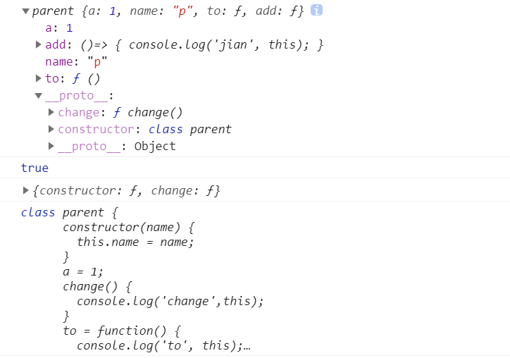
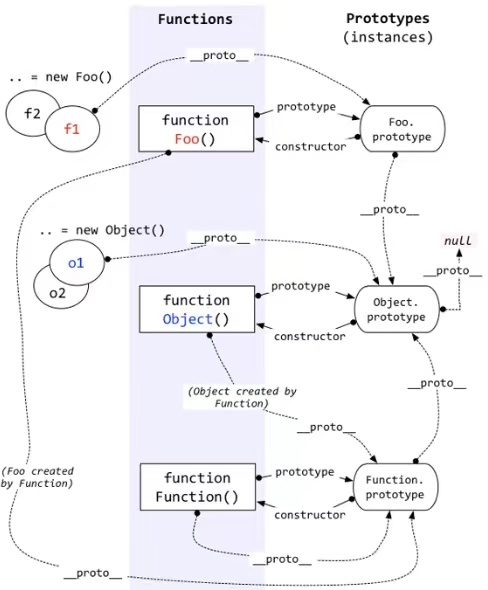
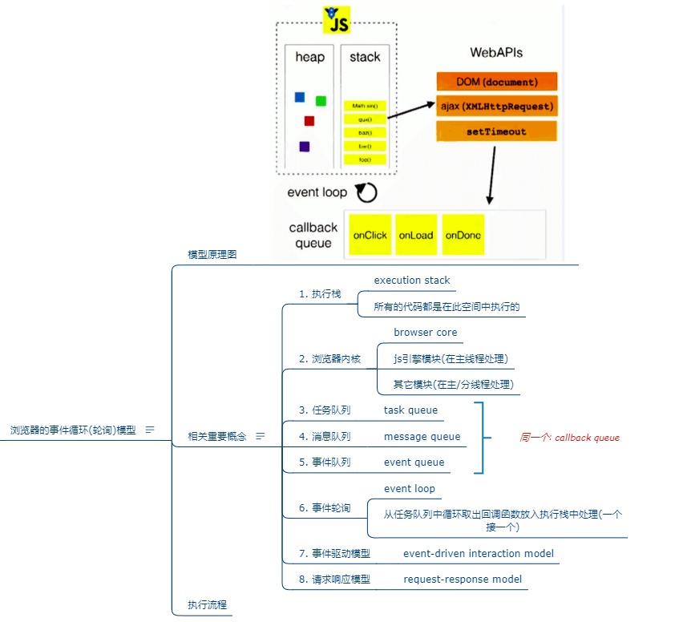

# 基础知识

## 类

>与函数定义相似，定义类有两种方式，类声明和类表达式，不同的是，函数声明可提升，但类声明不能

```js
class Person {}

const Animal = class {}
```

### 实例化  

>使用new实例化类等于使用new调用其构造函数，唯一不同的是JavaScript解释器知道使用new和类意味着应该使用constructor函数进行实例化  

用new调用类的构造函数会执行如下操作：  
1. 内存中创建一个空对象  
2. 新对象内部的`[[Prototype]]`指针被赋值为构造函数的prototype属性  
3. 构造函数内部的this被赋值为新对象（this指向新对象）  
4. 执行构造函数内部的代码（给新对象添加属性）  
5. 如果构造函数返回非空对象，则返回这个对象；否则，返回刚创建的新对象  

>调用类构造函数必须用new，普通构造函数如果不用new调用，就会以全局this（通常为window）作为内部对象

### 实例，原型方法

1. 实例

>每次调用new都会执行构造函数，在函数内部创建为新创建的实例（this）添加'自有'属性，每个实例都对应一个唯一的成员对象，所有成员不会在原型上共享  

2. 原型方法  

>类定义语法把在类块中定义的方法作为原型方法

- 在类块中定义的方法放在原型上
- 以表达式方式，箭头函数定义的属性或者方法放在类实例上 

```js
class parent {
      constructor(name) {
        this.name = name;
      }
      a = 1;
      change() {
        console.log('change',this);
      }
      to = function() {
        console.log('to', this);
      }
      add = ()=> {
        console.log('jian', this);
      }
    }
    let p = new parent('p');
    console.log(p);
    console.log(p.__proto__ === parent.prototype);
    console.log(parent.prototype);
    console.log(p.__proto__.constructor);
```




## 全局函数和全局变量  
>全局变量  
- Infinity: 正无穷大的数值
- NaN: 某个值不是数字值
- undefined

>全局函数
- decodeURI(): 解码某个编码的URI
- decodeURIComponent() : 解码一个编码的URI组件
- encodeURI(): 对字符串进行编码
- encodeURIComponent(): 字符串编码为 URI 组件。
- escape():对字符串进行编码。
- eval() :计算 Javascript 宇符串，并把它作为脚本代码来执行。
- isFinite():检查某个值是否为有穷大的数。
- isNaN(): 检查某个值是否是数宇。
- Number(): 把对象的值转换为数宇。
- parseFloat(): 解析一个字符串并返回一个浮点数。
- parseInt():解析一个字符串并返回一个整数。
- String(把: 对象的值转换为宇符串。
- unescape() :对由 escape()编码的字符串进行解码

## 数据,变量, 内存的理解
1. 数据  
 -  在内存中可读的, 可传递的保存了特定信息
 -  一切皆数据, 函数也是数据
 -  在内存中的所有操作的目标: 数据   


2. 变量
 - 在程序运行过程中它的值是允许改变的量
 - 一个变量对应一块小内存, 它的值保存在此内存中    


3. 内存
 - 内存条通电后产生的存储空间(临时的)
 - 一块内存包含2个方面的数据
    * 内部存储的数据
    * 地址值数据
 - 内存空间的分类
    * 栈空间: 全局变量和局部变量
    * 堆空间: 对象   


4.  内存,数据, 变量三者之间的关系
  * 内存是容器, 用来存储不同数据
  * 变量是内存的标识, 通过变量我们可以操作(读/写)内存中的数据  

## 函数的理解和使用
1. 什么是函数?
  * 用来实现特定功能的, n条语句的封装体
  * 只有函数类型的数据是可以执行的, 其它的都不可以  

2. 函数也是对象
  * instanceof Object===true
  * 函数有属性: prototype
  * 函数有方法: call()/apply()
  * 可以添加新的属性/方法  

3.  函数的3种不同角色
  * 一般函数 : 直接调用，一般首字母小写来定义 funciton fly(){}
  * 构造函数 : 通过new调用，一般首字母大写定义 function Person(){}
  * 对象 : 通过.调用内部的属性/方法  


4. 函数中的this
  * 显式指定谁: obj.xxx()
  * 通过call/apply指定谁调用: xxx.call(obj)
  * 不指定谁调用: xxx()  : window
  * 回调函数: 看背后是通过谁来调用的: window/其它
* 匿名函数自调用:
  ```js
  (function(w, obj){
    //实现代码
  })(window, obj)
  ```
  * 专业术语为: IIFE (Immediately Invoked Function Expression) 立即调用函数表达式						  
5. 回调函数的理解
  * 什么函数才是回调函数?
    * 你定义的
    * 你没有调用
    * 但它最终执行了(在一定条件下或某个时刻)
  * 常用的回调函数
    * dom事件回调函数
    * 定时器回调函数
    * ajax请求回调函数
    * 生命周期回调函数


## 函数高级

### 原型与原型链

>**实例对象的隐式原型__proto__===构造函数的显式原型prototype**   

>所有构造函数都是Function的实例，所有原型对象都是Object的实例（除了Object.prototype)  
```js
Object.prototype instanceof Object //false   
Function.__proto__===Function.prototype //true
```

1. 所有`函数`都有一个特别的属性:
   * `prototype` : 显式原型属性    


2. 所有`实例对象`都有一个特别的属性:
   * `__proto__` : 隐式原型属性  


3. 显式原型与隐式原型的关系
   * 函数的`prototype`: 定义函数时被自动赋值, 值默认为{}, 即用为`原型对象`
   * 实例对象的`__proto__`: 在`创建实例对象`时被自动添加, 并`赋值为构造函数的prototype值`
   * 原型对象即为当前实例对象的父对象

```js
function Fn(){
  //内部语句
  //this.prototype={}
}
  console.log(Fn.prototype);
  var fn = new Fn() //内部语句： this.__proto__=Fn.prototype
  console.log(fn.__proto__);
  console.log(Fn.prototype === fn.__proto__);//true
```
4. 原型链
   * 所有的实例对象都有__proto__属性, 它指向的就是原型对象
   * 这样通过__proto__属性就形成了一个链的结构---->原型链
   * 当查找对象内部的属性/方法时, js引擎自动沿着这个原型链查找
   * 当给对象属性赋值时不会使用原型链, 而只是在当前对象中进行操作

5. 原型对象中有一个属性constructor，指向函数对象

6. 原型链可以解决什么问题 ：对象共享属性和方法   
   
7. 函数拥有：prototype，对象拥有：__proto__   

8. 对象查找属性或方法的顺序：先在对象本身-->构造函数中查找-->对象的原型-->构造函数原型-->当前原型的原型   
 

```js
console.log(Date.prototype.constructor===Date) //true
```
1. 函数的所有实例对象自动拥有原型中的属性（方法）

```js
function Fun(){}
Fun.prototype.test=function(){
  console.log('test()')
}
var fun=new Fun()
fun.test() //test()
```
  

7. 例子

```js
 var A = function() {};
        A.prototype.n = 1;
        var b = new A();
        A.prototype = {
            n: 2,
            m: 3
        }
        var c = new A();

        console.log(b.n); //1
        console.log(b.m); //undefined
        console.log(c.n); //2
        console.log(c.m); //3
```

```js
 var F = function() {};
        Object.prototype.a = function() {
            console.log('a');
        };
        Function.prototype.b = function() {
            console.log('b');
        };

        var f = new F();

        f.a(); //a
        f.b(); //报错f.b is not a function
        //new 出来的实例是一个对象，只会继承Object原型上的方法，不会继承Function原型上的
        F.a(); //a
        F.b(); //b
```

```js
function Person(name) {
            this.name = name;
        }
        let p = new Person('nid')
        console.log(p.__proto__ === Person.prototype); //true
        console.log(Person.__proto__ === Function.prototype); //true
        console.log(Person.__proto__ === Object.prototype); //false
        console.log(Function.prototype.__proto__ === Object.prototype); //true

```  

```js
var foo = {},F = function() {};
      Object.prototype.a = 'value a'
      Function.prototype.b = 'value b'

      console.log(foo.a); //value a
      console.log(foo.b); //undefined

      console.log(F.a); //value a
      console.log(F.b); //value b
```  


### 执行上下文与执行上下文栈  


1. 变量提升与函数提升
   * 变量提升: 在变量定义(声明）语句之前, 就可以访问到这个变量(undefined)
   * 函数提升: 在函数定义(声明）语句之前, 就执行该函数
   * 函数提升优先级高于变量提升，不会被同名的变量声明覆盖，会被变量赋值覆盖

```js
console.log(b);//undefined 变量提升
fn2();// 可调用 函数提升
fn3();// 不能 变量提升

var b=3;
function fn2(){
  console.log('fn2()')
};

var fn3=function(){
  console.log('fn3()')
}
```  

```js
var c=1;
function c(c){
  console.log(c);
  var c=3;
}
c(3);//c is not a function

//相当于
var c;
function c(c){
  var c;
  console.log(c);
  c=3
}
c=1;
c(3);//c此时已经指向1，不再是一个函数，执行时报错
```


2. 理解
   * 执行上下文: 由js引擎自动创建的对象, 包含对应作用域中的所有变量属性
   * 执行上下文栈: 用来管理产生的多个执行上下文 
      * 全局代码执行前，JS引擎就会创建一个栈来存储管理所有的执行上下文对象
      * 全局执行上下文window确定后，添加到栈中
      * 函数调用时创建函数执行上下文，压栈
      * 当前函数执行完后，栈顶的对象出栈
      * 所有代码执行完后，栈中剩下window

3. 生命周期
   * 全局 : 准备执行全局代码前产生, 当页面刷新/关闭页面时死亡
   * 函数 : 调用函数时产生, 函数执行完时死亡  


4. 全局执行上下文:
   * 在执行全局代码前将window确定为全局执行上下文
   

5. 函数执行上下文
   * 在调用函数，准备执行函数之前，创建对应的函数执行上下文对象（**不执行不会创建**）
   

6. 执行上下文创建和初始化的过程
   * 全局:
     * 在全局代码执行前最先创建一个全局执行上下文(window)
     * 收集一些全局变量, 并初始化
     * 将这些变量设置为window的属性
   * 函数:
     * 在调用函数时, 在执行函数体之前先创建一个函数执行上下文
     * 收集一些局部变量, 并初始化
     * 将这些变量设置为执行上下文的属性   


### 作用域与作用域链
1. 理解:
   * 作用域: 一块代码区域, 在编码时就确定了, **不会再变化**。
   * 作用域链: 多个嵌套的作用域形成的由内向外的结构, 用于查找变量
>一般情况下，变量取值到创建这个变量的函数作用域中取值,但如果当前作用域中没有查到值，就会向上级作用域查找，直到查到全局作用域，这个查找过程形成的链条就是作用域链


2. 分类:
   * 全局:代码在程序任何地方都能访问，`window` 对象的内置属性都属于全局作用域
   * 函数：在固定的代码片段才能被访问  


3. 作用
   * 作用域: 隔离变量, 可以在不同作用域定义同名的变量不冲突
   * 作用域链: 查找变量  


4. 区别作用域与执行上下文
   * 作用域: 静态的, **编码时就确定了(不是在运行时)**, 一旦确定就不会变化了
   * 执行上下文: 动态的, 执行代码时动态创建, 当执行结束消失
   * 联系: **执行上下文环境是在对应的作用域中的**  

```js
var x=10;
function fn(){
  console.log(x);
}
function show(f){
  var x=20;
  f();
}
show(fn);//10,作用域一旦确定并不会改变
```  

```js
var fn=function(){
  console.log(fn) 
}
fn()//function fn(){}

var obj={
  fn2:function(){
     console.log(fn2) //fn2 is not defined 在内部作用域没有，全局作用域也没有
     console.log(this.fn2) //function (){}
  }
}
```

### 闭包 
1. 理解:
   * 当嵌套的内部函数引用了外部函数的变量时就产生了闭包
   * 通过chrome工具得知:闭包本质是内部函数中的一个对象, 这个对象中包含被引用的外部变量  
   * 调用几次外部函数产生几个闭包
   * 全局变量容易污染环境，局部变量无法长期驻留内存，需要一种机制，既能长期保存变量又不污染全局

```js
function fn1(){
  var a=2;
  var b='abc';
  function fn2(){ //  执行外部函数对象就会产生闭包，不一定要调用内部函数
    console.log(a)//
  }
}
fn1();
```

2. 作用:
   * 延长局部变量的生命周期
   * 让函数外部能操作内部的局部变量  


3. 常见闭包
  ```js
  //1. 将函数作为另一个函数的返回值
  function fn1() {
    var a = 2;
    function fn2() {
      a++;
      console.log(a);
    }
    return fn2;
  }
  var f = fn1();//一个闭包
  f();
  f();

  // 2. 将函数作为实参传递给另一个函数调用
  function showDelay(msg,time){
    setTimeout(function(){
      alert(msg)
    },time)
  }
  showDelay('dsds',2000)
  ```  


4. 闭包应用:
   * 模块化: 封装一些数据以及操作数据的函数, 向外暴露一些行为
   * 循环遍历加监听
   * JS框架(jQuery)大量使用了闭包
5. 缺点:
   * 变量占用内存的时间可能会过长
   * 可能导致内存泄露
   * 解决:
     * 及时释放 : f = null; //让内部函数对象成为垃圾对象
    
### 内存溢出与内存泄露
1. 内存溢出
   * 一种程序运行出现的错误
   * 当程序运行需要的内存超过了剩余的内存时, 就出抛出内存溢出的错误  


2. 内存泄露
   * 占用的内存没有及时释放
   * 内存泄露积累多了就容易导致内存溢出
   * 常见的内存泄露:
     * 意外的全局变量
     * 没有及时清理的计时器或回调函数
     * 闭包
  

## 对象高级  

### 对象的创建模式
* Object构造函数模式
  ```js
  var obj = {};
  obj.name = 'Tom'
  obj.setName = function(name){this.name=name}
  ```
* 对象字面量模式
  ```js
  var obj = {
    name : 'Tom',
    setName : function(name){this.name = name}
  }
  ```
* 构造函数模式
  ```js
  function Person(name, age) {
    this.name = name;
    this.age = age;
    this.setName = function(name){this.name=name;};
  }
  new Person('tom', 12);
  ```
* 构造函数+原型的组合模式
  ```js
  function Person(name, age) {
    this.name = name;
    this.age = age;
  }
  Person.prototype.setName = function(name){this.name=name;};
  new Person('tom', 12);
  ```
* 工厂模式
  ```js
  <!-- 返回一个对象的函数 -->
  function createPerson(name,age){
    var obj={
      name:name,
      age:age,
      setName:function(name){
        this.name=name;
      }
    }
    return obj;
  }
  ```
  
### 继承模式
* 原型链继承 : 得到方法
  ```js
  function Parent(){}
  Parent.prototype.test = function(){};
  function Child(){}
  Child.prototype = new Parent(); // 子类型的原型指向父类型实例
  Child.prototype.constructor = Child
  var child = new Child(); //有test()
  ```
* 借用构造函数 : 得到属性
  ```js
  function Parent(xxx){this.xxx = xxx}
  Parent.prototype.test = function(){};
  function Child(xxx,yyy){
      Parent.call(this, xxx);//借用构造函数   this.Parent(xxx)
  }
  var child = new Child('a', 'b');  //child.xxx为'a', 但child没有test()
  ```
* 组合
  ```js
  function Parent(xxx){this.xxx = xxx}
  Parent.prototype.test = function(){};
  function Child(xxx,yyy){
      Parent.call(this, xxx);//借用构造函数   相当于this.Parent(xxx)
  }
  Child.prototype = new Parent(); //得到test()
  Child.prototype.constructor=Child //修正constructor
  var child = new Child(); //child.xxx为'a', 也有test()
  ```
* new一个对象背后做了些什么?
  * 创建一个空对象
  * 给对象设置__proto__, 值为构造函数对象的prototype属性值   this.__proto__ = Fn.prototype
  * 执行构造函数体(给对象添加属性/方法)    


## 线程机制与事件机制  

### 线程与进程
* 进程:
  * 程序的一次执行, 它占有一片独有的内存空间
  * 可以通过windows任务管理器查看进程
* 线程:
  * 是进程内的一个独立执行单元
  * 是程序执行的一个完整流程
  * 是CPU的最小的调度单元
* 关系
  * 一个进程至少有一个线程(主)
  * 程序是在某个进程中的某个线程执行的

### 浏览器内核模块组成
* 主线程
  * js引擎模块 : 负责js程序的编译与运行
  * html,css文档解析模块 : 负责页面文本的解析
  * DOM/CSS模块 : 负责dom/css在内存中的相关处理 
  * 布局和渲染模块 : 负责页面的布局和效果的绘制(内存中的对象)
* 分线程
  * 定时器模块 : 负责定时器的管理
  * DOM事件模块 : 负责事件的管理
  * 网络请求模块 : 负责Ajax请求

### js线程
* js是单线程执行的(回调函数也是在主线程)
* H5提出了实现多线程的方案: Web Workers
* 只能是主线程更新界面

### 定时器问题:
* 定时器并不真正完全定时
* 如果在主线程执行了一个长时间的操作, 可能导致延时才处理
    
### 事件处理机制
* 代码分类
  * 初始化执行代码: 包含绑定dom事件监听, 设置定时器, 发送ajax请求的代码
  * 回调执行代码: 处理回调逻辑
* js引擎执行代码的基本流程: 
  * 初始化代码===>回调代码
* 模型的2个重要组成部分:
  * 事件管理模块
  * 回调队列
* 模型的运转流程
  * 执行初始化代码, 将事件回调函数交给对应模块管理
  * 当事件发生时, 管理模块会将回调函数及其数据添加到回调列队中
  * 只有当初始化代码执行完后(可能要一定时间), 才会遍历读取回调队列中的回调函数执行  


    

