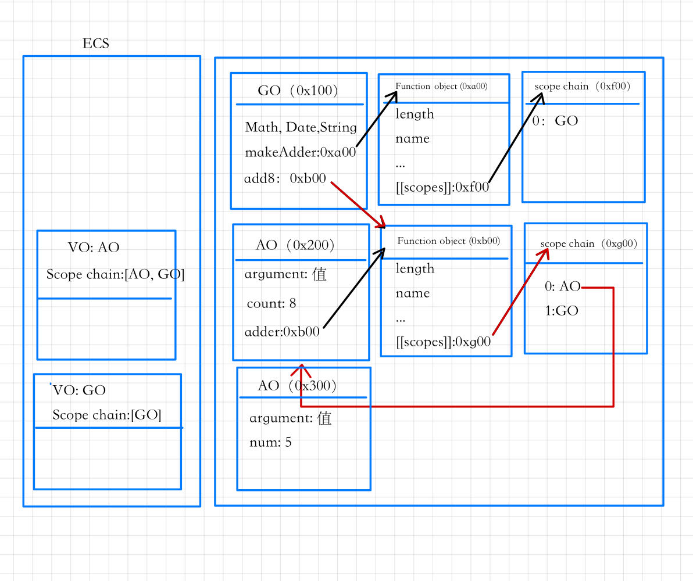

# JS进阶

## this

优先级： 
1. new  
2. bind  
3. apply/call  
4. 隐式绑定  
5. 默认绑定   

- new绑定和call、apply是不允许同时使用的，所以不存在谁的优先级更高   
- new绑定可以和bind一起使用，new绑定优先级更高   


<b>默认绑定：</b>  

独立的函数调用  

可以理解成函数没有被绑定到某个对象上进行调用   

```js
function foo(func) {
      func();
    }
    var obj = {
      name:'obj',
      bar: function() {
        console.log(this);
      },
      foo: ()=> {
        console.log(this);
      }
    }

    foo(obj.bar); //window
    foo(obj.foo); //window
```

<b>隐式绑定：</b>  

通过某个对象进行调用的     

也就是它的调用位置中，是通过某个对象发起的函数调用   

```js
    function foo(func) {
      console.log(this);
    }
    var obj1 = {
      name:'obj1',
      foo:foo,
    }
    var bar = obj1.foo
    bar(); //window

    var obj2 = {
      name: 'obj2',
      obj1:obj1,
    }
    obj2.obj1.foo();// {name: 'obj1', foo: ƒ}

```   

<b>显示绑定：</b>  

明确指明绑定对象    

隐式绑定有一个前提条件：   
- 必须在调用的对象内部有一个对函数的引用（比如一个属性）   
- 如果没有这样的引用，在进行调用时，会报找不到该函数的错误  
- 正是通过这个引用，间接的将this绑定到了这个对象上   

<b>JavaScript所有的函数都可以使用call和apply方法。</b>   

- 第一个参数是相同的，要求传入一个对象  
- 在调用这个函数时，会将this绑定到这个传入的对象上   
- 后面的参数，apply为数组，call为参数列表   

```js
  function foo(func) {
      console.log(this);
    }
  foo.call(window) //window
  foo.call({name: '123'}) //{name: '123'}
  foo.call(123) //Number {123} 
```  


如果我们希望一个函数总是显示的绑定到一个对象上,可以用bind()   

- 使用bind方法，bind() 方法创建一个新的绑定函数（bound function，BF）   
- 绑定函数是一个 exotic function object（怪异函数对象，ECMAScript 2015 中的术语）     
- 在 bind() 被调用时，这个新函数的 this 被指定为 bind() 的第一个参数，而其余参数将作为新函数的参数，供调用时使用。      

```js
func.bind(thisArg[, arg1[, arg2[, ...]]])
```  

<b>new绑定：</b>    

JavaScript中的函数可以当做一个类的构造函数来使用，也就是使用new关键字  
  
用new关键字来调用函数是，会执行如下的操作  
 
1. 创建一个全新的对象；  
2. 这个新对象会被执行prototype连接；  
3. 这个新对象会绑定到函数调用的this上（this的绑定在这个步骤完成）  
4. 如果函数没有返回其他对象，表达式会返回这个新对象；   


this规则之外： 

>如果在显示绑定中，我们传入一个null或者undefined，那么这个显示绑定会被忽略，使用默认规则   

```js
    function foo(func) {
      console.log(this);
    }
   
    var obj = {
      name:'why'
    }
    foo.call(obj) //obj对象
    foo.call(null) //window
    foo.call(undefined) //window
    var bar = foo.bind(null);
    bar() //window
```  

>间接函数引用   

创建一个函数的 间接引用，这种情况使用默认绑定规则   

- 赋值(obj2.foo = obj1.foo)的结果是foo函数；   
- foo函数被直接调用，那么是默认绑定；   

```js
    function foo(func) {
      console.log(this);
    }
    var obj1 = {
      name: 'obj1',
      foo:foo,
    }
    var obj2 = {
      name: 'obj2'
    }
    obj1.foo(); //obj1
    (obj2.foo = obj1.foo)() //window
```  

练习：
```js
     var name = 'window';
     var person = {
      name: 'person',
      sayName: function() {
        console.log(this.name);
      }
     };

     function sayName() {
      var sss = person.sayName;
      sss();
      person.sayName();
      (person.sayName)();
      (b = person.sayName)();
     }

     sayName()

     // window
     // person
     // person
     // window
```  

```js
    var name = 'window'
    var person1 = {
      name: 'person1', 
      foo1: function() {
        console.log(this.name);
      },
      foo2: () => console.log(this.name),
      foo3: function() {
        return function() {
          console.log(this.name);
        }
      },
      foo4: function() {
        return ()=> {
          console.log(this.name);
        }
      }
     }

     var person2 = {name: 'person2'}

     person1.foo1()
     person1.foo1.call(person2)
     
     person1.foo2()
     person1.foo2.call(person2)

     person1.foo3()()
     person1.foo3.call(person2)()
     person1.foo3().call(person2)  

     person1.foo4()()
     person1.foo4.call(person2)()
     person1.foo4().call(person2) 

      // person1
      // person2
      // window
      // window
      // window
      // window
      // person2
      // person1
      // person2
      // person1
```

## 浏览器渲染页面流程   

浏览器内核指的是浏览器的排版引擎    

>排版引擎（layout engine），也称为浏览器引擎（browser engine）、页面渲染引擎（rendering engine）或样版引擎。
也就是一个网页下载下来后，就是由我们的渲染引擎来帮助我们解析的。     

  

<b>1. HTML解析过程</b>

因为默认情况下服务器会给浏览器返回index.html文件，解析HTML是所有步骤的开始    

解析HTML，会构建<b>DOM Tree</b>   

    


<b>2. 生成CSS规则</b>    

在解析的过程中，遇到CSS的link元素，会由浏览器负责下载对应的CSS文件    

下载CSS文件不会影响DOM的解析    

浏览器下载完CSS文件后，就会对CSS文件进行解析，解析出对应的规则树    

称之为 <b>CSSOM</b>（CSS Object Model，CSS对象模型）     

    

<b>3. 构建Render Tree</b>   

当有了DOM Tree和 CSSOM Tree后，就可以两个结合来构建Render Tree了    

link元素不会阻塞DOM Tree的构建过程，但是会阻塞Render Tree的构建过程    

因为Render Tree在构建时，需要对应的CSSOM Tree    

Render Tree和DOM Tree并不是一一对应的关系，比如对于display为none的元素，不会出现在render tree中    

<b>4. 布局（layout）和绘制（Paint）</b>   

第四步是在渲染树（Render Tree）上运行布局（Layout）以计算每个节点的几何体。   

渲染树会表示显示哪些节点以及其他样式，但是不表示每个节点的尺寸、位置等信息  

布局是确定呈现树中所有节点的宽度、高度和位置信息   

第五步是将每个节点绘制（Paint）到屏幕上    

在绘制阶段，浏览器将布局阶段计算的每个frame转为屏幕上实际的像素点；    

包括将元素的可见部分进行绘制，比如文本、颜色、边框、阴影、替换元素（比如img）     

<b>特殊解析 : composite合成</b>   

绘制的过程，可以将布局后的元素绘制到多个合成图层中, 这是浏览器的一种优化手段   

默认情况下，标准流中的内容都是被绘制在同一个图层（Layer）中的   

而一些特殊的属性，会创建一个新的合成层（ CompositingLayer ），并且新的图层可以利用GPU来加速绘制    

因为每个合成层都是单独渲染的    

常见可以形成新的合成层的属性：   
- 3D transforms  
- video、canvas、iframe  
- opacity 动画转换时；
- position: fixed   
- will-change：一个实验性的属性，提前告诉浏览器元素可能发生哪些变化；
- animation 或 transition 设置了opacity、transform；   

分层确实可以提高性能，但是它以内存管理为代价，因此不应作为 web 性能优化策略的一部分过度使用。

## 回流和重绘   

理解回流reflow：（也可以称之为重排）  
- 第一次确定节点的大小和位置，称之为布局（layout）    
- 之后对节点的大小、位置修改重新计算称之为回流     

什么情况下引起回流：

- DOM结构发生改变（添加新的节点或者移除节点）    
- 改变了布局（修改了width、height、padding、font-size等值）     
- 窗口resize（修改了窗口的尺寸等）   
- 调用getComputedStyle方法获取尺寸、位置信息    

理解重绘repaint   

- 第一次渲染内容称之为绘制（paint）, 之后重新渲染称之为重绘    

什么情况下会引起重绘     
修改背景色、文字颜色、边框颜色、样式等        


回流一定会引起重绘，所以回流是一件很消耗性能的事情。   

开发中要尽量避免发生回流：     
1. 修改样式时尽量一次性修改     
  
   比如通过cssText修改，比如通过添加class修改    

2. 尽量避免频繁的操作DOM     
   可以在一个DocumentFragment或者父元素中将要操作的DOM操作完成，再一次性的操作；   

   也可以将要频繁修改的元素display:none; 修改完后在显示   

3. 尽量避免通过getComputedStyle获取尺寸、位置等信息；  

4. 对某些元素使用position的absolute或者fixed，并不是不会引起回流，而是开销相对较小，不会对其他元素造成影响      

>script元素和页面解析的关系    

浏览器在解析HTML的过程中，遇到了script元素是不能继续构建DOM树      

会停止继续构建，首先下载JavaScript代码，并且执行JavaScript的脚本；   

只有等到JavaScript脚本执行结束后，才会继续解析HTML，构建DOM树   

当脚本很大时，会造成页面的解析阻塞，在脚本下载、执行完成之前，用户在界面上什么都看不到    

为了解决这个问题，script元素给我们提供了两个属性（attribute）：defer和async    

### defer   

defer 属性告诉浏览器不要等待脚本下载，而继续解析HTML，构建DOM Tree。   

脚本会由浏览器来进行下载，不会阻塞DOM Tree的构建过程；   

如果脚本提前下载好了，它会等待DOM Tree构建完成，在DOMContentLoaded事件之前先执行defer中的代码   

多个带defer的脚本是可以保持正确的顺序执行的    

从某种角度来说，defer可以提高页面的性能，并且推荐放到head元素中   

defer仅适用于外部脚本，对于script默认内容会被忽略    

### async   

async 特性与 defer 有些类似，它也能够让脚本不阻塞页面   

async是让一个脚本完全独立的   

浏览器不会因 async 脚本而阻塞（与 defer 类似）    

async脚本不能保证顺序，它是独立下载、独立运行，不会等待其他脚本   

async不会能保证在DOMContentLoaded之前或者之后执行      


## 闭包   

### JS垃圾回收机制   

JS对于原始数据类型内存的分配会在执行时，直接在栈空间进行分配；   

JS对于复杂数据类型内存的分配会在堆内存中开辟一块空间，并且将这块空间的指针返回值变量引用；  


>常见GC  

1. 引用计数   

当一个对象有一个引用指向它时，那么这个对象的引用就+1；   

当一个对象的引用为0时，这个对象就可以被销毁掉；  

这个算法有一个很大的弊端就是会产生循环引用；   


2. 标记清除   

标记清除的核心思路是<b>可达性</b>（Reachability）    

这个算法是设置一个根对象，垃圾回收器会定期从这个根开始，找所有从根开始有引用到的对象，对于那些没有引用到的对象，就认为是不可用的对象；    

这个算法可以很好的解决循环引用的问题；   


JS引擎比较广泛的采用的就是可达性中的标记清除算法，V8引擎为了进行更好的优化，它在算法的实现细节上也会结合一些其他的算法：   

- 标记整理（Mark-Compact）   
  - 与标记清楚不同的是会整理    
  - 回收期间同时会将保留的存储对象搬运汇集到连续的内存空间，从而整合空闲空间，避免内存碎片化；


- 分代收集（Generational collection）—— 对象被分成两组：“新的”和“旧的”  
   - 许多对象出现，完成它们的工作并很快死去，它们可以很快被清理；
   - 那些长期存活的对象会变得“老旧”，而且被检查的频次也会减少；

- 增量收集（Incremental collection）   
   - 所以引擎试图将垃圾收集工作分成几部分来做，然后将这几部分会逐一进行处理，这样会有许多微小的延迟而不是一个大的延迟；   

- 闲时收集（Idle-time collection）    
   - 垃圾收集器只会在 CPU 空闲时尝试运行，以减少可能对代码执行的影响  


### 闭包    

>MDN解释： 一个<b>函数</b>和对其周围状态（lexical environment，词法环境）的引用捆绑在一起（或者说函数被引用包围），这样的组合就是闭包（closure）；  

 一个普通的函数function，如果它可以访问外层作用域的自由变量，那么这个函数和周围环境就是一个闭包；     

从广义的角度来说：JavaScript中的函数都是闭包；  

从狭义的角度来说：JavaScript中一个函数，如果访问了外层作用域的变量，那么它是一个闭包   


```js
function makeAdder(count) {
  function adder(num) {
    return count + num;
  }
  return adder;
}

var add8 = makeAdder(8)
console.log(add8(5))
```  

   


makeAdder函数执行完毕，正常情况下我们的AO对象会被释放；   

但是因为在0xg00的函数中有作用域引用指向了这个AO对象，所以它不会被释放掉；    


>闭包内存泄漏   

如果后续我们不再使用add8函数了，那么该函数对象应该要被销毁掉，并且其引用着的父作用域AO也应
该被销毁掉；   

但是目前因为在全局作用域下add8变量对0xb00的函数对象有引用，而0xb00的作用域中AO（0x200）有引用，所以最终会造成这些内存都是无法被释放的；   

闭包会造成内存泄露，其实就是刚才的引用链中的所有对象都是无法释放的；  

当将add8设置为null时，就不再对函数对象0xb00有引用，那么对应的AO对象0x200也就不可达了；  

在GC的下一次检测中，它们就会被销毁掉；   

## V8引擎   

   

Parse模块会将JavaScript代码转换成AST（抽象语法树），这是因为解释器并不直接认识JavaScript代码；    

Ignition是一个解释器，会将AST转换成ByteCode（字节码）    

同时会收集TurboFan优化所需要的信息（比如函数参数的类型信息，有了类型才能进行真实的运算）    

如果函数只调用一次，Ignition会解释执行ByteCode    

TurboFan是一个编译器，可以将字节码编译为CPU可以直接执行的机器码；  

如果一个函数被多次调用，那么就会被标记为热点函数，那么就会经过TurboFan转换成优化的机器码，提高代码的执行性能； 

### JS执行过程    

初始化全局对象   

js引擎会在执行代码之前，会在堆内存中创建一个全局对象：Global Object（GO）   

该对象 所有的作用域（scope）都可以访问，里面会包含Date、Array、String、Number、setTimeout、setInterval等等；   

其中还有一个window属性指向自己   

### 执行上下文   


js引擎内部有一个执行上下文栈（Execution Context Stack，简称ECS），它是用于执行代码的调用栈。    

js有全局执行上下文和函数执行上下文   

全局的代码块为了执行会构建一个 Global Execution Context（GEC）全局执行上下文；      

GEC会 被放入到ECS(执行上下文栈）中 执行；    

函数调用时产生函数执行上下文放入执行上下文栈中执行    


GEC包含两部分内容： 

1. 在代码执行前，在parser转成AST的过程中，会将全局定义的变量、函数等加入到GlobalObject中，变量不会赋值(undefined)，这个过程也称之为<b>变量的作用域提升（hoisting）</b>   

2. 在代码执行中，对变量赋值，或者执行其他的函数；  

每一个执行上下文有：

- 关联一个VO（Variable Object，变量对象），变量和函数声明会被添加到这个VO对象中   
- 作用域链: 作用域链是一个对象列表，用于变量标识符的求值   
- this  


当全局代码被执行的时候，VO就是GO对象   

函数执行上下文关联的VO:   

当进入一个函数执行上下文时，会创建一个AO对象（Activation Object）  

这个AO对象会使用arguments作为初始化，并且初始值是传入的参数；   

这个AO对象会作为执行上下文的VO来存放变量的初始化    


