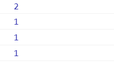
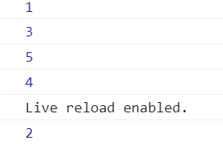
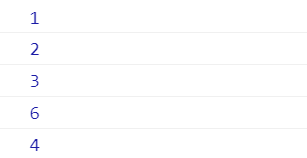
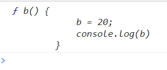
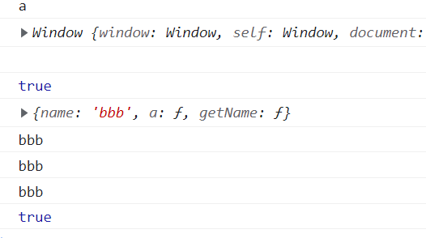
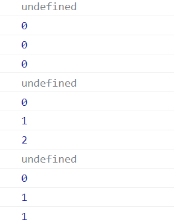

---
# 这是页面的图标
icon: page
# 这是侧边栏的顺序
order: 1
# 设置写作时间
date: 2022-08-02
tag:
  - JavaScript
---
<!-- more -->

# 输出

## 1

```js
 var num = 1;
 let obj = {
     num: 2,
     foo: function() {
         console.log(this.num);
     },
     foo2: () => {
         console.log(this.num);
     }
 }
 let f1 = obj.foo;
 let f2 = obj.foo2;
 obj.foo();//隐式调用，this指向上下文
 obj.foo2();//箭头函数this继承于上一个作用域的this，对象的嵌套不构成作用域链，上一层作用域是window
 f1();//显示调用，this指向window
 f2();
```

  

## 2

```js
 console.log(1);
 setTimeout(function() {
     console.log(2);
 }, 0);
 console.log(3);
 Promise.resolve(4).then(b => {
     console.log(b);
 });
 console.log(5);

 //promise管理异步任务，是微任务
 //setTimeout 是宏任务 微任务优先于宏任务
 ```
 

 ## 3

 ```js
 const p = new Promise((resolve, reject) => {
      console.log(1);
      resolve();
      console.log(2);
      reject();
      console.log(3);
  })
  p.then(() => {
      console.log(4);
  }).catch(err => {
      console.log(5);
  })
  console.log(6);
```
   

## 4

```js
 var b = 10;
        (function b() {
            b = 20;
            console.log(b)
        })()//非匿名自执行函数，函数名只读
```

   

## 5
```js
 function a() {
            a.name = 'aaa';
            console.log(this);
            console.log(this.name);
            return this.name;

        }
        console.log(a.name);

        var b = {
            a,
            name: 'bbb',
            getName: function() {
                return this.name;
            }
        }
        var c = b.getName;

        console.log(a() === '');
        console.log(b.a());
        console.log(b.getName());
        console.log(c() === '');
```

   

## 6
```js
  function fun(n, o) {
            console.log(o);
            return {
                fun: function(m) {
                    return fun(m, n)
                }
            }
        }
        var a = fun(0)//n导致闭包
        a.fun(1)//新产生的闭包没被接收
        a.fun(2)
        a.fun(3)
      
        var b = fun(0).fun(1).fun(2).fun(3)

        var c = fun(0).fun(1)
        c.fun(2)
        c.fun(3)
```

