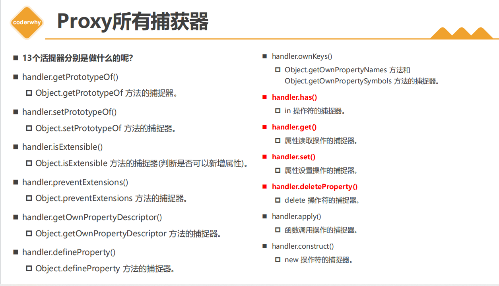
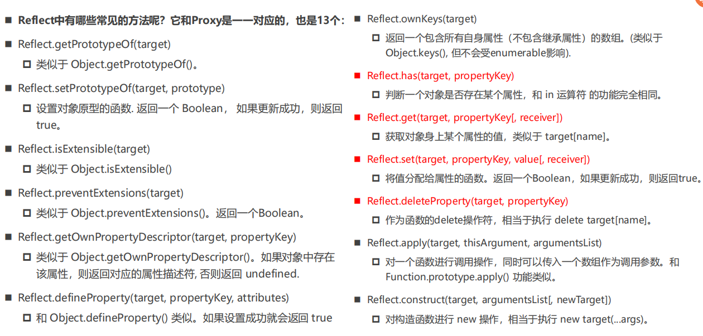

# Proxy-Reflect

## proxy   

在ES6中，新增了一个Proxy类,如果我们希望监听一个对象的相关操作，那么我们可以先创建一个代理对象    

之后对该对象的所有操作，都通过代理对象来完成，代理对象可以监听我们想要对原对象进行哪些操作     

首先，new Proxy对象，并且传入需要侦听的对象以及一个处理对象，称之为handler   

const p = new Proxy(target, handler)    

其次，之后的操作都是直接对Proxy的操作，而不是原有的对象，在handler里面进行侦听   

在handler中添加对应的捕捉器（Trap）:   

set和get分别对应的是函数类型；  

 set函数有四个参数：   

- target：目标对象（侦听的对象）；    

- property：将被设置的属性key；  

- value：新属性值；  

- receiver：调用的代理对象；    

 get函数有三个参数：  

- target：目标对象（侦听的对象）；  

- property：被获取的属性key；   

- receiver：调用的代理对象；   


<b>proxy捕获器</b>   

   

<b>Proxy的construct和apply</b>       

```js
const fooProxy = new Proxy(foo, {
  apply: function(target, thisArg, otherArgs) {
    console.log('函数的apply侦听');
    return target.apply(thisArg, otherArgs);
  },
  construct(target, argArray, newTarget) {
    console.log(target, argArray, newTarget);
    return new target();s
  }
})
```

## Reflect  

<b>Reflect作用</b>   

它主要提供了很多操作JavaScript对象的方法，有点像Object中操作对象的方法；     

>在早期的ECMA规范中没有考虑到这种对 对象本身 的操作如何设计会更加规范，所以将这些API放到了Object上面，但是Object作为一个构造函数，这些操作实际上放到它身上并不合适，另外还包含一些类似于 in、delete操作符，让JS看起来是会有一些奇怪的，所以在ES6中新增了Reflect，让我们这些操作都集中到了Reflect对象上；另外在使用Proxy时，可以做到不操作原对象；     

1. 代理对象的目的： 不用直接操作原对象   
2. Reflect.set返回Boolean值，可以判断本次操作是否成功    
3. receiver就是外层Proxy对象，Refelect.set/get最后一个参数，可以决定对象访问器setter/getter的this指向      

[Object和Proxy的API区别](https://developer.mozilla.org/zh-CN/docs/Web/JavaScript/Reference/Global_Objects/Reflect/Comparing_Reflect_and_Object_methods)    


<b>Reflect的常见方法</b>    

  

```js
const objProxy = new Proxy(obj, {
  has: function (target, key) {
    return Reflect.has(target, key);
  },
  set: function(target, key, value) {
    return Reflect.set(target, key, value);
  },
  get: function(target, key) {
    return Reflect.get(target, key);
  },
  deleteProperty: function(target, key) {
    return Reflect.defineProperty(target, key);
  }
})
```  

<b>Receiver作用</b>   

使用getter、setter的时候有一个receiver的参数   

如果我们的源对象（obj）有setter、getter的访问器属性，那么可以通过receiver来改变里面的this    

```js
const objProxy = new Proxy(obj, {
  has: function (target, key) {
    return Reflect.has(target, key);
  },
  set: function(target, key, value, receiver) {
    return Reflect.set(target, key, value, receiver);
  },
  get: function(target, key, receiver) {
    return Reflect.get(target, key, receiver);
  },
  deleteProperty: function(target, key) {
    return Reflect.defineProperty(target, key);
  }
})
```

<b>Reflect的construct</b>   

```js
function Student(name, age) {
  this.name = name
  this.age = age
}

function Animal() {

}

const stu = Reflect.construct(Student, ['why', 28], Animal);
console.log(stu.__proto__ === Animal.prototype); //true
```


