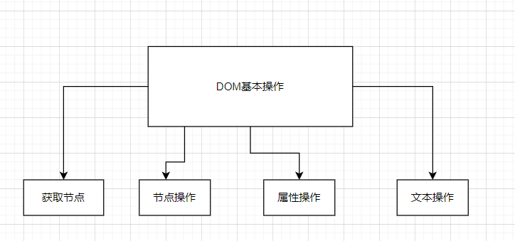

# BOM

## 1.什么是BOM

>BOM（Browser Object Model）即浏览器对象模型，它提供了独立于内容而与浏览器窗口进行交互的对象，其核心对象是 window。
BOM 由一系列相关的对象构成，并且每个对象都提供了很多方法与属性。
BOM 缺乏标准，JavaScript 语法的标准化组织是 ECMA，DOM 的标准化组织是 W3C，BOM 最初是Netscape 浏览器标准的一部分。

## 2.BOM 构成
BOM 比 DOM 更大，它包含 DOM。  



- BOM
  1. 浏览器对象模型
  2. 将浏览器当作一个对象来对待，这个对象主要定义了与浏览器进行交互的方法和接口
  3. BOM的核心是window
  4. 网页中定义的任何对象、变量和函数，都会作为全局对象的一个属性或者方法存在；  

- DOM
  1. 文档对象模型
  2. 把文档当作一个对象来对待，这个对象主要定义了处理网页的内容和接口
  3. DOM的顶级对象是document  

## 3.window对象的常见事件

1. window.onload 是窗口 (页面）加载事件，**当文档内容完全加载完成**会触发该事件(包括图像、脚本文件、CSS 文件等), 就调用的处理函数。  
2.  DOMContentLoaded 事件触发时，仅当DOM加载完成，不包括样式表，图片，flash等等。
​IE9以上才支持！！！
​如果页面的图片很多的话, 从用户访问到onload触发可能需要较长的时间, 交互效果就不能实现，必然影响用户的体验，此时用 DOMContentLoaded 事件比较合适。

> window.onload 传统注册事件方式 只能写一次，如果有多个，会以最后一个 window.onload 为准。
如果使用 addEventListener 则没有限制

3. window.onresize 是调整窗口大小加载事件,  当触发时就调用的处理函数。
   - 只要窗口大小发生像素变化，就会触发这个事件。
   - 我们经常利用这个事件完成响应式布局。 window.innerWidth 当前屏幕的宽度

```html
    <script>
        // 注册页面加载事件
        window.addEventListener('load', function() {
            var div = document.querySelector('div');
        	// 注册调整窗口大小事件
            window.addEventListener('resize', function() {
                // window.innerWidth 获取窗口大小
                console.log('变化了');
                if (window.innerWidth <= 800) {
                    div.style.display = 'none';
                } else {
                    div.style.display = 'block';
                }
            })
        })
    </script>
    <div></div>
```

## 4.定时器（两种）

### 4.1 setTimeout() 
```js
window.setTimeout(调用函数(回调函数), [延迟的毫秒数(默认0ms)]);
```
- 用于设置一个定时器，该定时器在定时器到期后执行调用函数。
- 回调，就是回头调用的意思。上一件事干完，再回头再调用这个函数。
定时器中的调用函数，事件处理函数，也是回调函数。
以前我们讲的element.onclick = function(){} 或者  element.addEventListener(“click”, fn);里面的 函数也是回调函数。

停止：
  ```js
  window.clearTimeout(timeoutID)
  ```

### 4.2 setInterval()
```js
window.setInterval(回调函数, [间隔的毫秒数]);
```
- setInterval() 方法重复调用一个函数，每隔这个时间，就去调用一次回调函数。

停止：
```js
window.clearInterval(intervalID);
```

案例：倒计时
```html
    <div>
        <span class="hour">1</span>
        <span class="minute">2</span>
        <span class="second">3</span>
    </div>
    <script>
        // 1. 获取元素（时分秒盒子） 
        var hour = document.querySelector('.hour'); // 小时的黑色盒子
        var minute = document.querySelector('.minute'); // 分钟的黑色盒子
        var second = document.querySelector('.second'); // 秒数的黑色盒子
        var inputTime = +new Date('2019-5-1 18:00:00'); // 返回的是用户输入时间总的毫秒数

        countDown(); // 我们先调用一次这个函数，防止第一次刷新页面有空白 

        // 2. 开启定时器
        setInterval(countDown, 1000);
		
        function countDown() {
            var nowTime = +new Date(); // 返回的是当前时间总的毫秒数
            var times = (inputTime - nowTime) / 1000; // times是剩余时间总的秒数 
            var h = parseInt(times / 60 / 60 % 24); //时
            h = h < 10 ? '0' + h : h;
            hour.innerHTML = h; // 把剩余的小时给 小时黑色盒子
            var m = parseInt(times / 60 % 60); // 分
            m = m < 10 ? '0' + m : m;
            minute.innerHTML = m;
            var s = parseInt(times % 60); // 当前的秒
            s = s < 10 ? '0' + s : s;
            second.innerHTML = s;
        }
    </script>
```

## 5.this指向

>**this的指向在函数定义的时候是确定不了的**，只有**函数执行的时候才能确定**this到底指向谁，一般情况下this的最终指向的是那个**调用它的对象**。

了解一下几个this指向:

1. 全局作用域或者普通函数中this指向全局对象window（注意定时器里面的this指向window）
2. 方法调用中谁调用this指向谁
3. 构造函数中this指向构造函数的实例 

```html
    <button>点击</button>
    <script>
        // this 指向问题 一般情况下this的最终指向的是那个调用它的对象
        // 1. 全局作用域或者普通函数中this指向全局对象window（ 注意定时器里面的this指向window）
        console.log(this);
        function fn() {
            console.log(this);
        }
        window.fn();
        window.setTimeout(function() {
            console.log(this);
        }, 1000);
        // 2. 方法调用中谁调用this指向谁
        var o = {
            sayHi: function() {
                console.log(this); // this指向的是 o 这个对象
            }
        }
        o.sayHi();
        var btn = document.querySelector('button');
        btn.addEventListener('click', function() {
                console.log(this); // 事件处理函数中的this指向的是btn这个按钮对象
            })
        // 3. 构造函数中this指向构造函数的实例
        function Fun() {
            console.log(this); // this 指向的是fun 实例对象
        }
        var fun = new Fun();
    </script>
```

## 6.location对象

### 6.1 什么是location对象
location 对象提供了与当前窗口中加载的文档有关的信息，还提供了一些导航的功能，它既是window对象的属性，也是document对象的属性

### 6.2 URL
>统一资源定位符 (Uniform Resource Locator, URL) 是互联网上标准资源的地址。互联网上的每个文件都有
一个唯一的 URL，它包含的信息指出文件的位置以及浏览器应该怎么处理它。

```js
protocol://host[:port]/path/[?query]#fragment
http://www.itcast.cn/index.html?name=andy&age=18#link
```


### 6.3 location对象的属性


```html
//5分钟自动跳转页面
<button>点击</button>
    <div></div>
    <script>
        var btn = document.querySelector('button');
        var div = document.querySelector('div');
        btn.addEventListener('click', function() {
            // console.log(location.href);
            location.href = 'http://www.itcast.cn';
        })
        var timer = 5;
        setInterval(function() {
            if (timer == 0) {
                location.href = 'http://www.itcast.cn';
            } else {
                div.innerHTML = '您将在' + timer + '秒钟之后跳转到首页';
                timer--;
            }
        }, 1000);
    </script>
```

## 7.navigator对象

>navigator 对象包含有关浏览器的信息，它有很多属性，我们最常用的是 `userAgent`，该属性可以返回由客户机发送服务器的 `user-agent` 头部的值。  

下面前端代码可以判断用户那个终端打开页面，实现跳转

```js
if((navigator.userAgent.match(/(phone|pad|pod|iPhone|iPod|ios|iPad|Android|Mobile|BlackBerry|IEMobile|MQQBrowser|JUC|Fennec|wOSBrowser|BrowserNG|WebOS|Symbian|Windows Phone)/i))) {
    window.location.href = "";     //手机
 } else {
    window.location.href = "";     //电脑
 }
```

## 8.history对象

window对象给我们提供了一个 history对象，与浏览器历史记录进行交互。该对象包含用户（在浏览器窗口中）访问过的URL。


## 9.JS执行机制

### 9.1 JS是单线程

>单线程就意味着，所有任务需要排队，前一个任务结束，才会执行后一个任务。如果前一个任务耗时很长，后一个任务就不得不一直等着。这样所导致的问题是： 如果 JS 执行的时间过长，这样就会造成页面的渲染不连贯，导致页面渲染加载阻塞的感觉。

### 9.2 同步任务和异步任务
​  为了解决这个问题，利用多核 CPU 的计算能力，HTML5 提出 Web Worker 标准，允许 JavaScript 脚本创建多个线程，但是子线程完全受主线程控制。于是，JS 中出现了**同步任务**和**异步任务**。

#### 同步任务

- ​前一个任务结束后再执行后一个任务，程序的执行顺序与任务的排列顺序是一致的、同步的。
- 同步任务都在主线程上执行，形成一个执行栈

#### 异步任务

js的异步是通过回调函数实现的，分为以下三类
- 普通事件：click等
- 资源加载：onload等
- 定时器：setTimeout等


### 9.3 JS执行机制实现

1. 先执行**执行栈**中的同步任务

2. 异步任务（回调函数）放入任务**队列**中。

3. 一旦执行栈中的所有同步任务执行完毕，系统就会按次序读取任务队列中的异步任务，于是被读取的异步任务结束等待状态，进入执行栈，开始执行操作。
4. 由于主线程不断的重复获得任务、执行任务，再获得任务，再执行，这种机制被称为事件循环


```js
 console.log(1);
 document.onclick = function() {
   console.log('click');
 }

 setTimeout(function() {
   console.log(3)
 }, 3000)
 console.log(2);
```
执行过程：
- 依次执行打印1，将onclick事件交由异步处理程序，打印2，将setTimeout事件交由异步处理程序

1. 在setTimeout设置的3秒之前点击页面
  - 异步进程在点击页面事件开始后，将处理函数（回调函数打印click）交由任务队列中
  -  3秒之间完成之后，异步处理程序将回调函数（打印3）交由任务队列中
  -  事件循环在主线程完成之后不断监听任务队列是否为空，不为空，将任务按照先进先出的原则将任务交由主线程进行执行
  -  打印的结果如下:  


  

2. 在setTimeout设置的3秒之后点击页面
  - 3秒之间完成之后，异步处理程序将回调函数（打印3）交由任务队列中
  - 异步进程在点击页面事件开始后，将处理函数（回调函数打印click）交由任务队列中
  - 事件循环在主线程完成之后不断监听任务队列是否为空，不为空，将任务按照先进先出的原则将任务交由主线程进行执行
  - 打印的结果如下:  


  