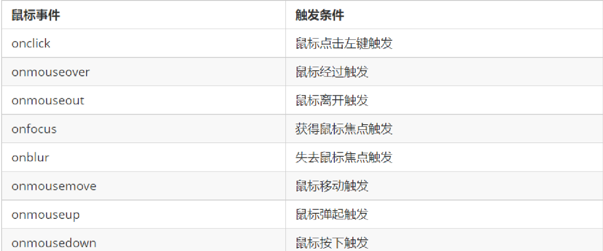

# WebApi

## 1.Web API介绍

### 1.1API的概念

>API（Application Programming Interface，应用程序编程接口）是一些预先定义的函数，目的是提供应用程序与开发人员基于某软件或硬件得以访问一组例程的能力，而又无需访问源码，无需理解其内部工作机制细节，只需直接调用使用即可。  

### 1.2 Web  API的概念

​Web API 是浏览器提供的一套操作浏览器功能和页面元素的 API ( BOM 和 DOM )。

​	MDN 详细 API : <https://developer.mozilla.org/zh-CN/docs/Web/API>


​	此处的 Web API 特指浏览器提供的一系列API(很多函数或对象方法)，即操作网页的一系列工具。例如：操作html标签、操作页面地址的方法。


### 1.3 API 和 Web  API 总结

1. API 是为我们程序员提供的一个接口，帮助我们实现某种功能，我们会使用就可以了，不必纠结内部如何实现

2. Web API 主要是针对于浏览器提供的接口，主要针对于浏览器做交互效果。

3. Web API 一般都有输入和输出（函数的传参和返回值），Web API 很多都是方法（函数）

4. 学习 Web API 可以结合前面学习内置对象方法的思路学习  

## 2. DOM 介绍

### 2.1 什么是DOM

​	文档对象模型（Document Object Model，简称DOM），是 [W3C](https://baike.baidu.com/item/W3C) 组织推荐的处理[可扩展标记语言](https://baike.baidu.com/item/%E5%8F%AF%E6%89%A9%E5%B1%95%E7%BD%AE%E6%A0%87%E8%AF%AD%E8%A8%80)（html或者xhtml）的标准[编程接口](https://baike.baidu.com/item/%E7%BC%96%E7%A8%8B%E6%8E%A5%E5%8F%A3)。  

>DOM是W3C组织制定的一套处理 html和xml文档的规范，所有的浏览器都遵循了这套标准。  

### 2.2. DOM树


DOM树 又称为文档树模型，把文档映射成树形结构，通过节点对象对其处理，处理的结果可以加入到当前的页面。

- 文档：一个页面就是一个文档，DOM中使用document表示
- 节点：网页中的所有内容，在文档树中都是节点（标签、属性、文本、注释等），使用node表示
- 标签节点：网页中的所有标签，通常称为元素节点，又简称为“元素”，使用element表示  

## 3. 获取元素

### 3.1. 根据ID获取

```js
语法：document.getElementById(id)
作用：根据ID获取元素对象
参数：id值，区分大小写的字符串
返回值：元素对象 或 null
```

### 3.2. 根据标签名获取元素

```js
语法：document.getElementsByTagName('标签名') 或者 element.getElementsByTagName('标签名') 
作用：根据标签名获取元素对象
参数：标签名
返回值：元素对象集合（伪数组，数组元素是元素对象）
```
> 注意：getElementsByTagName()获取到是动态集合，即：当页面增加了标签，这个集合中也就增加了元素。  

### 3.3. H5新增获取元素方式  
>  1. getElementsByClassName 根据类名获得某些元素集合
>  2. querySelector 返回指定选择器的第一个元素对象  切记 里面的选择器需要加符号 .box  #nav
>  3. querySelectorAll()返回指定选择器的所有元素对象集合  


```html
<body>
    <div class="box">盒子1</div>
    <div class="box">盒子2</div>
    <div id="nav">
        <ul>
            <li>首页</li>
            <li>产品</li>
        </ul>
    </div>
    <script>
        var boxs = document.getElementsByClassName('box');
        console.log(boxs);
        var firstBox = document.querySelector('.box');
        console.log(firstBox);
        var nav = document.querySelector('#nav');
        console.log(nav);
        var li = document.querySelector('li');
        console.log(li);
        var allBox = document.querySelectorAll('.box');
        console.log(allBox);
        var lis = document.querySelectorAll('li');
        console.log(lis);
    </script>
</body>
```

### 3.4 获取特殊元素（body，html）
> document.body  


> document.html  


> document.documentElement

```js
// 1.获取body 元素
var bodyEle = document.body;
console.log(bodyEle);
console.dir(bodyEle);
// 2.获取html 元素
// var htmlEle = document.html;
var htmlEle = document.documentElement;
console.log(htmlEle);

```  


### 3.5 获取父节点或者子节点

```js
//父节点 parentNode
var erweima = document.querySelector('.erweima');
// var box = document.querySelector('.box');
// 得到的是离元素最近的父级节点(亲爸爸) 如果找不到父节点就返回为 null
console.log(erweima.parentNode);
```
```js
 // DOM 提供的方法（API）获取
var ul = document.querySelector('ul');
var lis = ul.querySelectorAll('li');
// 1. 子节点  childNodes 所有的子节点 包含 元素节点 文本节点等等
console.log(ul.childNodes);
console.log(ul.childNodes[0].nodeType);
console.log(ul.childNodes[1].nodeType);
// 2. children 获取所有的子元素节点 也是我们实际开发常用的
console.log(ul.children);

```  

## 4. 事件基础
 
### 4.1. 事件概述

JavaScript 使我们有能力创建动态页面，而事件是可以被 JavaScript 侦测到的行为。

简单理解： **触发--- 响应机制**。

​	网页中的每个元素都可以产生某些可以触发 JavaScript 的事件，例如，我们可以在用户点击某按钮时产生一个 事件，然后去执行某些操作。  

### 4.2. 事件三要素

- 事件源（谁）：触发事件的元素
- 事件类型（什么事件）： 例如 click 点击事件
- 事件处理程序（做啥）：事件触发后要执行的代码(函数形式)，事件处理函数   

### 4.3. 执行事件的步骤
>执行事件步骤
       1. 获取事件源
       2.绑定事件 注册事件
       3.添加事件处理程序   

### 4.4. 常见的鼠标事件


## 5. 操作元素  

### 5.1 常用元素的属性操作
- innerText、innerHTML 改变元素内容
- src、href
- id、alt、title   
 
>innerText和innerHTML的区别
>- 获取内容时的区别：
​	innerText会去除空格和换行，而innerHTML会保留空格和换行	
>- 设置内容时的区别：
​	innerText不会识别html，而innerHTML会识别

### 5.2 表单元素属性操作 

>利用 DOM 可以操作如下表单元素的属性：
type、value、checked、selected、disabled

### 5.3 操作元素总结

