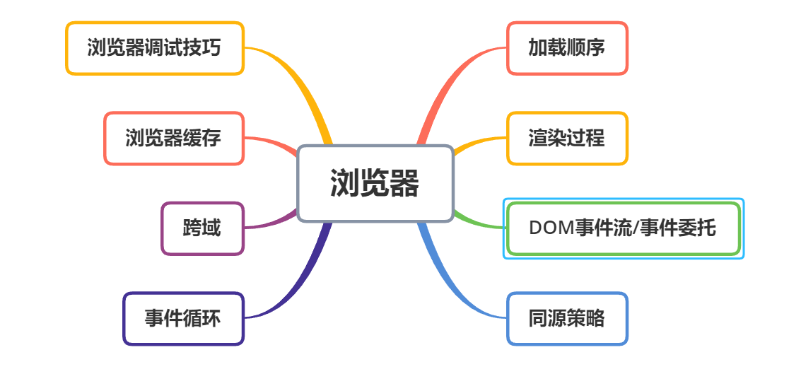
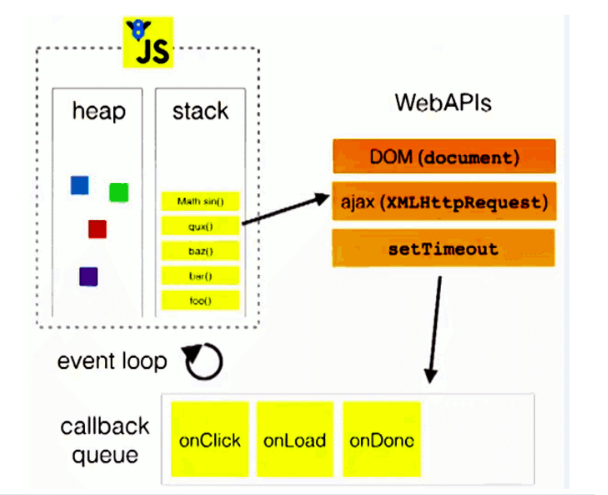
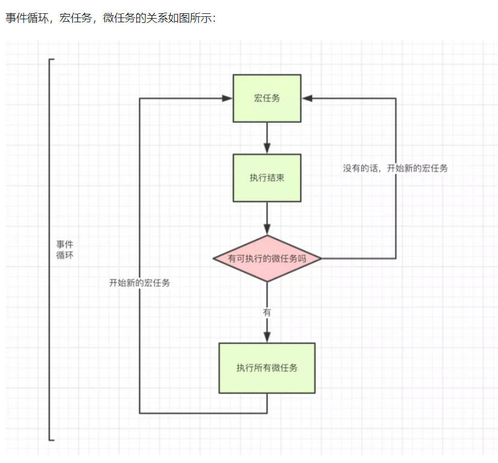
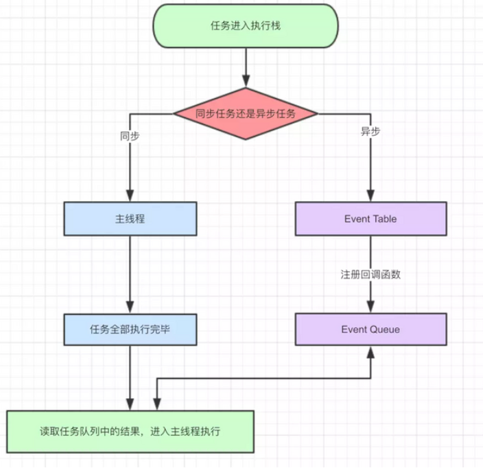
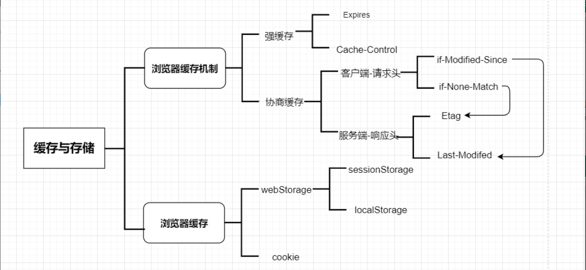

# 浏览器   

   

## DOM事件流  

某个事件发生时，事件会在元素节点之间按照特定的顺序传播，这个传播过程称为DOM事件流   

事件流描述的就是从页面接收事件的顺序  

事件流分为两种：  

### 事件捕获   
某个事件发生时，父元素最先接收到，目标元素最后接收到   
window->document->body->button

### 事件冒泡  
事件冒泡即事件开始时，由最具体的元素接收（也就是事件发生所在的节点），然后逐级传播到较为不具体的节点。  
比如：button->body->document->Window   

### DOM事件流  
DOM事件流包括三个阶段：  

1. 事件捕获阶段:  
   - 事件发生时，首先发生的是事件捕获，为父元素截获事件提供了机会      
2. 处于目标阶段:
   - 事件到了具体元素时，在具体元素上发生，并且被看成冒泡阶段的一部分。随后，冒泡阶段发生，事件开始冒泡   
3. 事件冒泡阶段   

### 常见事件绑定应用  
- onclick：只能使用冒泡阶段  
- attachEvent：只能使用冒泡阶段   
- addEventListener：第三个参数决定使用哪个阶段。第三个参数若为true，则使用捕获阶段，若为false（默认），则使用冒泡阶段。若不输入第三个参数默认为false。  


## 事件循环   
>**javascript是一门单线程语言**  
>**Event Loop是javascript的执行机制**  ,也是是js实现异步的一种方法

   

总方针是先同步再异步，异步中先微任务，在宏任务。  

宏任务（macro-task)：整体script,setTimeout，setInterval  
微任务（micro-task）：Promise.then/catch，process.nextTick    

**主线程从"任务队列"中读取执行事件，这个过程是循环不断的，这个机制被称为事件循环。**  

每次单个宏任务执行完毕后， 检查微任务队列是否为空， 如果不为空，会按照先入先出的规则全部执行完微任务后， 清空微任务队列， 然后再执行下一个宏任务，如此循环    

    
 
怎么知道主线程执行栈为空  
js引擎存在monitoring process进程，会持续不断的检查主线程执行栈是否为空，一旦为空，就会去Event Queue那里检查是否有等待被调用的函数。     

   

为什么要有微任务  ： 

因为事件队列其实是一个“先进先出”的数据结构，排在前面的事件会优先被主线程读取，如果突然来了一个优先级更高的任务，还让去人家排队，就很不理性化， 所以需要引入微任务。    

```js
console.log("start");
setTimeout(() => {
    console.log("children2")
    Promise.resolve().then(() =>{
        console.log("children3")
    })
}, 0)
 
new Promise(function(resolve, reject){
    console.log("children4")
    setTimeout(function(){
        console.log("children5")
        resolve("children6")
    }, 0)
}).then(res =>{
    console.log("children7")
    setTimeout(() =>{
        console.log(res)
    }, 0)
})
```  
1. 整体代码作为一个宏任务执行，输出'start'  
2. 遇到setTimeout，其回调函数被分发到宏任务Event Queue中，记为`setTimeout1`;  
3. 遇到Promise，new Promise直接执行，输出'children4'。  
   - 在Promise中遇到setTimeout， 将其回调放入宏任务队列(记为`setTimeout2`)中；整体代码执行完毕  
>Promise本身是同步的立即执行函数，then是异步执行函数  

setTimeout1  
setTimeout2  
- 第一轮事件循环宏任务结束时各Event Queue的情况，此时已经输出了start ,children4  
- 没有微任务， 所以第一次事件循环结束，开始第二轮  

1. 执行宏任务setTimeout1，输出'children2'  
   - 遇到Promise，并直接调用了resolve，将.then回调加入都微任务队列中（记为`then1`)  

setTimeout2  
then1
   - 第二轮事件循环宏任务结束时各Event Queue的情况   
   - 检查并执行所有微任务， 输出'children3'， 没有多余的微任务， 所以第二轮事件循环结束，开始第三轮事件循环   

1. 执行setTimeout2,输出'children5'  
2. 调用了resolve, 所以将对应的.then回调放入到微任务队列中 记为`then2`  

then2  
   - 第三轮事件循环宏任务结束时各Event Queue的情况   
   - 检查并执行所以微任务， 输出'children7'，遇到setTimeout(`setTimeout3`)，将其加入到宏任务队列中,开始第四轮事件循环  


1. 执行setTimeout3， 输出'children6'， 没有任何微任务， 第四轮事件循环结束。  


输出：
```js
start
children4
children2
children3
children5
children7
children6
```     

```js
async function async1() {
    console.log("async1 start")
    await async2()
    console.log("async1 end")
}
 
async function async2(){
    console.log("async2")
}
 
console.log("script start")
 
setTimeout(function(){
    console.log("setTimeout")
}, 0)
 
async1()
 
new Promise(function(resolve){
    console.log("promise1")
    resolve()
}).then(function(){
    console.log("promise2")
})
 
console.log("script end")  
```   
1. 建立执行上下文，先执行同步任务，输出'script start'  
2. 往下执行，遇到setTimeout，将其回调函数放入宏任务队列，等待执行,记为`setTimeout1`  
3. 往下执行，调用async1:  
   - 输出'async1 start'   
   - 接下来await async2(), 相当于new Promise(()=>{async2()}),而将 await 后面的全部代码放到.then()中去；所以输出'async2',把async2()后面的代码放到微任务中,记为`then1`   
4. 向下执行，遇到Promise，输出'promise1',调用resolve，将对应.then函数放入微任务队列中,记为`then2`   
5. 继续往下执行， 输出'script end'，此时调用栈被清空    

队列中情况：  
setTimeout1  
then1  
then2  

- 检查微任务队列， 发现其中放入了2个微任务（then1,then2）， 执行输出'async1 end'，'promise2'，第一次循环结束 

开始第二次循环：  

- 从宏任务开始， 检查宏任务队列中有setTimeout(setTimeout1)回调， 输出'setTimeout'  

- 检查微任务队列，无可执行的微任务， 第二次循环结束   

```js
script start
async1 start
async2
promise1
script end
async1 end
promise2
setTimeout
```

>async/await底层是基于Promise封装的，所以await前面的代码相当于new Promise，是同步进行的，await后面的代码相当于.then回调，才是异步进行的    


## 浏览器加载顺序   

默认加载顺序：
浏览器首先会按照资源默认的优先级确定加载顺序：   

1. html 、 css 、 font 优先级最高；  
2. 然后是 preload 资源（通过 <link rel=“preload"> 标签预加载）、 script 、 xhr 请求；
3. 接着是图片、语音、视频；  
4. 最低的是prefetch预读取的资源    

## 浏览器渲染过程  

1. 解析HTML文件，创建DOM树  
>浏览器解析html源码，然后创建一个 DOM树。并行请求 css/image/js在DOM树中，每一个HTML标签都有一个对应的节点，并且每一个文本也都会有一个对应的文本节点。DOM树的根节点就是 documentElement，对应的是html标签。  

2. 解析CSS,形成CSS对象模型   
>浏览器解析CSS代码，计算出最终的样式数据。构建CSSOM树。对CSS代码中非法的语法它会直接忽略掉。解析CSS的时候会按照如下顺序来定义优先级：  

>浏览器默认设置 < 用户设置 < 外链样式 < 内联样式 < html中的style。   

3. 将CSS与DOM合并，构建渲染树（renderingtree）   
>DOM Tree + CSSOM –> 渲染树（rendering tree）。渲染树和DOM树有点像，但是是有区别的。DOM树完全和html标签一一对应，但是渲染树会忽略掉不需要渲染的元素，比如head、display:none的元素等。而且一大段文本中的每一个行在渲染树中都是独立的一个节点。渲染树中的每一个节点都存储有对应的css属性。     

4. 布局和绘制  
>一旦渲染树创建好了，浏览器就可以根据渲染树直接把页面绘制到屏幕上。  

以上四个步骤并不是一次性顺序完成的。如果DOM或者CSSOM被修改，以上过程会被重复执行。实际上，CSS和JavaScript往往会多次修改DOM或者CSSOM     

浏览器优化渲染       
  - 将多次改变样式属性的操作合并成一次操作    
  - 将需要多次重排的元素，position属性设为absolute或fixed，这样此元素就脱离了文档流，它的变化不会影响到其他元素。例如有动画效果的元素就最好设置为绝对定位。 
  - 由于display属性为none的元素不在渲染树中，对隐藏的元素操作不会引发其他元素的重排。如果要对一个元素进行复杂的操作时，可以先隐藏它，操作完成后再显示。这样只在隐藏和显示时触发2次重排   


## 浏览器缓存   

原文:<https://juejin.cn/post/6844903593275817998>

不要和浏览器存储弄混了   

[浏览器存储](./storage.md) 

   

浏览器的缓存机制也就是我们说的HTTP缓存机制，其机制是根据HTTP报文的缓存标识进行   

关键：   
- 浏览器每次发起请求，都会先在浏览器缓存中查找该请求的结果以及缓存标识   

- 浏览器每次拿到返回的请求结果都会将该结果和缓存标识存入浏览器缓存中   

根据是否需要向服务器重新发起HTTP请求将缓存过程分为两个部分   

### 强制缓存  
>强制缓存的缓存规则
当浏览器向服务器发起请求时，服务器会将缓存规则放入HTTP响应报文的HTTP头中和请求结果一起返回给浏览器，控制强制缓存的字段分别是Expires和Cache-Control，其中Cache-Control优先级比Expires高,同时存在时，只有Cache-Control生效。  

#### Expires   
>Expires是HTTP/1.0控制网页缓存的字段，其值为服务器返回该请求结果缓存的到期时间，即再次发起该请求时，如果客户端的时间小于Expires的值时，直接使用缓存结果。  

到了HTTP/1.1，Expire已经被Cache-Control替代，原因在于Expires控制缓存的原理是使用客户端的时间与服务端返回的时间做对比，那么如果客户端与服务端的时间因为某些原因（例如时区不同；客户端和服务端有一方的时间不准确）发生误差，那么强制缓存则会直接失效，这样的话强制缓存的存在则毫无意义   

#### Cache-Control   

在HTTP/1.1中，Cache-Control是最重要的规则，主要用于控制网页缓存，主要取值为：  
    
  - public：所有内容都将被缓存（客户端和代理服务器都可缓存）  
        
  - private：所有内容只有客户端可以缓存，Cache-Control的默认取值   
        
  - no-cache：客户端缓存内容，但是是否使用缓存则需要经过协商缓存来验证决定  
        
  - no-store：所有内容都不会被缓存，即不使用强制缓存，也不使用协商缓存    
        
  - max-age=xxx (xxx is numeric)：缓存内容将在xxx秒后失效   

>强制缓存的情况主要有三种   

1. 不存在该缓存结果和缓存标识，强制缓存失效，则直接向服务器发起请求（跟第一次发起请求一致)   

2. 存在该缓存结果和缓存标识，但该结果已失效，强制缓存失效，则使用协商缓存  

3. 存在该缓存结果和缓存标识，且该结果尚未失效，强制缓存生效，直接返回该结果  


### 协商缓存   
>协商缓存就是强制缓存失效后，浏览器携带缓存标识向服务器发起请求，由服务器根据缓存标识决定是否使用缓存的过程，主要有以下两种情况   

1. 协商缓存生效，返回304   

2. 协商缓存失效，返回200和请求结果结果   

>协商缓存的标识也是在响应报文的HTTP头中和请求结果一起返回给浏览器的，控制协商缓存的字段分别有：`Last-Modified / If-Modified-Since`和`Etag / If-None-Match`，其中Etag / If-None-Match的优先级比Last-Modified / If-Modified-Since高,同时存在则只有Etag / If-None-Match生效。   

#### Last-Modified / If-Modified-Since
Last-Modified是服务器响应请求时，返回该资源文件在服务器最后被修改的时间     

>If-Modified-Since则是客户端再次发起该请求时，携带上次请求返回的Last-Modified值，通过此字段值告诉服务器该资源上次请求返回的最后被修改时间。服务器收到该请求，发现请求头含有If-Modified-Since字段，则会根据If-Modified-Since的字段值与该资源在服务器的最后被修改时间做对比，若服务器的资源最后被修改时间大于If-Modified-Since的字段值，则重新返回资源，状态码为200；否则则返回304，代表资源无更新，可继续使用缓存文件    

#### Etag / If-None-Match
Etag是服务器响应请求时，返回当前资源文件的一个唯一标识(由服务器生成)   

>If-None-Match是客户端再次发起该请求时，携带上次请求返回的唯一标识Etag值，通过此字段值告诉服务器该资源上次请求返回的唯一标识值。服务器收到该请求后，发现该请求头中含有If-None-Match，则会根据If-None-Match的字段值与该资源在服务器的Etag值做对比，一致则返回304，代表资源无更新，继续使用缓存文件；不一致则重新返回资源文件，状态码为200   

### 总结   
强制缓存优先于协商缓存进行，若强制缓存(Expires和Cache-Control)生效则直接使用缓存，若不生效则进行协商缓存(Last-Modified / If-Modified-Since和Etag / If-None-Match)，协商缓存由服务器决定是否使用缓存，若协商缓存失效，那么代表该请求的缓存失效，重新获取请求结果，再存入浏览器缓存中；生效则返回304，继续使用缓存    

在 Header 内的字段用于控制缓存机制   
老方法 Expires，记录的绝对值    
新方法 Cache-Control 多了一堆选项，记录的时间是相对值    
获取缓存检测缓存是否过期，如果没过期取缓存，优先从内存，其次硬盘，如果过期，则与服务器协商缓存是否仍然可用，如果不可用则获取，可用取缓存    


