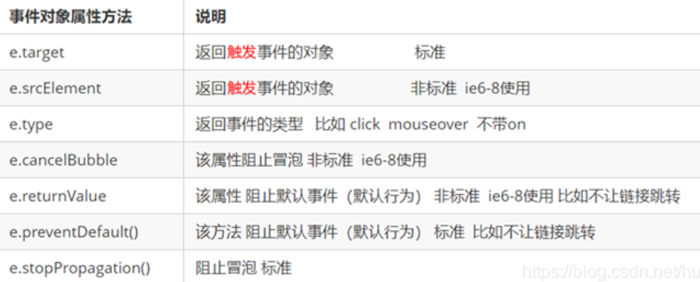
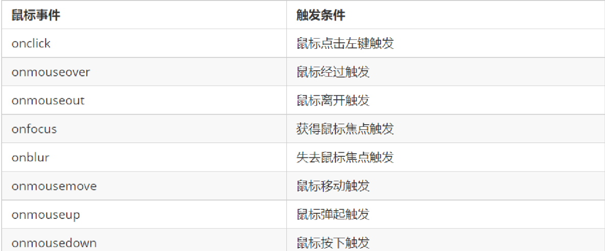
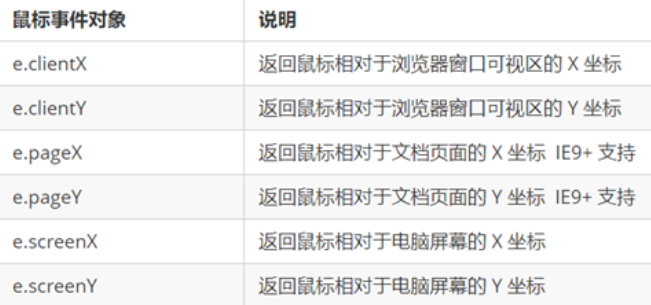
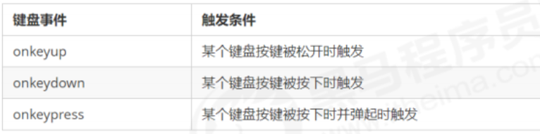
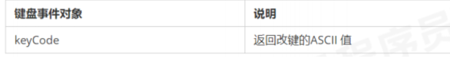

# 事件高级

## 1.注册事件

```js
1. onclick
2. eventTarget.addEventListener(type,function(){},[useCapture])
 type : click、mouseover.... 不要带on
 function: 处理函数
 useCapture:可选参数，布尔值，默认为false
IE9 之前的 IE 不支持此方法

3. eventTarget.attachEvent(eventNameWitnOn,callback)
IE8 及早期版本支持
```
- 处理兼容性
```js
  function addEventListener(element, eventName, fn) {
 // 判断当前浏览器是否支持 addEventListener 方法
 if (element.addEventListener) {
 element.addEventListener(eventName, fn); // 第三个参数 默认是false
 } else if (element.attachEvent) {
 element.attachEvent('on' + eventName, fn);
 } else {
 // 相当于 element.onclick = fn;
 element['on' + eventName] = fn;
}
```


## 2.解绑事件

```js
1. eventTarget.onclick = null
2. eventTarget.removeEventListener(type, listener[, useCapture]);
3. eventTarget.detachEvent(eventNameWithOn, callback);
```

- 处理兼容性

```js
function removeEventListener(element, eventName, fn) {
 // 判断当前浏览器是否支持 removeEventListener 方法
 if (element.removeEventListener) {
 element.removeEventListener(eventName, fn); // 第三个参数 默认是false
 } else if (element.detachEvent) {
 element.detachEvent('on' + eventName, fn);
 } else {
 element['on' + eventName] = null;
}
```

## 3.DOM事件流   
>事件流 描述的是从页面中接收事件的顺序。
事件发生时会在元素节点之间按照特定的顺序传播，这个传播过程即 DOM 事件流 

DOM 事件流会经历3个阶段： 

1. 捕获阶段

2. 当前目标阶段

3. 冒泡阶段   

事件冒泡：事件由子元素传递到父元素的过程叫做冒泡  

事件捕获：事件由父元素传递到子元素的过程叫做事件捕获  

>-  JS 代码中只能执行捕获或者冒泡其中的一个阶段。  
>-  onclick 和 attachEvent 只能得到冒泡阶段。
>-  addEventListener(type, listener,[useCapture]) 第三个参数如果是 true ，表示在事件捕获阶段调用事件处理程序；如果是 false，表示在事件冒泡阶段调用事件处理程序。 （默认false ）
>- 实际开发中更关注事件冒泡。
>- 有些事件是没有冒泡的，比如 onblur 、 onfocus 、 onmouseenter 、 onmouseleave

## 4.事件对象  

### 4.1 什么是事件对象

事件发生后，跟事件相关的一系列信息数据的集合都放到这个对象里面，这个对象就是事件对象。

比如：  

1. 谁绑定了这个事件。

2. 鼠标触发事件的话，会得到鼠标的相关信息，如鼠标位置。

3. 键盘触发事件的话，会得到键盘的相关信息，如按了哪个键。

### 4.2 事件对象的兼容性处理  

```js
   var div = document.querySelector('div');
        div.onclick = function(e) {
                // 事件对象
                e = e || window.event;
                console.log(e);
        }
```  

### 4.3 事件对象的常见属性和方法



#### e.target 和 this 的区别

-  this 是事件绑定的元素（绑定这个事件处理函数的元素）。

-  e.target 是事件触发的元素。

```js
通常情况下terget 和 this是一致的，
> 但有一种情况不同，那就是在事件冒泡时（父子元素有相同事件，单击子元素，父元素的事件处理函数也会被触发执行），
> 	这时候this指向的是父元素，因为它是绑定事件的元素对象，
> 	而target指向的是子元素，因为他是触发事件的那个具体元素对象。
> 
```
```html
  <ul>
        <li>abc</li>
        <li>abc</li>
        <li>abc</li>
    </ul>
    <script>
        var ul = document.querySelector('ul');
        ul.addEventListener('click', function(e) {
              // 我们给ul 绑定了事件  那么this 就指向ul  
              console.log(this); // ul

              // e.target 触发了事件的对象 我们点击的是li e.target 指向的就是li
              console.log(e.target); // li
        });
    </script>
```

### 4.4 阻止默认行为

```html
 <a href="http://www.baidu.com">百度</a>
    <script>
        // 2. 阻止默认行为 让链接不跳转 
        var a = document.querySelector('a');
        a.addEventListener('click', function(e) {
             e.preventDefault(); //  dom 标准写法
        });
        // 3. 传统的注册方式
        a.onclick = function(e) {
            // 普通浏览器 e.preventDefault();  方法
            e.preventDefault();
            // 低版本浏览器 ie678  returnValue  属性
            e.returnValue = false;
            // 我们可以利用return false 也能阻止默认行为 没有兼容性问题
            return false;
        }
    </script>
```
```html
阻止冒泡
<div class="father">
        <div class="son">son儿子</div>
    </div>
    <script>
        var son = document.querySelector('.son');
		// 给son注册单击事件
        son.addEventListener('click', function(e) {
            alert('son');
            e.stopPropagation(); // stop 停止  Propagation 传播
            window.event.cancelBubble = true; // 非标准 cancel 取消 bubble 泡泡
        }, false);
    </script>
```

- 阻止冒泡的兼容性处理

```js
if(e && e.stopPropagation){
 e.stopPropagation();
}else{
 window.event.cancelBubble = true;
}
```

## 5.事件委托（代理，委派）

事件委托也称为事件代理，在 jQuery 里面称为事件委派。

说白了就是，不给子元素注册事件，给父元素注册事件，把处理代码在父元素的事件中执行。

### 5.1 事件委托原理

>给父元素注册事件，利用事件冒泡，当子元素的事件触发，会冒泡到父元素，然后去控制相应的子元素。

### 5.2 事件委托的作用

>- 我们只操作了一次 DOM ，提高了程序的性能。
>- 动态新创建的子元素，也拥有事件


## 6.鼠标事件

 ### 6.1 常用鼠标事件




- 禁止选中文字和禁止右键菜单

```html
<body>
    我是一段不愿意分享的文字
    <script>
        // 1. contextmenu 我们可以禁用右键菜单
        document.addEventListener('contextmenu', function(e) {
                e.preventDefault();
        })
        // 2. 禁止选中文字 selectstart
        document.addEventListener('selectstart', function(e) {
            e.preventDefault();
        })
    </script>
</body>
```

### 6.2 鼠标事件对象



-  图片跟随鼠标移动

```html
1. mousemove只要我们鼠标移动1px 就会触发这个事件
2.核心原理： 每次鼠标移动，我们都会获得最新的鼠标坐标， 
3.把这个x和y坐标做为图片的top和left 值就可以移动图片

    <script>
      let img=document.querySelector('img');
      img.addEventListener('mousemove',function(e){
        let x = e.pageX;
        let y = e.pageY;
        //3 . 千万不要忘记给left 和top 添加px 单位
        img.style.left = x - 50 + 'px';
        img.style.top = y - 40 + 'px';
      })
    <script>
```

## 7.键盘事件

### 7.1 常用键盘事件
  

### 7.2 键盘事件对象


>1. onkeypress它不识别功能键，比如左右箭头，shift 等
>2. onkeydown 和 onkeyup 不区分字母大小写，onkeypress 区分字母大小写
>3. 三个事件的执行顺序  keydown -- keypress -- keyup