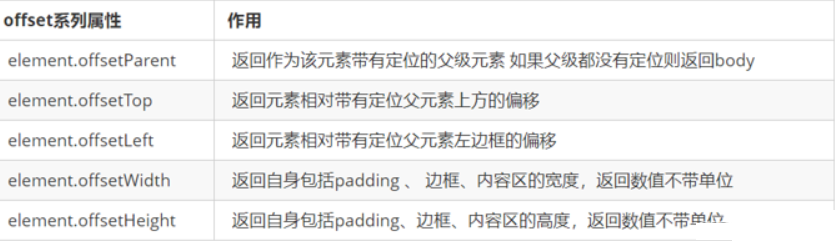
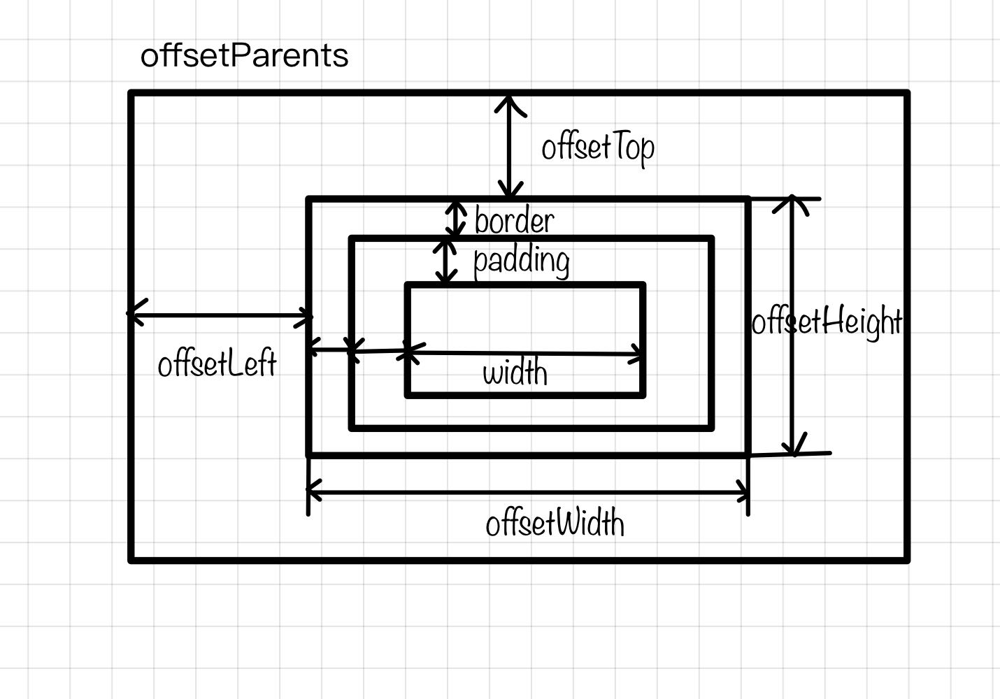
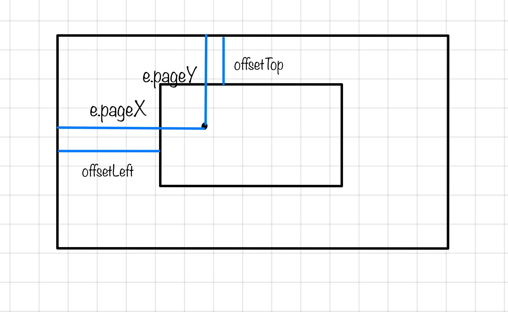
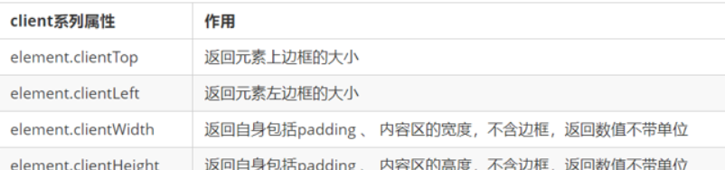
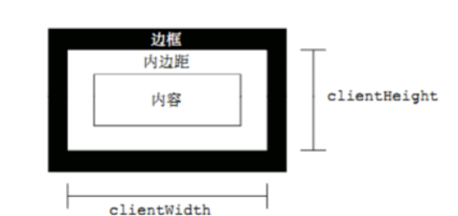
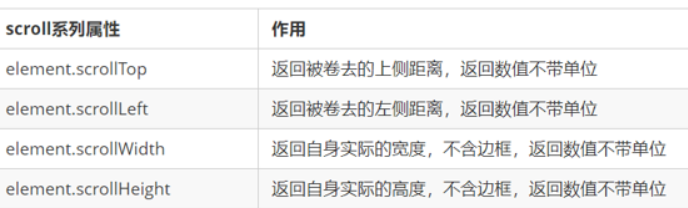
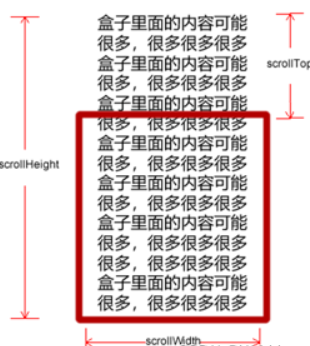
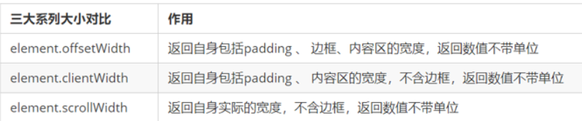

# offset、client、scroll

## 1.元素偏移量offset

### 1.1 offset

offset 翻译过来就是偏移量， 我们使用 offset系列相关属性可以动态的得到该元素的位置（偏移）、大小等。

1. 获得元素距离**带有定位父元素**的位置  

2. 获得元素自身的大小（宽度高度）

3. 注意：返回的数值都不带单位





### 1.2 offset 与 style 区别 

#### offset

- offset 可以得到任意样式表中的样式值

- offset 系列获得的数值是没有单位的

- offsetWidth 包含`padding+border+width`

- offsetWidth 等属性是**只读**属性，只能获取不能赋值

- > 所以，我们想要获取元素大小位置，用offset更合适

#### style

- style 只能得到****行内样式表**中的样式值

- style.width 获得的是带有单位的字符串

- style.width 获得不包含padding和border 的值

- style.width 是可读写属性，可以获取也可以赋值

- > 所以，我们想要给元素更改值，则需要用style改变 

### 1.3  案例：获取鼠标在盒子内的坐标

1. 我们在盒子内点击，想要得到鼠标距离盒子左右的距离。
2. 首先得到鼠标在页面中的坐标（e.pageX, e.pageY）
3. 其次得到盒子在页面中的距离 ( box.offsetLeft, box.offsetTop)
4. 用鼠标距离页面的坐标减去盒子在页面中的距离，得到 鼠标在盒子内的坐标
5. 如果想要移动一下鼠标，就要获取最新的坐标，使用鼠标移动



```js
let box=document.querySelector('.box')
box.addEventListener('mousemove',function(e){
  let x = e.pageX - this.offsetLeft;
  let y = e.pageY - this.offsetTop;
  this.innerHTML = 'x坐标是' + x + ' y坐标是' + y;
})
```

## 2.元素可视区 client 

### 2.1 client概述

client 翻译过来就是客户端，我们使用 client 系列的相关属性来获取元素可视区的相关信息。通过 client系列的相关属性可以动态的得到该元素的边框大小、元素大小等

  



## 3.元素滚动 scroll

### 3.1. scroll 概述  

scroll 翻译过来就是滚动的，我们使用 scroll 系列的相关属性可以动态的得到该元素的大小、滚动距离等。  

  


### 3.2. 页面被卷去的头部

如果浏览器的高（或宽）度不足以显示整个页面时，会自动出现滚动条。当滚动条向下滚动时，页面上面被隐藏掉的高度，我们就称为页面被卷去的头部。滚动条在滚动时会触发 `onscroll`事件

### 3.3.案例：仿淘宝固定右侧侧边栏

1. 原先侧边栏是绝对定位
2. 当页面滚动到一定位置，侧边栏改为固定定位
3. 页面继续滚动，会让 返回顶部显示出来

>1. 需要用到页面滚动事件 scroll  因为是页面滚动，所以事件源是document
>2. 滚动到某个位置，就是判断页面被卷去的上部值。
>3. 页面被卷去的头部：可以通过window.pageYOffset 获得  如果是被卷去的左侧window.pageXOffset
>4. 注意，元素被卷去的头部是element.scrollTop  , 如果是页面被卷去的头部 则是 window.pageYOffset
>5. 其实这个值 可以通过盒子的 offsetTop可以得到，如果大于等于这个值，就可以让盒子固定定位了  

```js
//1. 获取元素
        var sliderbar = document.querySelector('.slider-bar');
        var banner = document.querySelector('.banner');
        // banner.offestTop 就是被卷去头部的大小 一定要写到滚动的外面
        var bannerTop = banner.offsetTop
            // 当我们侧边栏固定定位之后应该变化的数值
        var sliderbarTop = sliderbar.offsetTop - bannerTop;
        // 获取main 主体元素
        var main = document.querySelector('.main');
        var goBack = document.querySelector('.goBack');
        var mainTop = main.offsetTop;
        // 2. 页面滚动事件 scroll
        document.addEventListener('scroll', function() {
            // console.log(11);
            // window.pageYOffset 页面被卷去的头部
            // console.log(window.pageYOffset);
            // 3 .当我们页面被卷去的头部大于等于了 172 此时 侧边栏就要改为固定定位
            if (window.pageYOffset >= bannerTop) {
                sliderbar.style.position = 'fixed';
                sliderbar.style.top = sliderbarTop + 'px';
            } else {
                sliderbar.style.position = 'absolute';
                sliderbar.style.top = '300px';
            }
            // 4. 当我们页面滚动到main盒子，就显示 goback模块
            if (window.pageYOffset >= mainTop) {
                goBack.style.display = 'block';
            } else {
                goBack.style.display = 'none';
            }

        })
```

### 3.4 页面被卷去的头部兼容性解决方案

需要注意的是，页面被卷去的头部，有兼容性问题，因此被卷去的头部通常有如下几种写法：

1. 声明了 DTD，使用 document.documentElement.scrollTop
2. 未声明 DTD，使用  document.body.scrollTop
3. 新方法 window.pageYOffset和 window.pageXOffset，IE9 开始支持  

```js
function getScroll() {
    return {
      left: window.pageXOffset || document.documentElement.scrollLeft || document.body.scrollLeft||0,
      top: window.pageYOffset || document.documentElement.scrollTop || document.body.scrollTop || 0
    };
 } 
使用的时候  getScroll().left

```


## 4. 三大系列总结

  

1. offset系列 经常用于获得元素位置    offsetLeft  offsetTop

2. client经常用于获取元素大小  clientWidth clientHeight

3. scroll 经常用于获取滚动距离 scrollTop  scrollLeft  

4. 注意页面滚动的距离通过 window.pageXOffset  获得

## 5. mouseenter和mouseover的区别

- 当鼠标移动到元素上时就会触发`mouseenter` 事件
- 类似 `mouseover`，它们两者之间的差别是
- `mouseover` 鼠标经过`自身盒子`会触发，经过`子盒子`还会触发。mouseenter  只会经过`自身盒子`触发
- 之所以这样，就是因为`mouseenter`不会冒泡
- 跟`mouseenter`搭配鼠标离开` mouseleave ` 同样不会冒泡