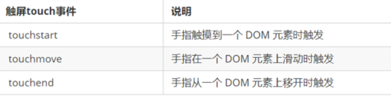
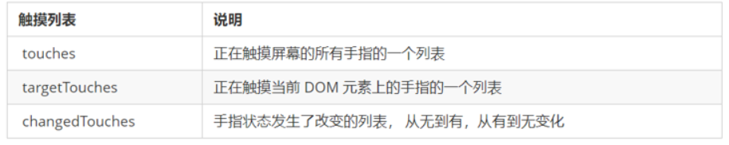

# 移动端触屏事件

## 1. 触屏事件概述 

移动端浏览器兼容性较好，我们不需要考虑以前 JS 的兼容性问题，可以放心的使用原生 JS 书写效果，但是移动端也有自己独特的地方。比如触屏事件 touch（也称触摸事件），Android和 IOS 都有。

>touch 对象代表一个触摸点。触摸点可能是一根手指，也可能是一根触摸笔。触屏事件可响应用户手指（或触控笔）对屏幕或者触控板操作。 



## 2.触摸事件对象（TouchEvent）  

TouchEvent 是一类描述手指在触摸平面（触摸屏、触摸板等）的状态变化的事件。这类事件用于描述一个或多个触点，使开发者可以检测触点的移动，触点的增加和减少，等等

touchstart、touchmove、touchend 三个事件都会各自有事件对象。



>因为平时我们都是给元素注册触摸事件，所以重点记住 `targetTocuhes`  

## 3.案例：移动端拖动元素

1. touchstart、touchmove、touchend可以实现拖动元素

2. 但是拖动元素需要当前手指的坐标值 我们可以使用  targetTouches[0] 里面的pageX 和 pageY 

3. 移动端拖动的原理：    手指移动中，计算出手指移动的距离。然后用盒子原来的位置 + 手指移动的距离

4. 手指移动的距离：  手指滑动中的位置 减去  手指刚开始触摸的位置

   拖动元素三步曲：

   （1） 触摸元素 touchstart： 获取手指初始坐标，同时获得盒子原来的位置

   （2） 移动手指 touchmove： 计算手指的滑动距离，并且移动盒子

   （3） 离开手指 touchend:

>注意： 手指移动也会触发滚动屏幕所以这里要阻止默认的屏幕滚动 e.preventDefault();`


```js
        // （1） 触摸元素 touchstart：  获取手指初始坐标，同时获得盒子原来的位置
        // （2） 移动手指 touchmove：  计算手指的滑动距离，并且移动盒子
        // （3） 离开手指 touchend:
        var div = document.querySelector('div');
        var startX = 0; //获取手指初始坐标
        var startY = 0;
        var x = 0; //获得盒子原来的位置
        var y = 0;
        div.addEventListener('touchstart', function(e) {
            //  获取手指初始坐标
            startX = e.targetTouches[0].pageX;
            startY = e.targetTouches[0].pageY;
            x = this.offsetLeft;
            y = this.offsetTop;
        });

        div.addEventListener('touchmove', function(e) {
            //  计算手指的移动距离： 手指移动之后的坐标减去手指初始的坐标
            var moveX = e.targetTouches[0].pageX - startX;
            var moveY = e.targetTouches[0].pageY - startY;
            // 移动我们的盒子 盒子原来的位置 + 手指移动的距离
            this.style.left = x + moveX + 'px';
            this.style.top = y + moveY + 'px';
            e.preventDefault(); // 阻止屏幕滚动的默认行为
        });
```


## 4.classList 属性

classList属性是HTML5新增的一个属性，返回元素的类名。但是ie10以上版本支持。

该属性用于在元素中添加，移除及切换 CSS 类。有以下方法

**添加类：**
```javascript
focus.classList.add('current');
```

**移除类：**
```javascript
focus.classList.remove('current');
```

**切换类：**
```javascript
focus.classList.toggle('current');
```

>注意:以上方法里面，所有类名都不带点  


## 5.click 延时解决方案

移动端 click 事件会有 300ms 的延时，原因是移动端屏幕双击会缩放(double tap to zoom) 页面。

解决方案：

​	1. 禁用缩放。 浏览器禁用默认的双击缩放行为并且去掉300ms 的点击延迟。

```html
  <meta name="viewport" content="user-scalable=no">
```

​	2.利用touch事件自己封装这个事件解决300ms 延迟。 

​	原理就是：

1.  当我们手指触摸屏幕，记录当前触摸时间
2.  当我们手指离开屏幕， 用离开的时间减去触摸的时间
3.  如果时间小于150ms，并且没有滑动过屏幕， 那么我们就定义为点击

代码如下:

```javascript
//封装tap，解决click 300ms 延时
function tap (obj, callback) {
        var isMove = false;
        var startTime = 0; // 记录触摸时候的时间变量
        obj.addEventListener('touchstart', function (e) {
            startTime = Date.now(); // 记录触摸时间
        });
        obj.addEventListener('touchmove', function (e) {
            isMove = true;  // 看看是否有滑动，有滑动算拖拽，不算点击
        });
        obj.addEventListener('touchend', function (e) {
            if (!isMove && (Date.now() - startTime) < 150) {  // 如果手指触摸和离开时间小于150ms 算点击
                callback && callback(); // 执行回调函数
            }
            isMove = false;  //  取反 重置
            startTime = 0;
        });
}
//调用  
  tap(div, function(){   执行代码  });

```

3. 使用插件。fastclick 插件解决300ms 延迟。   


## 6.移动端常用开发插件

### 6.1 fastclick

1.  引入 js 插件文件。

2.  按照规定语法使用。

3.  fastclick 插件解决 300ms 延迟。 使用延时

4.  GitHub官网地址： <https://github.com/ftlabs/fastclick>

    ```javascript
    if ('addEventListener' in document) {
                document.addEventListener('DOMContentLoaded', function() {
                           FastClick.attach(document.body);
                }, false);
    }
    ```

### 6.2 Swiper 插件的使用

中文官网地址： <https://www.swiper.com.cn/> 

1.  引入插件相关文件。
2.  按照规定语法使用

### 6.3 其他移动端常见插件

lsuperslide： <http://www.superslide2.com/>

iscroll：<https://github.com/cubiq/iscroll>

