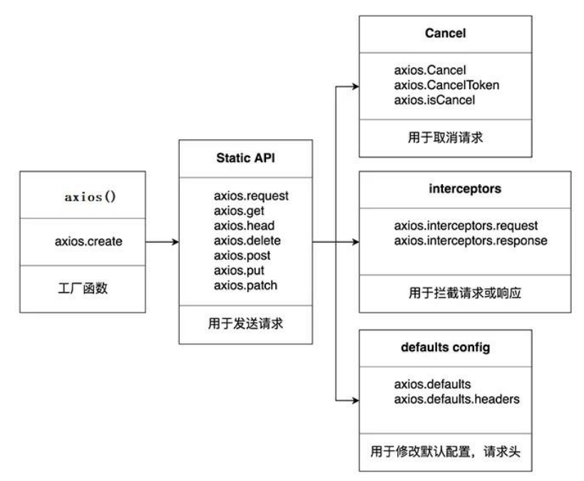

# 基础知识

## 特点
1. 基于 xhr + promise 的异步 ajax 请求库  
2. 浏览器端/node 端都可以使用  
3. 支持请求／响应拦截器  
4. 支持请求取消  
5. 请求/响应数据转换  
6. 批量发送多个请求  

## 常用语法  

  

axios.create([config]): 创建一个新的 axios(它没有下面的功能) :   

- axios.Cancel(): 用于创建取消请求的错误对象  
- axios.CancelToken(): 用于创建取消请求的 token 对象    
- axios.isCancel(): 是否是一个取消请求的错误    
- axios.all(promises): 用于批量执行多个异步请求   
- axios.spread(): 用来指定接收所有成功数据的回调函数的方法    

## axios.create
1. 根据指定配置创建一个新的 axios, 也就就每个新 axios 都有自己的配置     
2. 新 axios 只是没有取消请求和批量发请求的方法, 其它所有语法都是一致的    
   
项目中有部分接口需要的配置与另一部分接口需要的配置不太一样    

创建 2 个新 axios, 每个都有自己特有的配置, 分别应用到不同要
求的接口请求中    