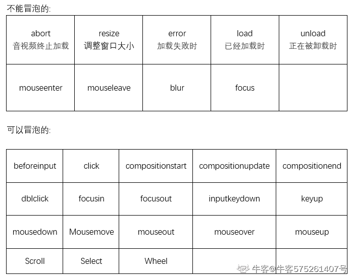

# CSS

## 水平居中元素

### 行内元素

- 如果父级元素是块级元素，直接给父级元素设置 text-align:center
- 如果不是，可以用 display:block 将父级元素变成块级元素 在设置 text-align:center

```css
text-align: center; /*不能直接用在行内元素上span...*/
```

### 块级元素

- 定宽度：直接调整外边距，谁居中，就给谁设置 margin：0 auto
- 不定宽度：默认子元素的宽度和父元素一样，将子元素 display:inline/inline-block,在给父元素设置 text-align：center
- 使用定位
- 使用 flex 布局（宽度定不定都行）给待处理的块状元素的父元素添加属性 display: flex; justify-content: center;

```css
div {
  height: 200px;
  width: 200px; /*需要有宽度*/
  margin: 0 auto; /*ie5 6不支持*/
}
/*ie5 6*/
body {
  text-align: center;
}
/*给不需要居中的元素*/
h1 {
  text-align: left;
}
```

### 浮动元素

- 首先设置父元素为相对定位，再设置子元素为绝对定位，设置子元素的 left:50%，即让子元素的左上角水平居中；
- （有宽度）设置绝对子元素的 margin-left: -元素宽度的一半 px; 或者设置 transform: translateX(-50%);

```css
.square {
  height: 200px;
  width: 200px;
  background: gold;
  float: left;
  position: relative;
  left: 50%;
  transform: translatex(-50%); /*margin-left:-100px;也可*/
}
```

```css
/*需要元素位置与文档无关不占据空间 用绝对定位*/
<body > <span > 文字</span > </body > body {
  text-align: center;
}
span {
  color: gold;
  position: absolute;
  left: 0;
  right: 0;
  margin: 0 auto; /*设置绝对定位后可以像块级元素一样设置宽高*/

  //或者
  left: 50%;
  transform: translateX(-50%);
}
```

## 垂直居中元素

### 行内元素

1. 单行

   - 只需要设置单行行内元素的"行高等于盒子的高"即可；

2. 多行
   - 给父元素设置 display:table-cell;和 vertical-align: middle;属性即可

### 块级元素

1. 定位

- 首先设置父元素为相对定位，再设置子元素为绝对定位，设置子元素的 top: 50%，即让子元素的左上角垂直居中；
- （定高度）设置绝对子元素的 margin-top: -元素高度的一半 px; 或者设置 transform: translateY(-50%);

2. flex 布局

- 给待处理的块状元素的父元素添加属性 display: flex; align-items: center;

## 如何用纯 CSS 绘制三角形

- 为正方形设置边框，把长和宽都设置为 0，只有边框的厚度。上下左右隐藏三个边框只保留一个边框
- 可以把各边都隐藏，为要显示的边框设置颜色

```css
div {
  width: 0;
  height: 0;
  border-style: solid;
  border-width: 0 50px 50px; /*将隐藏部分的高度去掉*/
  border-color: transparent transparent #d9534f;
}
```

> <b>直角三角形</b>

只设置两条边即可

```css
div {
  width: 0;
  height: 0;
  border-top: #d9534f solid;
  border-right: pink solid;
  border-width: 85px;
}
```


> <b>设置三条边 </b>

```css
div {
  width: 0;
  height: 0;
  border-top: #d9534f solid;
  border-right: pink solid;
  border-left: skyblue solid;
  border-width: 66px;
  margin: auto;
}
```


> 要实现一个只有边框的空心三角形，可以利用伪类

伪类元泰定位参照对象的内容区城宽高都为 0，则内容区域即可以理解成中心一点，所以伪元泰相对中心这点定位

将元素定位微调以及改变颜色

```css
.border {
  width: 0;
  height: 0;
  border-style: solid;
  border-width: 0 50px 50px;
  border-color: transparent transparent #d9534f;
  position: relative;
}

.border::after {
  content: "";
  border-style: solid;
  border-width: 0 40px 40px;
  border-color: transparent transparent #eee;
  position: absolute;
  top: 6px;
  left: -40px;
}
```


## 解决 img 5px 间距的问题

```css
/*1*/
.img-contanier {
  font-size: 0;
}
/*2*/
.img {
  display: block;
}
/*3*/
.img {
  vertical-align: bottom;
}

/*4.给父元素设置line-height*/
.img-container {
  line-height: 5px;
}
```

## 元素高度与 window 的高度相同

```css
height: 100vh;
```

## 修改 input placeholder 样式

```css
.placeholder-custom ::-webkit-input-placeholder {
  color: pink;
  font-size: 16px;
}
```

## :not 选择器

> 除了最后一个元素外，所有元素都需要一些样式，使用:not 选择器非常容易做到

```html
<style>
  /*最后一个元素没有底边*/
  li:not(:last-child) {
    border-bottom: 1px solid #ebedf0;
  }
</style>
```

## 使用 caret-color 修改光标颜色

改变输入框光标颜色，同时又不改变输入框里面的内容的颜色

```css
input {
  caret-color: #ffd476;
}
```

`caret-color` 属性不仅对于原生的输入表单控件有效，对设置`contenteditable`的普通标签也适用。
`contenteditable` 属性: 规定是否可编辑元素内容.

```html
<div contenteditable="true">文字蓝色，光标黄色</div>
<style>
  [contenteditable="true"] {
    margin-left: 20px;
    font-size: 30px;
    color: blue;
    caret-color: yellow;
  }
</style>
```

## 删除 type='number'末尾的上下箭头

```css
.no-arrow::-webkit-outer-spin-button,
.no-arrow::-webkit-inner-spin-button {
  -webkit-appearance: none;
}
```

## outline:none 删除输入状态线

> 当输入框被选中时，默认会有一条蓝色状态线，可以通过 outline:none 移除

## 英文文本大写

```css
text-transform: capitalize; /*首字母大小写*/
text-transform: uppercase; /*大写*/
text-transform: lowercase; /*小写*/
text-transform: none; /*阻止大小写转换*/
text-transform: full-width;
```

## 多余文字省略号表示

### 单行文本

文本在一行内显示，多余部分省略号表示

```css
/* 普通情况下用在块级元素的外层隐藏部分溢出元素 或者配合下面两个属性实现文本溢出省略*/
overflow: hidden;
/* 设置文本不换行 */
white-space: nowrap;
/*有两个值 ellipsis表示当对象文本溢出时显示省略标记 clip表示当对象文本溢出部分裁切掉 */
text-overflow: ellipsis;
```

### 多行文本

伪元素 + 定位

通过伪元素绝对定位到行尾并遮住文字，在通过 overflow:hidden 隐藏多余文字

```html
<style>
  .demo {
    position: relative;
    /*高度固定时设置行高 控制显示的行数 */
    line-height: 20px;
    height: 40px;
    overflow: hidden;
  }
  .demo::after {
    content:'...';
    position: absolute;
    bottom: 0;
    right: 0;
    padding: 0 20px 0 10px;
  }

  <body>
    <div class="demo">这是一段很长的文本</div>
  </body>
</style>
```

## 清除浮动

> 浮动元素不在文档流中，所以文档流的块框表现得就像浮动框不存在一样。浮动元素会漂浮在文档流的块框上。

> 浮动带来的问题：
>
> 1.  父元素的高度无法被撑开，影响与父元素同级的元素
> 2.  与浮动元素同级的非浮动元素（内联元素）会跟随其
>     后
> 3.  若非第一个元素浮动，则该元素之前的元素也需要浮动．否则会影响页面显示的结构。

> 清除浮动的方式：
>
> 1.  父级 div 定义 height
> 2.  最后一个浮动元素后加空 div 标签 并添加样式 clear:both.
> 3.  包含浮动元素的父标签添加样式 overflow 为 hidden 或 auto.
> 4.  父级 div 定义 zoom
> 5.  伪元素
>     需要清除浮动时，在需要清楚浮动的元素添加 clearfix 类名，

```css
.clearfix:after {
  content: "";
  display: "block";
  height: 0;
  line-height: 0;
  visibility: hidden;
  clear: both;
}
.clearfix {
  zoom: 1;
}
```

## z-index 失效

> 如果两个对象的此属性具有同样的值，那么将依据它们在 HTML 文档中流的顺序层叠，写在后面的将会覆盖前面的。需要注意的是，父子关系是无法用 z-index 来设定上下关系的，一定是子级在上父级在下

1. 元素本身没有设置 position 属性，或者 position 属性值为 static 的时候会失效。

- 因为 z-index 属性只作用在被定位了的元素上。所以如果你在一个没被定位的元素上使用 z-index 的话，是不会有效果的
- 设置该元素的 position 属性为 relative, absolute 或是 fixed 中的一种。

2. 元素在设置 z-index 的同时还设置了 float 浮动。

- 解决：去除浮动。

3. 当前元素的层叠效果会受祖先元素的 Z-index 影响，如果父元素的 z-index 值很小，那么当前元素的 z-indlex 值再大也不起作用。

- 解决：提高祖先元素的 z-index 值。

## position 定位值

1. relative 相对定位

- 元素会保留其原本特性
- 不会使元素脱离文档流,不会改变页面结构（元素原本位置会被保留，即改变位置也不会占用新位置）
- 没有定位偏移量时对元素无影响（相对于自身原本位置进行偏移）

2. absolute 绝对定位

- 元素完全脱离文档流（在文档流中不再占位）
- 改变内联元素的特性（能设置宽高）
- 改变区块元素的特性（未设置宽度时由内容撑开宽度）
- 相对于最近的非 static 定位祖先元素偏移

3. fixed 固定定位

- 元素会相对于屏幕视口(viewport)来定位
- 在滚动屏幕位置的时候元素位置不会改变。在固定顶部导航栏的时候可以使用这个属性。
- 创建新的层叠上下文
- 当元素祖先的 transform, perspective 或 filter 属性非 none 时，容器由视口改为该祖先

4. static 默认值

- 默认布局。元素出现在正常的流中（忽略 top, bottom, left, right ， z-index 声明）。

5. sticky 粘性定位

- 可以被认为是相对定位和固定定位的混合。元素在跨越特定阈值前为相对定位，之后为固定定位

```css
div {
  position: sticky;
  top: 20px;
}
```

在 viewport 视口滚动到元素 top 距离小于 20px 之前，元素为相对定位。之后，元素将固定在与顶部距离 20px 的位置，直到 viewport 视口回滚到阈值以下。

6. inherit

- 规定应该从父元素继承 position 属性的值

## 伪类和伪元素

- 伪元素与伪类的区别在于：**是否创造了新的元素**

1. 伪元素：不存在 DOM 文档中，代表某个元素的子元素，仅逻辑上存在

2. 伪元素有以下几种：  
   (1)`:first-letterl`/`::first-letter`：设置对象的第一个字符样式  
   (2)`:first-line`/`::first-line`：设置对象内第一行的样式  
   (3）`:before`/`:before`：设置在对象前发生的内容  
   (4）`:after`/`::after`：设置在对象后发生的内容  
   (5）`::placeholder`：设置对象文字占位符的样式  
   (6）`::selection`：设置对象被选择时的颜色

3. 伪类：存在 DOM 文档中

4. 伪类有以下：  
   (1）`:link`：a 标签末被访问时的样式  
   (2)`:visited`：a 标签已被访问过的样式  
   (3）`:hover`：a 标签鼠标悬停时的样式  
   (4) `:active`：元素在被用户激活时的样式  
   (5）`:focus`：元素的`onfocus`事件发生时的样式  
   (6）`:lang(fr)`：匹配使用特殊语言的元素  
   (7）`:not(s)`：匹配不含有 s 选择符的元素  
   (8）`:root`：匹配该元素的根元素  
   (9)`:first-child`:匹配父元素的第一个子元素  
   (10)`:last-child`：匹配父元素的最后一个子元素  
   (11）`only-child`:匹配父元素仅有的一个子元素  
   (12）`:nth-child(n)`：匹配第 n 个元素  
   (13) `:nth-last-child(n)`:匹配父元素的倒数第 n 个子元素  
   (14)`:first-of-type`：匹配同类型中的第一个同级兄弟元素  
   (15）`:last-of-type`：匹配同类型中的最后一个同级兄弟元素  
   (16）`:only-of-type`：匹配同类型中的唯一一个同级兄弟元素  
   (17）`:nth-of-type(n)`：匹配同类型中的第 n 个同级兄弟元素  
   (18) `:nth-last-of-type(n)`：匹配同类型中的倒数第 n 个同级兄弟元素  
   (19）`：empty`：匹配没有任何子元素的元素  
   (20）`:checked`：匹配处于选中状态的元素  
   (21）`:enabled`：匹配处于可用状态的元素  
   (22）`:disabled`：匹配处于禁用状态的元素  
   (23）`:target`：匹配相关 URL 指向的元素

## :before 和 ::before 的区别

- 写法等效

- 单冒号是 CSS2.1 引入的，用于伪类，操作文档已有的元素，侧重于丰富选择器的选择能力

- 双冒号是 CSS3 引入的，用于伪元素，会创建文档树之外的元素，侧重于表达或定义不在语法定义范围内的抽象元素

## 几种隐藏的区别

1. `visibility:hidden`：隐藏元素，不会让元素从渲染树上消失，会继续在文档流中占位，所以触发重绘，隐藏后不能触发点击事件，继承属性，子孙结点消失由于继承了 hidden，为子孙结点设置`visibility:visible`可以让子孙结点显示

2. `display:none`：隐藏元素，会让元素从渲染树上消失，会从页面中删除掉，所以会触发重排和重绘,非继承属性，修改子孙节点无法显示

3. `opacity:0`：透明，不会从渲染树消失 ,会继续在文档流中占位，所以触发重绘。由是是作用于元素自身，所以子元素会继承，全部变透明，透明后可以触发点击事件，

4. `rgba(0,0,0,0)`：透明，会继续在文档流中占位，所以触发重绘。由于只作用于颜色或背景色，所以子元素不会继承，透明后可以触发点击事件

> 另外 transition 过渡不支持 display:none，其他三个是支持的

## 重绘和重排

重绘就是重新绘制（repaint）  
重排就是重新排列（reflow）

DOM 发生改变的时候触发重排，使 DOM 重新排列  
重绘不一定会重排，但是重排一定发生重绘，重绘和重排都会耗费浏览器的性能，尽量避免

### 网页如何生成

1. 解析 html 绘制 DOM 树
2. 解析 css 绘制 CSS 树
3. 生成 render tree（渲染树）
4. flow 排列，将渲染树节点合成（渲染）
5. paint 绘制，将排列绘制在屏幕上（渲染）

### 重排

什么时候导致：

> DOM 的变化引发了元素几何属性的变化，比如改变元素的宽高，元素的位置，导致浏览器不得不重新计算元素的几何属性，并重新构建渲染树

1. 页面首次渲染（所以渲染页面至少会有一次重排和重绘)
2. 添加、删除、更新 DOM 节点
3. display: none
4. 动画
5. 添加或改变字号、宽高等样式
6. 用户行为，比如滚动、调整窗口大小

怎么减少重排影响：

1. 避免使用大量 style 属性，而是用 class
2. 让动画元素脱离文档流，这样不会影响到其他的布局分层
3. 能用 CSS 动画的就不要用 JS 动画
4. 尽量不要用 table 布局,table 中任何一个元素的改变，都会引起重排

### 重绘

> 完成重排后，要将重新构建的渲染树渲染到屏幕上

发生外观的变化，没有改变布局

## 白屏

1. 问题排查：  
   (1）检查 ur1 地址是否拼写错误  
   (2） 查看控制台输出，是否报错  
   (3） 查看 dom 构，是否正常加载  
   (4）查看 network 资源加载情况  
   (5）查看路由是否路径错误

2. 减少白屏时间的方法：  
   (1）采用 DNS 预解析  
   (2）减少 http 请求数量  
   (3）合并压缩文件  
   (4) 异步加载 js  
   (5）服务端渲染  
   (6）资源缓存  
   (7）图片懒加载

## BFC

1. 什么是 BFC  
   BFC （块级格式化上下文）是一个独立的渲染区域，内部元素的渲染不会影响外部元素

2. 触发条件：

- HTML 就是一个 BFC
- float 存在且不为 none
- overflow 存在且不为 visible
- display 为 flex、inline-block、table-cell,、table-caption、inline-flex, inline-block
- position 为 fixed 或 absolute

1. 特性：

- 在同一 BFC 区域内的两个相邻容器上下 margin 会重叠
- 计算 BFC 高度时，浮动元素也计算在内
- BFC 区域不会与浮动元素发生重叠

4. 应用：清除浮动

5. BFC 使用场景：
   外边距重叠:

- 父子元素都设置了 margin-top
- 兄弟元素 margin-bottom 和 margin-top 会重叠
- 空元素设置了上下 margin 值不一样
- 这三种情况没有 BFC 的话，margin 会重叠取 margin 较大的那个

左边定宽，右边自适应

- 只需要给右边创建 BFC 即可

BFC 可以阻止浮动元素的覆盖。父元素没有设置高度，子元素浮动了，不参与父元素高度计算，由于父元素高度为 0，导致父元素的兄弟元素向上顶，与子元素重叠，只需给父元素创建 BFC 即可

## 盒模型

- 标准模式：元素的 width/height = content + border + padding

- 怪异模式：元素的 width/height = content(已经包含 border 和 padding)

- 通过 CSS 的 box-sizing 属性切换模式，content-box 就是标准模式，border-box 就是怪异模式

## 常见样式兼容问题

- 不同浏览器默认 margin 和 padding 不一样

- Chrome 默认文字最小 12px，可添加 CSS 属性` -webkit-text-size-adjust:none`; 解决，或用`transform:scale()`缩小

- 超链接访问过后` hover` 和 `active` 样式就不出现了，解决办法调整 CSS 属性顺序 lvha：a:link{} a:visited{} a:hover{} a:active{}

- Chrome 中`visibility`的值为` collapse`和`hidden`是一样的，在 Firefox,Opera 和 IE 中，值为`collapse`和`display:none`是一样的

- CSS3 属性添加针对不同浏览器的前缀

## 利用标签提升渲染速度

1. link 标签

通过 rel 属性进行预加载，如 :

<link rel="dns-prefetch" href="//xx.baidu.com">

rel 有几个属性：

- `dns-prefetch`：浏览器会对 href 中的域名进行 DNS 解析并缓存，当再次请求该域名资源时，能省去查询 IP 的过程，从而减少时间损耗

- `prefetch/preload`：都是预先下载并缓存某个资源，不同的是 prefetch 可能会在浏览器忙时被忽略，而 preload 则一定会预先下载

- `preconnect`：正式发送 http 请求前预先执行 DNS 解析、TCP 握手、TLS 协商。通过消除往返延迟来节省时间

- `prerender`：浏览器不仅会加载资源，还会解析执行页面，并进行预渲染

2. script 标签

> 由于浏览器底层运行机制，渲染引擎在解析 HTML 时遇到 script 标签引用文件是会暂停解析过程的，同时通过网络线程加载文件，文件加载后切换至 js 引擎执行相应代码，代码执行完成后再切换回渲染引擎继续渲染页面
> 可是首次渲染可能并不依赖这些 js 文件，这就延长了页面渲染的时间，所以为了减少这些时间损耗，可以通过 script 标签三个属性来实现

- async：立即请求文件，但不阻塞渲染引擎，而是文件加载完毕后再阻塞渲染引擎并执行 js，不会按照顺序执行，谁先加载完谁先执行

- defer：立即请求文件，但不阻塞渲染引擎，等解析完 HTML 再执行 js，如国有多个设置了 defer 的 script 存在，会按照顺序执行，defer 脚本会在文档渲染完毕后，DOMContentLoaded 事件调用前执行

- H5 标准的 type="module"：让浏览器按照 ES6 标准将文件当模板解析，默认阻塞效果和 defer 一样，也可以配合 async 在请求完成后立即执行

## href 和 src 的区别

href 是引用，src 是引入

1. href:

- href 引入的 CSS 会阻塞页面渲染，CSS 加载完成才会进行渲染，所以渲染出来就是带样式的

- 不会阻塞 js 加载，但是会阻塞 js 的执行，因为 js 执行可能会操作 DOM，所以 CSS 加载完之前执行 js 是可能会有问题的

2. src:

- src 引入的 js 会阻塞页面的渲染(没有 defer 和 async 的情况下)，因为 js 很可能操作 DOM 修改文档结构

- 多个脚本时不会阻塞后续资源的加载，但是会阻塞后续 js 逻辑的执行，按顺序执行

## SEO 和语义化

SEO 就是搜索引擎优化，利用搜索引擎的搜索规则来提高网站的自然排名，比如对网站的标题、关键字、描述精心设置，比如网站的结构布局设计和网页代码优化

语义化就根据内容结构化选择合适的标签和特有的属性去格式化文档内容，在没有 CSS 的情况下也能呈现出很好的内容结构，代码结构，便于开发者阅读和维护，同时也利于 SEO

## alt 和 title 的作用及区别

共同点是有利于 SEO

不同点是 alt 是图片不能正常显示时出现的提示信息；title 是鼠标移到元素上时显示的提示信息，而且大多数标签都支持 title 属性，但是优先级要低于 alt(都在图片上图片不能正常显示时)；title 内容可以比 alt 更长

## 垂直水平居中

1. absolute + translate

```css
.content{
  position : absolute;
  top ：50%;
  left ：50%;
  transform : translate(-50%,-50%)
}
```

2. vertical-align + 伪元素

```css
.box {
  width: 300px;
  height: 300px;
  text-align: center;
}
.box:after {
  content: '';
  height: 100%;
  display: inline-block;
  vertical-align: middle;
}

<div class="box">
   <span class="content">你看今天的月亮圆不圆</span>
</div>
```

3. flex

```css
.box{
 width :200px;
 height:200px;
 display :flex;
 justify-content : center;
 align-items : center;
}

<div class="box">
  <span class="content">你看今天的月亮圆不圆</span>
</div>
```

4. grid

```css
.box{
  width:200px;
  height : 200px;
  diplay : grid;
}
.content{
  justify-self:center;
  align-items:center;
}
<div class="box">
   <span class="content">你看今天的月亮圆不圆</span>
</div>
```

5. table-cell

```css
.box {
  width: 300px;
  height: 300px;
  display: table-cell;
  text-align: center;
  vertical-align: middle;
}
... <div class="box" > <span class="content" > 我不看月亮</span > </div >;
```

6. writing-mode

```css
.box {
  width: 300px;
  height: 300px;
  writing-mode: vertical-lr;
  text-align: center;
}
.content {
  writing-mode: horizontal-tb;
  display: inline-block;
  width: 100%;
}

<div class="box">
   <div class="content">
       <span>我不看月亮</span>
   </div>
</div>

```

writing-mode :<https://developer.mozilla.org/zh-CN/docs/Web/CSS/writing-mode>

## input

```html
禁止input展示历史记录
<input autocomplete="off" type="text" />

触发默认拍照功能 user:前置 environment：后置 camera：相机 camcoder：摄像机
microphone：录音

<input type="flie" capture="camera" accept="image/*" />

上传文件时选择多张
<input type="file" name="file" mutiple />
```

## label

label 标签定义表单控件间的关系，用户选择改标签时，浏览器自动将焦点转到与改标签相关的表单控件上

## flex 布局

### flex: 1

默认值： 0 1 auto

flex:1 => flex : 1 1 auto

flex 包含三个属性：

- flex-grow: 默认为 0, 代表元素的放大比例，当一个容器有多余空间时，设置容器内某个元素的放大比例，该元素会对多余空间根据设置的比例分配大小，所有项目设置为 1 时，等分剩余空间

- flex-shrink: 默认为 1，空间不足，该项目将缩小，所有项目设置为 1 时，缩小的比例相同

- flex-basis: 默认 auto，即项目原本大小，定义在分配多余空间时，项目占据的主轴空间，浏览器根这个属性计算主轴是否有多余空间，想相当于设置初始值

## 牛客

### 伪元素和伪类的区别

1. 伪类本质上是给元素创建多一个类名，多个类名多个效果
2. 伪元素本质上是创建了一个有内容的虚拟容器，也就是多了一个dom节点(元素)
3. CSS3中伪类和伪元素的语法不同，伪元素一般是:: , 伪类是:
4. 可以同时使用多个伪类，而只能同时使用一个伪元素；

```css
:nth-child(n),n从1开始计数 
 
:nth-child(odd)和:nth-child(even),从1开始计数 
 
:nth-child(an+b),n从0开始计数
```

### overflow

- 参数是scroll，必会出现滚动条。
- 参数是auto，子元素内容大于父元素时出现滚动条。
- 参数是visible，溢出的内容出现在父元素之外。默认值
- 参数是hidden，溢出隐藏

### 选择器权重

内联 权重1000 ， ID 选择器 权重：100， 类 伪类 属性选择器 权重：10 ，类型选择器 权重：1 除!important ，内联权重最大！

1. 第一等：代表内联样式，如: style=””，权值为1000。 
2. 第二等：代表ID选择器，如：#content，权值为0100。 
3. 第三等：代表**类，伪类和属性选择器**，如.content，权值为0010。 
4. 第四等：代表**类型选择器和伪元素选择器**，如div p，权值为0001。 **通配符、子选择器、相邻选择器等**的。如*、>、+,权值为0000。 **继承的样式没有权值**。


">"与"+"的规则如下：

div > p：选择父元素是 `<div> `的所有` <p> `元素

div + p：选择紧跟` <div> `元素的**首个** `<p> `元素


### link与@import的区别

1. 区别1：link是XHTML标签，除了加载CSS外，还可以定义RSS等其他事务；@import属于CSS范畴，只能加载CSS。
2. 区别2：link引用CSS时，在页面载入时同时加载；@import需要页面网页完全载入以后加载。
3. 区别3：link是XHTML标签，无兼容问题；@import是在CSS2.1提出的，低版本的浏览器不支持。
4. 区别4：link支持使用Javascript控制DOM去改变样式；而@import不支持

### 节点类型

DOM树一共有12种节点类型，常用的有4种：

1. Document类型（document节点）——DOM的“入口点”
2. Element节点（元素节点）——HTML标签，树构建块
3. Text类型（文本节点）——包含文本
4. Comment类型（注释节点）——有时我们可以将一些信息放入其中，它不会显示，但JS可以从DOM中读取它。

### text-shadow

  

### meta
一个常用的针对移动网页优化过的页面的 viewport meta 标签大致如下： 

```html
<meta name="viewport" content="width=device-width, initial-scale=1.0">
```

- width：控制 viewport 的大小，可以指定的一个值，如 600，或者特殊的值，如 device-width 为设备的宽度（单位为缩放为 100% 时的 CSS 的像素）。    
- height：和 width 相对应，指定高度。    
- initial-scale：初始缩放比例，也即是当页面第一次 load 的时候缩放比例。    
- maximum-scale：允许用户缩放到的最大比例。    
- minimum-scale：允许用户缩放到的最小比例。    
- user-scalable：用户是否可以手动缩放。


### 能冒泡的元素

  

### 创建带有 ID 属性的 DOM 元素有什么副作用

```html
会增加内存负担
会创建同名的全局变量
```

由于一个元素拥有ID属性，那么ID属性值会成为window对象的一个属性，这意味在整个页面的生命周期中，除非自己手动去清除该属性，否则这个属性会引用着dom不释放掉，从而增加了内存负担

**带有id的DOM树元素会成为全局变量**


### 浮动元素重叠

1. 行内元素与浮动元素发生重叠，边框、背景、内容都会显示在浮动元素之上
2. 块级元素与浮动元素发生重叠，边框、背景会显示在浮动元素之下，内容会显示在浮动元素之上

###  calc()的运算规则 

calc()使用通用的数***算规则，但是也提供更智能的功能：  

1. 使用“+”、“-”、“*” 和 “/”四则运算；      
2. 可以使用百分比、px、em、rem等单位；      
3. 可以混合使用各种单位进行计算；      
4. 表达式中有“+”和“-”时，其前后必须要有空格，如"widht: calc(12%+5em)"这种没有空格的写法是错误的；      
5. 表达式中有“*”和“/”时，其前后可以没有空格，但建议留有 

### dom中HTMLDivElement的正确继承关系是

HTMLDivElement > HTMLElement > Element > Node > EvenTarget

### 以下代码能让child内容垂直居中吗

假设HTML结构为<parent><child>content</child></parent>

```css
parent {
display: table;
}
child {
display: table-cell;
vertical-align: middle;
}
```

>把parent变成table，再把子元素变为table-cell，而vertical-align属性可以设置元素垂直对齐，前提条件：只能应用于内联元素以及display值为table-cell的元素。 

```css
parent:after {
content: '';
height: 100%;
vertical-align: middle;
width: 0;
}
child {
display: inline-block;
vertical-align: middle;
}
```

>设置伪元素。vertical-align属性定义行内元素的基线相对于该元素所在行的基线的垂直对齐。打个比方：有两个行内元素a和b，a和b都是img，如果a加了vertical-align:middle样式，b的底部（基线）就会对齐a的中间位置；如果a和b都加了一个vertical-align:middle样式。那么就互相对齐了对方的中间位置，也就是它们在垂直方向上的中线对齐了。 

>而伪元素的display属性默认值为inline，行内元素是无法设置宽高的，想要设置宽高需要将之设置为block或者inline-block。所以有错误，应该将：after设置为inline-block才行

### 什么是SVG

SVG 指可伸缩矢量图形 (Scalable Vector Graphics)

SVG 用来定义用于网络的基于矢量的图形
SVG 使用 XML 格式定义图形
SVG 图像在放大或改变尺寸的情况下其图形质量不会有所损失
SVG 是万维网联盟的标准
SVG 与诸如 DOM 和 XSL 之类的 W3C 标准是一个整体
(SVG是HTML下的一个分支)

### svg和canvas


