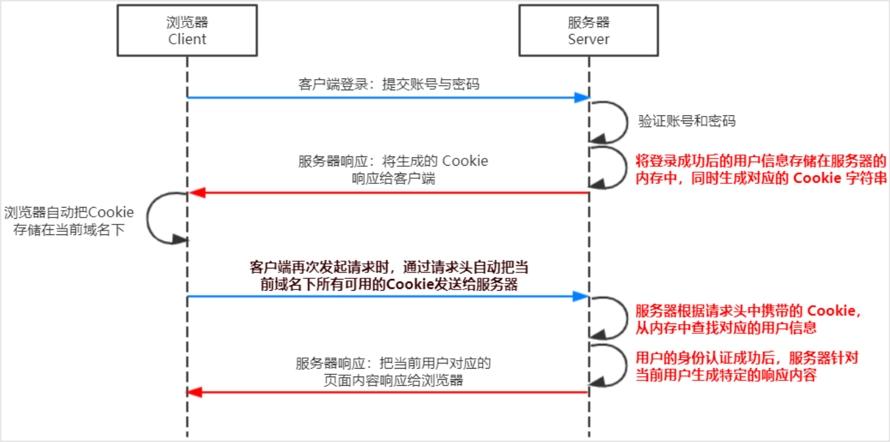

# 数据库和身份认证   

## 操作数据库  
```js
const mysql = require('mysql')
//数据库信息文件
const config = require('./config')
const { debug } = require('../utils/constant')//debug控制输出

function connect() {
    return mysql.createConnection({
        host: config.host,// 数据库的 IP 地址
        user: config.user,// 登录数据库的账号
        password: config.password,// 登录数据库的密码
        database: config.database,// 指定要操作哪个数据库
        // 允许每条 mysql 语句有多条查询
        multipleStatements: true
    })
}

function querySql(sql) {
    const conn = connect()
    debug && console.log(sql)
    return new Promise((resolve, reject) => {
        try {
            conn.query(sql, (err, results) => {
                if (err) {
                    debug && console.log('查询失败，原因:' + JSON.stringify(err))
                    reject(err)
                } else {
                    debug && console.log('查询成功', JSON.stringify(results))
                    resolve(results)
                }
            })
        } catch (e) {
            reject(e)
        } finally {
            conn.end()
        }
    })
}
// conn 对象使用完毕后需要调用 end 进行关闭，否则会导致内存泄露

function queryOne(sql) {
    return new Promise((resolve, reject) => {
        querySql(sql)
            .then(results => {
                if (results && results.length > 0) {
                    resolve(results[0])
                } else {
                    resolve(null)
                }
            })
            .catch(error => {
                reject(error)
            })
    })
}

module.exports = {
    querySql,
    queryOne
}
```   

## 身份认证

### session认证机制
  - 服务端渲染推荐使用 Session 认证机制  

#### session工作原理
   
   

#### session认证
1. 输入用户名和密码，服务端进行验证，如果通过则生成一个sessionId， 并保存在一个会话表中    
2. 将sessionId放到`set-cookie`字段返回给客户端，之后客户端取出set-cookie中的cookie字段，将其放入到cookie中   
3. 下一次请求，浏览器都会自动将cookie中的sessionId字段传给服务端    
4. 服务端去会话表中查询是否有对应的字段，如果一致则登录成功，否则失败。    
   
缺点：sessionId保存在服务端，如果有多个用户同时登录，会增加服务器开销   

### JWT认证机制    

   


#### JWT认证  
1. 输入用户名和密码，服务端验证通过后，返回一个token给客户端  
2. 客户端将其存在sessionstorage或loaclstorage中  
3. 之后客户端每次请求数据需要带上token，服务端验证token是否匹配，如果匹配则向客户端返回数据   

优点：token存储在客户端，不存放在cookie中，不容易受到csrf攻击，适用于单点登录   

缺点：一旦签发一个jwt在到期之前无法中途废弃。例如当需要更新信息时，会重新签发一个jwt，但是旧的jwt还没有过期，使用旧的jwt还可以登录，但是此时获取到的数据是过时的，为了解决这个问题，需要通过设置一个黑名单，一旦签发了新jwt，就将旧的jwt加入黑名单，避免被再次使用    


#### JWT的续签问题  

当token过期后，如何动态刷新token避免重新登录？  

在session认证中的一般做法时，如果在有效期内再次登录，则将有效期延长相应时间  

解决办法： 
1. 每次请求都返回新的token，开销较大  
2. 用户登录返回两个token  
   - 一个是` accessToken`
   - 另一个是`refreshToken `，用户登录后，将两个token保存在本地，每次访问将accessToken传给服务端，服务端校验accessToken的有效性，如果过期，就将refreshToken传给服务端；如果有效，服务端生成新的accessToken给客户端  


#### 使用   
```sh
npm i jsonwebtoken express-jwt
```

- jsonwebtoken 用于生成 JWT 字符串   
- express-jwt 用于将 JWT 字符串解析还原成 JSON 对象   

为了保证 JWT 字符串的安全性，防止 JWT 字符串在网络传输过程中被别人破解，需要专门定义一个用于加密和解密
的 secret 密钥：
- 当生成 JWT 字符串的时候，需要使用 secret 密钥对用户的信息进行加密，最终得到加密好的 JWT 字符串
- 当把 JWT 字符串解析还原成 JSON 对象的时候，需要使用 secret 密钥进行解密

```js
// TODO_01：安装并导入 JWT 相关的两个包，分别是 jsonwebtoken 和 express-jwt
const jwt = require('jsonwebtoken')
const expressJWT = require('express-jwt')

// 允许跨域资源共享
const cors = require('cors')
app.use(cors())

// 解析 post 表单数据的中间件
const bodyParser = require('body-parser')
app.use(bodyParser.urlencoded({ extended: false }))

// TODO_02：定义 secret 密钥，建议将密钥命名为 secretKey
const secretKey = 'secretKey'

/ TODO_04：注册将 JWT 字符串解析还原成 JSON 对象的中间件
// 注意：只要配置成功了 express-jwt 这个中间件，就可以把解析出来的用户信息，挂载到 req.user 属性上
app.use(expressJWT({ secret: secretKey }).unless({ path: [/^\/api\//] }))  

// 登录接口
app.post('/api/login', function (req, res) {
  // 将 req.body 请求体中的数据，转存为 userinfo 常量
  const userinfo = req.body
  // 登录失败
  if (userinfo.username !== 'admin' || userinfo.password !== '000000') {
    return res.send({
      status: 400,
      message: '登录失败！',
    })
  }
  // 登录成功
  // TODO_03：在登录成功之后，调用 jwt.sign() 方法生成 JWT 字符串。并通过 token 属性发送给客户端
  // 参数1：用户的信息对象
  // 参数2：加密的秘钥
  // 参数3：配置对象，可以配置当前 token 的有效期
  // 记住：千万不要把密码加密到 token 字符中
  const tokenStr = jwt.sign({ username: userinfo.username }, secretKey, { expiresIn: '30s' })
  res.send({
    status: 200,
    message: '登录成功！',
    token: tokenStr, // 要发送给客户端的 token 字符串
  })
})

// 这是一个有权限的 API 接口
app.get('/admin/getinfo', function (req, res) {
  // TODO_05：使用 req.user 获取用户信息，并使用 data 属性将用户信息发送给客户端
  console.log(req.user)
  res.send({
    status: 200,
    message: '获取用户信息成功！',
    data: req.user, // 要发送给客户端的用户信息
  })
})

// TODO_06：使用全局错误处理中间件，捕获解析 JWT 失败后产生的错误
app.use((err, req, res, next) => {
  // 这次错误是由 token 解析失败导致的
  if (err.name === 'UnauthorizedError') {
    return res.send({
      status: 401,
      message: '无效的token',
    })
  }
  res.send({
    status: 500,
    message: '未知的错误',
  })
})

// 调用 app.listen 方法，指定端口号并启动web服务器
app.listen(8888, function () {
  console.log('Express server running at http://127.0.0.1:8888')
})
```


>可将响应结果封装成models/Result.js

```js
// node响应结果封装

const {
    CODE_ERROR,//-1
    CODE_SUCCESS,//0
    CODE_TOKEN_EXPIRED //-2
} = require('../utils/constant')

class Result {
    constructor(data, msg = '操作成功', options) {
        this.data = null
        if (arguments.length === 0) {
            this.msg = '操作成功'
        } else if (arguments.length === 1) {
            this.msg = data
        } else {
            this.data = data
            this.msg = msg
            if (options) {
                this.options = options
            }
        }
    }

    createResult() {
        if (!this.code) {
            this.code = CODE_SUCCESS
        }
        let base = {
            code: this.code,
            msg: this.msg
        }
        if (this.data) {
            base.data = this.data
        }
        if (this.options) {
            base = {...base, ...this.options }
        }
        console.log(base)
        return base
    }

    json(res) {
        res.json(this.createResult())
    }

    success(res) {
        this.code = CODE_SUCCESS
        this.json(res)
    }

    fail(res) {
        this.code = CODE_ERROR
        this.json(res)
    }

    expired(res) {
        this.code = CODE_TOKEN_EXPIRED
        this.json(res)
    }
}

module.exports = Result
```