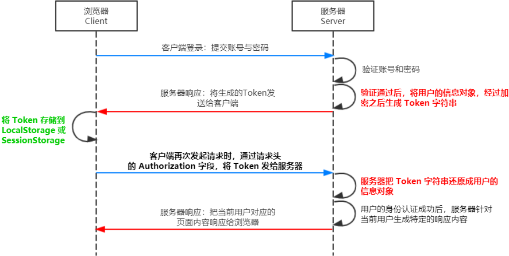

# 数据库和身份认证

## 身份认证

### session认证机制
  - 服务端渲染推荐使用 Session 认证机制  

#### session工作原理
   
   

#### session认证
1. 输入用户名和密码，服务端进行验证，如果通过则生成一个sessionId， 并保存在一个会话表中    
2. 将sessionId放到`set-cookie`字段返回给客户端，之后客户端取出set-cookie中的cookie字段，将其放入到cookie中   
3. 下一次请求，浏览器都会自动将cookie中的sessionId字段传给服务端    
4. 服务端去会话表中查询是否有对应的字段，如果一致则登录成功，否则失败。    
   
缺点：sessionId保存在服务端，如果有多个用户同时登录，会增加服务器开销   

### JWT认证机制    

   

### JWT认证  
1. 输入用户名和密码，服务端验证通过后，返回一个token给客户端  
2. 客户端将其存在sessionstorage或loaclstorage中  
3. 之后客户端每次请求数据需要带上token，服务端验证token是否匹配，如果匹配则向客户端返回数据   

优点：token存储在客户端，不存放在cookie中，不容易受到csrf攻击，适用于单点登录   

缺点：一旦签发一个jwt在到期之前无法中途废弃。例如当需要更新信息时，会重新签发一个jwt，但是旧的jwt还没有过期，使用旧的jwt还可以登录，但是此时获取到的数据是过时的，为了解决这个问题，需要通过设置一个黑名单，一旦签发了新jwt，就将旧的jwt加入黑名单，避免被再次使用    

### JWT的续签问题  

当token过期后，如何动态刷新token避免重新登录？  

在session认证中的一般做法时，如果在有效期内再次登录，则将有效期延长相应时间  

解决办法： 
1. 每次请求都返回新的token，开销较大  
2. 用户登录返回两个token  
   - 一个是` accessToken`
   - 另一个是`refreshToken `，用户登录后，将两个token保存在本地，每次访问将accessToken传给服务端，服务端校验accessToken的有效性，如果过期，就将refreshToken传给服务端；如果有效，服务端生成新的accessToken给客户端
