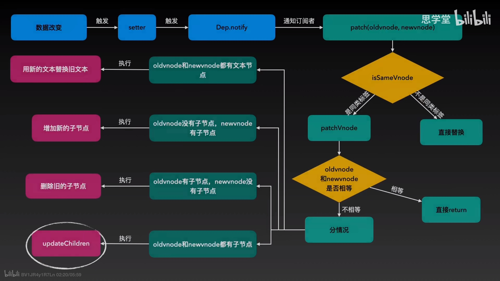
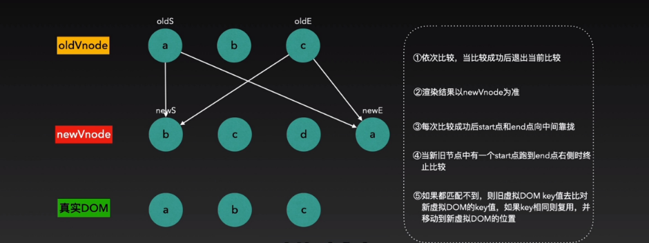
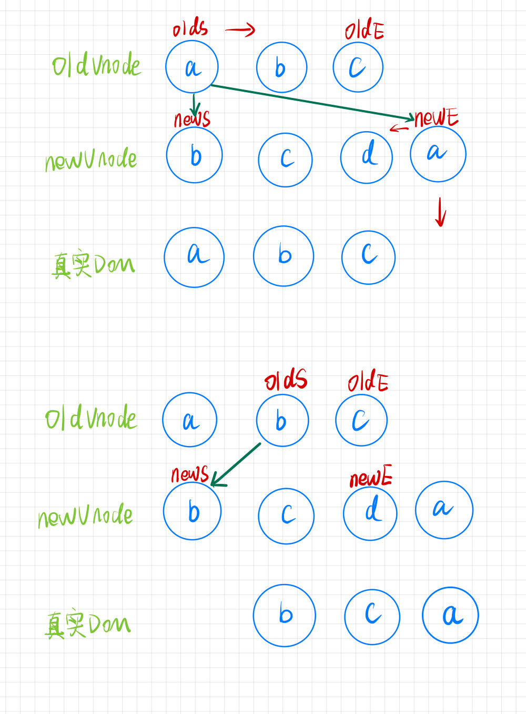
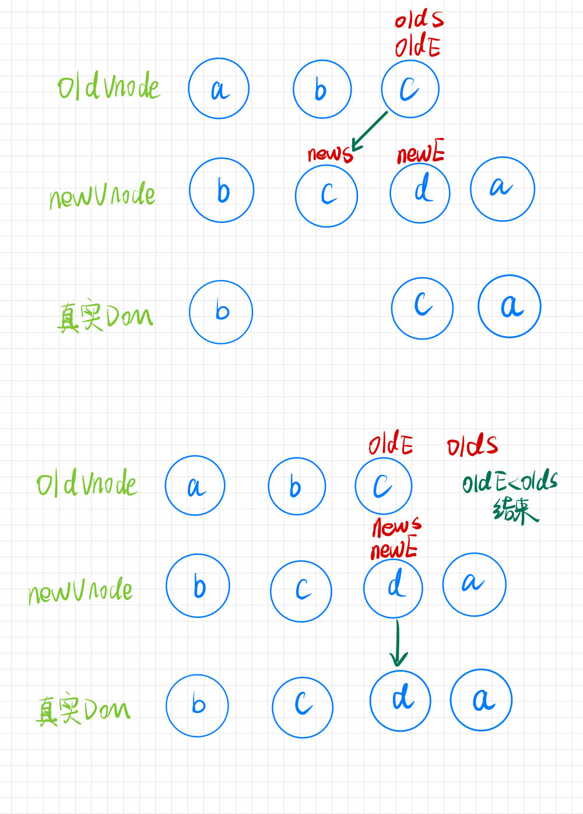

# diff算法

diff算法流程：

  

<b>updateChildren流程</b>   

1. 将Vnode的子节点Vch和oldVnode的子节点oldCh提取出来   

2. oldCh和vCh各有两个头尾的变量StartIdx和EndIdx，它们的2个变量相互比较，一共有4种比较方式。如果4种比较都没匹配，如果设置了key，就会用key进行比较，在比较的过程中，变量会往中间靠，一旦StartIdx>EndIdx表明oldCh和vCh至少有一个已经遍历完了，就会结束比较。     

   

