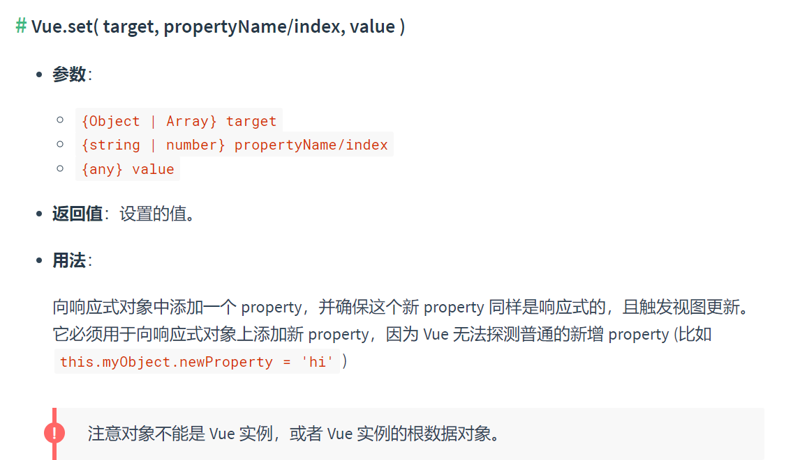

# vnode
## 虚拟DOM和diff算法

### snabbdom简介和测试环境搭建
- snabbdom是著名的虚拟DOM库，是diff算法的鼻祖，Vue源码借鉴了snabbdom；
- 官方git：<https://github.com/snabbdom/snabbdom>
- 在git上的snabbdom源码是用TypeScript写的，git上并不提供编译好的
JavaScript版本；
- 如果要直接使用build出来的JavaScript版的snabbdom库，可以从npm上下载：
  ```js
   npm i -S snabbdom
  ```
- snabbdom库是DOM库，当然不能在nodejs环境运行，所以我们需要搭建webpack和webpack-dev-server开发环境，好消息是不需要安装任何loader
- 这里需要注意，必须安装最新版webpack@5，不能安装webpack@4，这是因为webpack4没有读取身份证中exports的能力，建议大家使用这样的版本：
 ```js
   npm i -S webpack@5 webpack-cli@3 webpack-dev-server@
 ```
 - 参考webpack官网，书写好webpack.config.js文件
 - 跑通snabbdom官方git首页的demo程序，即证明调试环境已经搭建成功
 - https://github.com/snabbdom/snabbdom
 - 不要忘记在index.html中放置一个div#container

### 虚拟DOM和h函数
- 虚拟DOM：用JavaScript对象描述DOM的层次结构。DOM 中的一切属性都在虚DOM中有对应的属性
- **diff是发生在虚拟DOM上的**
- 新虚拟DOM和老虚拟DOM进行diff（精细化比较），算出应该如何最小量更新，最后反映到真正的DOM上。

- h函数用来产生虚拟节点（vnode）
- 比如这样调用h函数：
  ```js
  h('a', { props: { href: 'http://www.atguigu.com' }}, '尚硅谷');
  ```
- 将得到这样的虚拟节点：
  ```js
  { "sel": "a", "data": { props: { href: 'http://www.atguigu.com' } }, "text": "尚硅谷" }

  //它表示的真正的DOM节点
  <a href="http://www.atguigu.com">尚硅谷</a>
  ```
- 一个虚拟节点有哪些属性
  ```js
   {  children: undefined
   data: {}
   elm: undefined
   key: undefined
   sel: "div"
   text: "我是一个盒子"
   }
  ```


## vue检测数据的原理

Vue监视数据的原理：
  1. vue会监视data中所有层次的数据。  


  2. 如何监测对象中的数据？
  
     * 通过setter实现监视，且要在new Vue时就传入要监测的数据。

     * 对象中后追加的属性，Vue默认不做响应式处理

     * 如需给后添加的属性做响应式，请使用如下API：
         - Vue.set(target，propertyName/index，value) 或 
         - vm.$set(target，propertyName/index，value)
 
 >**特别注意**：Vue.set() 和 vm.$set() 不能给vm 或 vm的根数据对象 添加属性  

 
     

  1. 如何监测数组中的数据？  
      通过包裹数组更新元素的方法实现，本质就是做了两件事：  

     * 调用原生对应的方法对数组进行更新。  

     * 重新解析模板，进而更新页面   


  2. 在Vue修改数组中的某个元素一定要用如下方法：    
     * 使用这些API:push()、pop()、shift()、unshift()、splice()、sort()、reverse()    
     * Vue.set() 或 vm.$set()    


