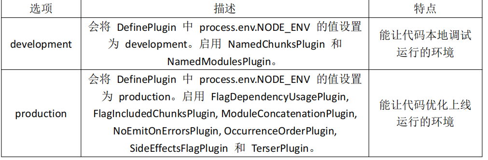

# 基础知识  

## webpack 五个核心
1. Entry 入口(Entry)    
  指示 webpack 以哪个文件为入口起点开始打包，分析构建内部依赖图。  

2. Output 输出(Output)  
  指示 webpack 打包后的资源 bundles 输出到哪里去，以及如何命名。   

3. Loader    
  Loader 让 webpack 能 够 去 处 理 那 些 非 JavaScript 文 件 (webpack 自 身 只 理 解 JavaScript)    

4. Plugins 插件(Plugins)   
  可以用于执行范围更广的任务。插件的范围包括，从打包优化和压缩， 一直到重新定义环境中的变量等。   

5.  Mode 模式(Mode)
  指示 webpack 使用相应模式的配置    

   


>webpack 能够编译打包 js 和 json 文件。    
>能将 es6 的模块化语法转换成浏览器能识别的语法。   
>能压缩代码。   
>不能编译打包 css、img 等文件。 不能将 js 的 es6 基本语法转化为 es5 以下语法   

```sh
初始化 package.json 输入指令: npm init  
下载并安装 webpack 输入指令: npm install webpack webpack-cli -g  
npm install webpack webpack-cli -D
```