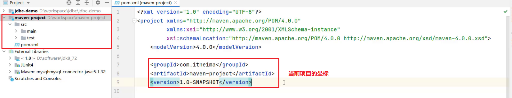

# Maven

## web服务器 

Web服务器是一个应用程序（软件），对 HTTP协议的操作进行封装，使得程序员不必直接对协议进行操作，让Web开发更加便捷。主要功能是“提供网上信息浏览服务   


## maven简介   


Apache Maven 是一个项目管理和构建工具，它基于项目对象模型(POM)的概念，通过一小段描述信息来管理项目的构
建、报告和文档。  
官网 ：<http://maven.apache.org/>  

## 仓库  

创建Maven项目后，在项目中使用坐标来指定项目的依赖，其实依赖jar包是存储在我们的本地仓库中。而项目运行时从本地仓库中拿需要的依赖jar包。     
 
仓库分类：   
本地仓库：自己计算机上的一个目录   
中央仓库：由Maven团队维护的全球唯一的仓库   
地址： <https://repo1.maven.org/maven2/>
远程仓库(私服)：一般由公司团队搭建的私有仓库   
当项目中使用坐标引入对应依赖jar包后，首先会查找本地仓库中是否有对应的jar包：  
如果有，则在项目直接引用;    
如果没有，则去中央仓库中下载对应的jar包到本地仓库。    

## Maven安装

1. 解压 apache-maven-3.6.1.rar 既安装完成
2. 配置环境变量 MAVEN_HOME 为安装路径目录，并在path中配置%MAVEN_HOME%\bin
3. 配置本地仓库  
- 修改 conf/settings.xml 中的 为一个指定目录作为本地仓库，用来存储jar包。
4. 配置阿里云私服
中央仓库在国外，所以下载jar包速度可能比较慢，而阿里公司提供了一个远程仓库，里面基本也都有开源项目的jar包。
修改 conf/settings.xml 中的 标签，为其添加如下子标签  

```
<mirror> 
  <id>alimaven</id> 
  <name>aliyun maven</name> 
  <url>http://maven.aliyun.com/nexus/content/groups/public/</url>
  <mirrorOf>central</mirrorOf>
</mirror>
```


## 基本使用 

Maven基本使用  
### Maven 常用命令 
compile ：编译  
clean：清理  
test：测试  
package：打包  
install：安装  


## Maven 坐标   



什么是坐标？  

Maven 中的坐标是资源的唯一标识  

使用坐标来定义项目或引入项目中需要的依赖   

Maven 坐标主要组成   :

- groupId：定义当前Maven项目隶属组织名称（通常是域名反写，例如：com.itheima）  

- artifactId：定义当前Maven项目名称（通常是模块名称，例如 order-service、 goods-service）  

- version：定义当前项目版本号   
