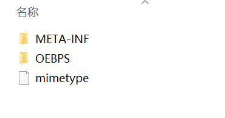
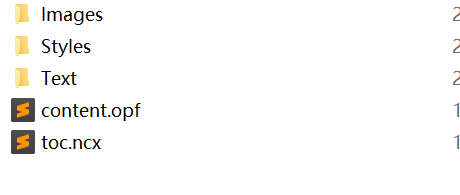
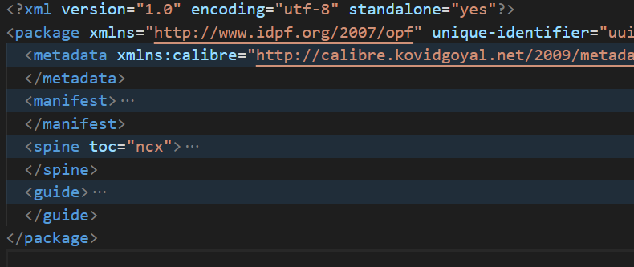
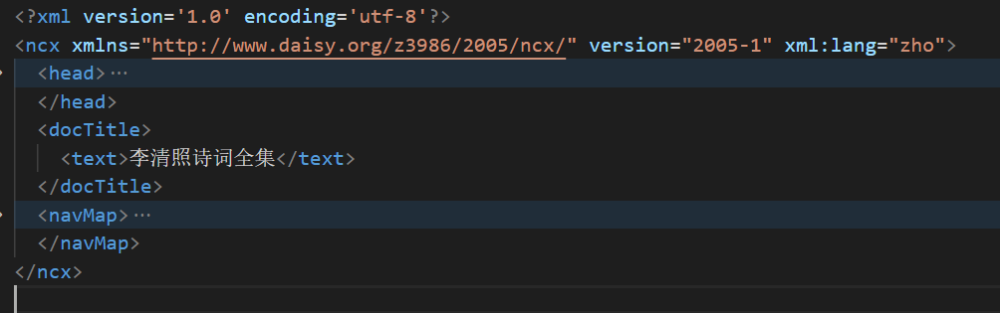
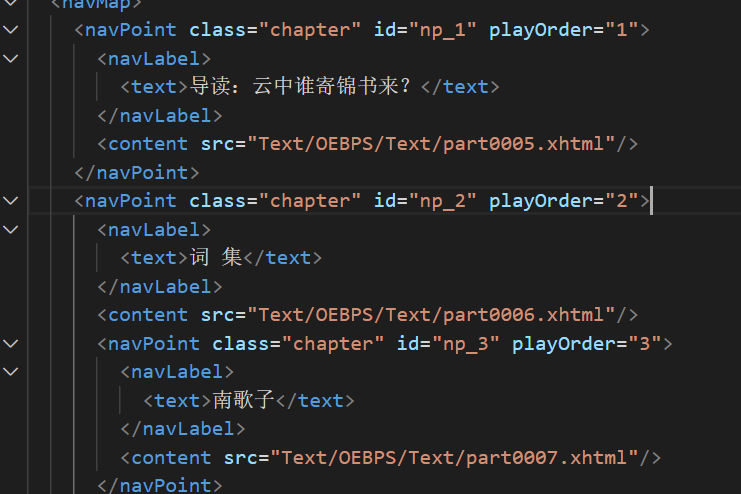

# 

## nginx配置  

>upload文件夹里存放电子书相关

在安装目录下修改nginx.conf  

末尾大括号之前添加

```sh
include C:/Users/dd/upload/upload.conf;
``` 

upload.conf文件如下 ；   

```sh
server
{ 
  charset utf-8;
  listen 8089;
  server_name http_host;
  #资源文件路径
  root C:/Users/dd/upload/;
  autoindex on;
  #不使用缓存
  add_header Cache-Control "no-cache, must-revalidate";
  #路由，/表示对所有路由生效
  location / { 
    add_header Access-Control-Allow-Origin *;
  }
}
```

访问：  
http://localhost:8089


## epub电子书组成  

电子书解压后一般有如下文件 

  

- META-INF中只有一个container.xml文件

```xml
<?xml version="1.0" encoding="utf-8"?>
<container version="1.0" xmlns="urn:oasis:names:tc:opendocument:xmlns:container">
	<rootfiles>
		<rootfile full-path="OEBPS/content.opf" media-type="application/oebps-package+xml"/>
  	</rootfiles>
</container>
``` 

- OEBPS  

  

1. content.opf 
  

  - metadata标签：有电子书的title,  creator,  creatorFileAs,  publisher,  language,  cover等信息   
  - manifest:由很多item标签组成  

  ```xml
  <item href="Text/titlepage.xhtml" id="titlepage" media-type="application/xhtml+xml" />
  ```
  - spine :由itemref标签组成  

  ```xml
   <spine toc="ncx">
    <itemref idref="titlepage" />
    .....
   </spine>
  ```

  - guide

  ```xml
  <guide>
    <reference href="Text/titlepage.xhtml" title="Cover" type="cover" />
    <reference href="Text/part0000.xhtml" title="目录" type="toc" />
  </guide>
  ``` 

2. toc.ncx 
 

保存目录信息  

  

每个navPoint包含一个navLabel和content，分别保存文章标题和相对路径  

navPoint里也可嵌套navPoint表示子目录  


3. mimetype 即文件类型  
```xml
application/epub+zip
``` 


## request entity too large  

Post请求参数过大引起的413 (Request Entity Too Large)错误   

```js
const express =require('express')
const app=express()

//修改限制大小
var bodyParser = require('body-parser');
app.use(bodyParser.json({limit:'50mb'}));
app.use(bodyParser.urlencoded({limit:'50mb',extended:true}));

app.listen(8888,()=>{
    console.log('server is runing at http://127.0.0.1:8888')
})
```   

## 数据库报错The user specified as a definer ('root'@'%') does not exist

>访问视图文件没有权限

1. DOS进入mysql

```sh
mysql -hlocalhost -uroot -p密码
```

2. 给mysql添加权限

```sh
mysql> grant all privileges on *.* to root@"%" identified by ".";
  Query OK, 0 rows affected (0.00 sec)

mysql> flush privileges;
  Query OK, 0 rows affected (0.00 sec)
``` 


## 模糊查询关键字高亮  

>利用正则表达式将需高亮的关键字替换

```js
 wrapperKeyword(k, v) {
   function highLight(value) {
     return `<span style="color: #1890ff">${value}</span>`
   }
   if(!this.listQuery[k]) {
     return v
   } else {
     //利用正则表达式匹配到需要高亮的部分，用highLight函数返回的span替换 
    //  i表示不区分大小写，g表示全局查询
     return v.replace(new RegExp(this.listQuery[k],'ig'),v => highLight(v))
   }
}
```

>获取图书列表时生成带有高亮的文字

```js
 getList() {
      this.listLoading = true
      listBook(this.listQuery).then(response => {
        const {list} =response.data
        this.list = list
        this.listLoading = false
        this.list.forEach(book => {
          book.titleWrapper = this.wrapperKeyword('title', book.title)
          book.authorWrapper = this.wrapperKeyword('author', book.author)
        })
      })
    },
```

>将展示的字段替换为新生成的,在span标签上加上v-html指令，否则无效

```html
<el-table-column label="书名" width="150" align="center"> 
  <template slot-scope="{row:{ titleWrapper }}">
      <span v-html="titleWrapper" />
  </template>
</el-table-column>
```


## vue路由守卫next说明  

[vue路由守卫next说明](https://blog.csdn.net/qq_41912398/article/details/109231418?spm=1001.2014.3001.5501)

## 路由权限  

[路由权限](https://panjiachen.github.io/vue-element-admin-site/zh/guide/essentials/permission.html#%E6%9D%83%E9%99%90%E9%AA%8C%E8%AF%81)

## 打包

1. 在vue.config.js将publicPath改为 `'.'`
2. 运行npm run build:prod 命令生成dist文件夹
3. 将dist文件夹里的文件放入 nginx 配置文件的同级目录下  


